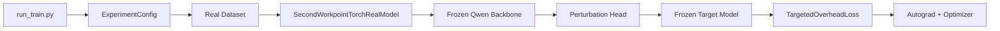

# 去除 stub 并收敛真实训练主线报告

## 1. 本次工作的目标

这轮工作的目标不是“让 stub 和真实链路共存得更优雅”，而是彻底改变第二工作点的默认工程语义：

- 从“有一条真实分支”改成“只有真实分支”
- 从“stub 是主线、real 是扩展”改成“real 是主线、stub 已删除”

## 2. 这轮删除了什么

### 2.1 删除的运行路径

- `vista_augur/run_train_stub.py`
- `StubTrainer`
- `StubFlowDataset`
- `FrozenBackboneStub`
- `SecondWorkpointStubModel`
- `FrozenTargetModelStub`

### 2.2 删除的配置

- `second_workpoint_stub.json`
- `second_workpoint_stub_deepcorr300_target.json`
- `second_workpoint_deepcorr300_real_smoke.json`

### 2.3 删除的旧接口

- 哈希 `prompt_ids` 主输入
- 伪梯度 `apply_stub_update`
- stub 专用 checkpoint 语义

## 3. 这轮保留了什么

去 stub 不是把实验面做窄，而是把无效分支删掉后，把真正有价值的实验变量留下来。

当前仍然保留：

- `DeepCorr300` 与 `DeepCoFFEA` 两类真实数据路径
- `text_prototypes` 与 `learned_prototypes` 两种语义对齐模式
- 真实 Qwen backbone 的可配置加载方式
- 真实 target model 的可配置加载方式

## 4. 当前主线长什么样

## 5. 为什么这对后续更大规模训练更好

### 5.1 少了一套无意义的维护面

以后再改：

- backbone 尺寸
- prompt 长度
- target 反馈策略
- checkpoint 结构

都不需要再问一句“stub 要不要也跟着改”。

### 5.2 Prompt 语义入口更稳定

当前主输入已经统一为：

`prompt_text -> tokenizer -> inputs_embeds`

这意味着后续更大 backbone 的实验不会再夹着一个历史占位接口。

### 5.3 实验解释更清楚

现在如果结果变化了，你可以更放心地把变化归因到：

- 语义对齐模式
- backbone 规模
- 数据集差异
- batch 与优化超参

而不是怀疑“是不是另一条旧路径还在起作用”。

## 6. 本次修改后的验证结果

### 静态验证

- `compileall` 通过
- 三份保留配置都能按纯 real 路径通过 `load_config()`

### 结构验证

- `text_prototypes` 配置能正确声明为 `torch_real / real / hf_frozen / torch`
- `learned_prototypes` 对照配置同样能通过真实路径校验
- `DeepCoFFEA` smoke 配置也已同步到纯 real 口径

### 运行时验证

这轮最终仍以 `DeepCorr300 + text_prototypes` 的最小真实训练链路作为硬验证目标。

## 7. 结论

第二工作点现在的代码与文档语义已经统一到一个更适合长期训练的状态：

- 不再存在 stub 主线
- 真实链路是唯一主线
- 语义对齐实验面仍然保留
- 后续向更大 backbone 扩展时，不需要再做一次“从假链路切回真链路”的重复重构
