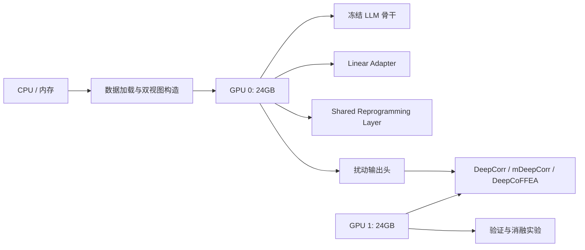
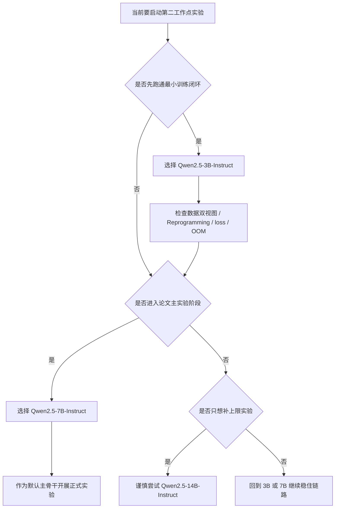

# 🧭 环境配置与基模选型说明

> [!TIP]
> **阅读方式建议**
> 如果你只想先拿到结论，可以优先看 `🎯 文档目的`、`❓ 要不要用 API`、`✅ 推荐结论` 和 `📌 最终建议` 四节。

> [!NOTE]
> **颜色阅读提示**
> 如果你的 Markdown 预览器支持 HTML 样式，可以把文中的颜色理解为快速判断标签：
> <span style="color:#15803d;"><strong>推荐</strong></span>、
> <span style="color:#0f766e;"><strong>默认方案</strong></span>、
> <span style="color:#b45309;"><strong>谨慎</strong></span>、
> <span style="color:#b91c1c;"><strong>不建议</strong></span>。

## 🗺️ 快速导航

> [!TIP]
> **怎么读这份文档**
> 不必从头顺序读完。先找到你当前最关心的问题，再按对应章节跳读，会更轻松。

| 如果你现在最想知道 | 直接看哪里 |
| --- | --- |
| 这份文档到底解决什么问题 | `🎯 1. 文档目的` |
| 为什么不能直接用 API | `❓ 2. 要不要用 API` |
| 两张 4090 最合理怎么分工 | `🧩 4. 双卡如何分工才合理` |
| 为什么主模型推荐 7B 而不是 14B | `🧠 5. 基模选型的核心判断标准`、`✅ 6. 推荐结论` |
| 3B、7B、14B 到底怎么选 | `⚖️ 7. 备选模型如何排序` |
| 单卡 24GB 到底能不能训 | `💾 8. 单卡本地部署是否可行` |
| 量化和精度该怎么配 | `🛠️ 9. 推荐的训练精度与量化方案` |
| 软件环境怎么装最稳 | `🧱 10. 建议的软件环境` |
| 实验应该按什么顺序启动 | `🚀 11. 实验启动顺序建议` |
| 最终默认落地方案是什么 | `📌 12. 最终建议` |

## 🃏 模型选择速览卡

> [!NOTE]
> **先看这张卡，再读后面的细节**
> 如果你只想先抓住主线，这一节就够了。

| 模型 | 定位 | 适合什么时候用 |
| --- | --- | --- |
| <span style="color:#15803d;"><strong>`Qwen2.5-7B-Instruct`</strong></span> | 主实验默认骨干 | 你要开始正式论文实验时 |
| <span style="color:#0f766e;"><strong>`Qwen2.5-3B-Instruct`</strong></span> | 调试与兜底骨干 | 你要先跑通最小闭环、排查 OOM 或检查链路时 |
| <span style="color:#b45309;"><strong>`Qwen2.5-14B-Instruct`</strong></span> | 上限补充骨干 | 你已经完成主实验，想补一组更大 backbone 的上限验证时 |

> <span style="color:#15803d;"><strong>一句话建议：</strong></span>
> <span style="color:#15803d;">先用 3B 跑通，再用 7B 做主实验，14B 只在后期作为补充，不要反过来。</span>

## 🎯 1. 文档目的

- 这一节只回答一个问题：在你当前服务器条件下，第二工作点最适合采用什么样的基模和部署方式。它不讨论“社区里谁最强”，只讨论“谁最适合现在这条训练链路”。

> [!NOTE]
> **一句话定位**
> 这不是“最强模型榜单”，而是一份“在你这台服务器上最稳怎么落地”的环境决策说明。

> <span style="color:#0f766e;"><strong>重点句：</strong></span>
> <span style="color:#0f766e;">这份文档真正要解决的，不是谁更强，而是谁更适合你当前这条训练链路。</span>

| 判断项 | 本文关注点 |
| --- | --- |
| 硬件条件 | 2 块 RTX 4090，每块 24GB 显存 |
| 任务性质 | 端到端训练，不是单纯离线推理 |
| 方法结构 | 双视图特征 + Reprogramming Layer + 冻结 LLM + 输出头 |
| 文档目标 | 给出可执行、可复现、可解释的环境方案 |

- 你的硬件条件看起来并不弱，但一旦把问题放到端到端训练场景里，约束会立刻变得具体。第二工作点不是只把一个大模型下载下来跑推理，而是要把流量特征、视觉增强表示、Reprogramming Layer、冻结 LLM 骨干、输出头以及目标模型反馈整合进同一条训练链路里。

- 这意味着显存里不仅要放模型权重，还要放中间激活、KV cache、优化器状态和批量数据。因此，“模型能不能推理”与“模型能不能稳定训练”是两件不同的事。本文真正要解决的是后者。

- 另一个前提是，你的方法对最终自然语言生成质量要求并不高。第二工作点里的 LLM 主要承担的是上下文编码职责，它更像一个语义变换骨干，而不是一个追求极限对话质量的通用助手。

- 正因为如此，选型原则不应当是“越大越好”，而应当是“在显存占用、训练稳定性和语义表达能力之间找到平衡点”。后文优先推荐 7B 级模型，而不是直接追 14B 或更高规格，原因就建立在这个判断之上。

> <span style="color:#b45309;"><strong>关键判断：</strong></span>
> <span style="color:#b45309;">对第二工作点来说，LLM 是语义骨干，不是长文本生成器，因此“稳定”和“兼容”比“极限上限”更重要。</span>

---

## ❓ 2. 先回答最关键的问题：要不要用 API

> [!IMPORTANT]
> **先给结论**
> <span style="color:#b91c1c;"><strong>不建议</strong></span> 把核心基模建立在远程 API 上，第二工作点应当采用本地部署。

- 这一节的结论可以先直接写出来：不建议把核心基模建立在远程 API 上，而应该本地部署。

- 原因首先不是成本，而是训练闭环本身。第二工作点是端到端训练，这意味着每个 batch 都要经过特征构造、重编程映射、LLM 前向、输出扰动生成、扰动回填、目标模型评估和损失回传。只要你还需要这一整条梯度链，远程 API 就很难成立。

- 更具体地说，API 最大的问题是你拿不到可参与反向传播的内部计算图，也无法稳定控制隐藏状态、嵌入层、token 拼接顺序和中间表征。即使退一步，只把 API 当成纯前向编码器，它仍然会带来吞吐下降、网络时延、调用成本积累和数据外发风险。

- 从工程控制权的角度看，本地部署也更合理。你的方法里有一层共享 Reprogramming Layer，这要求你能明确控制“时序分支怎么投影”“视觉分支怎么投影”“文本 prompt 怎么嵌入”“三类 token 以什么顺序进入骨干模型”。这些操作在本地 `transformers` 框架里都能直接实现，但在远程 API 场景下，控制面会被明显压缩。

- 所以更准确的说法不是“API 不划算”，而是“只要目标是端到端训练，本地部署就是方法成立的前提条件”。

> <span style="color:#b91c1c;"><strong>必须记住：</strong></span>
> <span style="color:#b91c1c;">只要你的目标仍然是端到端训练，远程 API 就不是主方案，而本地部署几乎是前提条件。</span>

---

## 🖥️ 3. 你的硬件条件到底意味着什么

| 资源项 | 当前条件 | 对方法设计的直接含义 |
| --- | --- | --- |
| GPU 数量 | 2 块 RTX 4090 | 可以把生成器骨干和目标模型分开部署，减少显存互相挤压 |
| 单卡显存 | 24GB | 适合 7B 级模型本地训练，14B 级主干做主训练会明显吃紧 |
| 训练目标 | 端到端训练 | 需要考虑激活占用，而不仅仅是权重是否能加载 |
| 方法结构 | 冻结 LLM + 轻量 adapter + Reprogramming Layer | 大模型不需要全参微调，因此可以利用量化降低权重占用 |
| 结果要求 | 不追求极限生成质量 | 可以优先选择“够用且稳”的模型，而不是盲目追求更大参数量 |

- 这张表给的是静态资源信息，但真正重要的是它对应的训练含义。最容易被误判的一点是：24GB 显存并不等于“任何 7B 或 14B 模型都能轻松训练”。

- 如果只做推理，很多量化模型确实可以在单卡 24GB 上运行。但只要进入训练态，就必须额外支付激活图、缓存和训练层参数的显存成本。你的方法虽然不会全参微调 LLM，但仍然需要保留足够的计算路径，让 Reprogramming Layer、线性 adapter 和输出头完成梯度更新。

- 因此，模型大小的判断标准不该是“是否能成功 `from_pretrained()`”，而应该是“在真实 batch、真实序列长度和真实训练闭环下，能否持续训练而不频繁 OOM”。

- 按这个标准看，7B 是当前硬件下最稳的主航道，3B 是保守兜底，14B 只能作为高风险备选，而不应当作为默认主方案。

---

## 🧩 4. 双卡如何分工才合理

> [!TIP]
> **推荐分工**
> <span style="color:#15803d;"><strong>推荐</strong></span> `GPU 0` 放生成器主干，`GPU 1` 放目标模型与验证流程。



- 最推荐的思路，是把“冻结 backbone 链路”和“可训练生成器 + 目标反馈链路”拆开，而不是把两类显存行为完全不同的负担混放在同一张卡上。

- `GPU 0` 建议固定给冻结 LLM 骨干与预训练 token embedding，也就是 `prompt_text -> tokenizer -> inputs_embeds -> frozen backbone` 这条主语义链。这里的压力主要来自 backbone 权重、上下文序列和 `E -> E'` 原型构造。

- `GPU 1` 建议固定给可训练模块和目标攻击模型，也就是时序 adapter、视觉 adapter、语义对齐层、width bridge、输出头，以及 DeepCorr / mDeepCorr / DeepCoFFEA 目标反馈。

- 这样分工的核心价值，不是表面上的“资源平均分配”，而是把两类显存行为完全不同的计算隔离开。backbone 侧的压力主要来自权重、上下文序列和 prototype 构造；目标模型侧的压力主要来自扰动写回后的前向评估与反向梯度聚合。

- 如果把这两类负担塞到同一张卡上，训练过程中的显存峰值会更难预测。拆开之后，系统的资源行为通常会稳定很多，调参时也更容易判断问题究竟出在哪一侧。

- 如果第一版实现想尽量简单，也可以先采用“单卡训练主干，第二张卡只做验证”的保守策略。不过这更适合作为启动方案，不适合作为长期默认方案。

- 原因很直接。第二工作点不是静态特征提取实验，而是一个需要目标模型反馈参与训练的系统。只要损失计算里还依赖目标模型，把这部分负担迁移到第二张卡，通常就会带来更高吞吐和更低显存风险。

- 所以双卡环境真正的价值，不是把单卡已经能跑的东西复制一份，而是把“主干编码”和“目标反馈”这两个物理职责拆开，让训练链路更清晰，也更稳。

> <span style="color:#15803d;"><strong>重点结论：</strong></span>
> <span style="color:#15803d;">双卡最有价值的地方，不是“资源平均分配”，而是把主干编码和目标反馈彻底解耦。</span>

---

## 🧠 5. 基模选型的核心判断标准

> [!TIP]
> **看模型时先问四件事**
> 语言是否匹配、7B 左右是否稳定、部署门槛是否可控、后续实验是否容易扩展。

- 这一节不讨论“谁在榜单上更强”，只讨论“谁最适合你当前这条训练链路”。

| 判断标准 | 真正要解决的问题 |
| --- | --- |
| 语言适配性 | 中英文混合 prompt 会不会带来额外摩擦 |
| 7B 级稳定性 | 中等规模下能不能提供稳定语义空间 |
| 部署门槛 | 能不能尽快搭起可训练闭环 |
| 扩展性 | 后面能不能自然做 3B / 7B / 14B 尺度对照 |

- **标准一：先看语言是否匹配。**
  你的论文写作、实验记录和后续开发语境都偏中文，但 traffic prompt 又可能同时出现中文描述和英文模板。基于这一点，最合适的模型不是某个“纯英文场景下特别强”的骨干，而是一个天然支持中英双语、并且中文理解不明显掉队的模型。这样做的直接好处，是把语言风格错位的变量尽量提前消掉，避免后面把精力浪费在“prompt 要不要全部改英文”“中文输入会不会让语义空间不稳定”这类边际收益很低的问题上。

- **标准二：再看 7B 左右是否足够稳。**
  第二工作点并不要求基模输出特别漂亮的自然语言，它真正承担的是上下文编码职责。换句话说，你需要的是一个能稳定承载重编程后时序 token 和视觉 token 的语义骨干，而不是一个只在开放问答里表现亮眼的聊天模型。因此，这里的判断重点不是“它到底有多聪明”，而是“它在 7B 左右这个规模上，是否已经足够稳定、足够兼容冻结骨干策略”。

- **标准三：还要看部署门槛是否可控。**
  你当前最重要的目标，是尽快搭起端到端训练闭环，而不是把大量时间耗在许可证、量化兼容、框架版本和加载报错上。一个模型如果理论上更强，但它会显著增加环境复杂度，那么它在当前阶段未必更有价值。因为环境复杂度一旦失控，最先受影响的不是模型精度，而是整个实验推进速度。

- **标准四：最后看后续实验能否自然扩展。**
  一个适合作为主实验骨干的模型，最好还能自然衍生出 3B 对照组和 14B 上限组。这样你后续做尺度消融时，不需要整体更换 tokenizer、prompt 模板和加载逻辑，也不需要额外处理跨家族模型带来的风格偏移。这个标准很关键，因为你后面很可能需要回答一个核心问题：性能提升究竟来自第二工作点的方法结构，还是仅仅来自更大的语言骨干。

- **按这四个标准收束，Qwen 系列会自然占优。**
  它的优势不在某一项指标特别极端，而在整体平衡更贴合你当前的研究问题。Qwen2.5 官方模型卡给出的信息表明，7B 版约为 7.61B 参数，支持 128K 上下文，并覆盖 29 种以上语言，其中明确包含中文。同时，3B、7B、14B 又构成了非常自然的实验梯度。这样你后面可以在不切换模型家族的前提下完成尺度对照，把“结构收益”和“模型放大带来的收益”更清楚地拆开。

> <span style="color:#15803d;"><strong>一句话收束：</strong></span>
> <span style="color:#15803d;">如果把语言适配、7B 稳定性、部署门槛和尺度扩展性放在一起看，Qwen2.5 系列是当前最顺手的一条主线。</span>

---

## ✅ 6. 推荐结论：主模型选 Qwen2.5-7B-Instruct

> [!IMPORTANT]
> **默认方案**
> <span style="color:#0f766e;"><strong>默认方案</strong></span> 主基模选 `Qwen2.5-7B-Instruct`，本地部署，单卡承载冻结 LLM 主干，另一张卡承载目标模型与验证流程。

- 如果现在必须先给出一个可执行的主结论，那么建议直接定为下面这套默认方案：

- **主基模：** `Qwen2.5-7B-Instruct`
- **部署方式：** 本地部署，不使用远程 API
- **训练策略：** 单卡承载冻结 LLM 主干，另一张卡承载目标模型与验证流程
- **使用定位：** 作为第二工作点论文主实验的默认 backbone

- 这套选择的理由可以拆成三层来看。

- **第一层是规模平衡。** Qwen2.5-7B-Instruct 官方模型卡显示，它是 7.61B 参数、128K 上下文、29+ 语言覆盖、Apache 2.0 许可证，并明确要求 `transformers` 使用较新的版本。从工程角度看，这个规模已经足够提供稳定的语言语义空间，但又没有大到像 14B 那样在训练期明显压缩单卡 24GB 的安全余量。对于“冻结骨干 + 轻量可训练层”的结构来说，7B 这一档通常就是最合理的平衡点。

- **第二层是语言环境匹配。** 你当前不是在做一个纯英文研究环境下的通用对话系统，而是在做一个中英混合、以中文写作为主的研究项目。Qwen2.5-7B-Instruct 在这一点上会更自然。Meta Llama 3.1 8B 虽然也是可行备选，并且同样具备 128K 上下文，但其官方模型卡列出的支持语言主要集中在英文及若干其他外语，并没有把中文列为核心支持语言。Gemma 2 9B-it 则更偏向英文轻量路线。相比之下，Qwen 在你的真实语境下迁移成本更低。

- **第三层是后续实验延展性。** 选择 Qwen2.5-7B-Instruct，不只是为了当前这一版主实验，还为了给后续的 3B 对照组和 14B 上限组留出自然扩展路径。这样后面如果你要补“不同 backbone 规模是否影响最终收益”的实验，不需要更换整个模型家族，分析逻辑也会干净很多。这一点在论文阶段其实很重要，因为它会直接影响你后续结果解释是否清晰。

---

## ⚖️ 7. 备选模型如何排序

| 模型 | 是否建议作为主方案 | 适用位置 | 主要原因 |
| --- | --- | --- | --- |
| `Qwen2.5-7B-Instruct` | <span style="color:#15803d;"><strong>是</strong></span> | 主实验默认基模 | 中文友好、7B 级平衡好、训练压力可控、后续可向 3B/14B 扩展 |
| `Qwen2.5-3B-Instruct` | <span style="color:#0f766e;"><strong>是，但更适合作为保守备选</strong></span> | 调试、消融、快速验证 | 更省显存，能快速跑通训练闭环，但语义容量弱于 7B |
| `Meta-Llama-3.1-8B-Instruct` | <span style="color:#b45309;"><strong>可以作为英文对照</strong></span> | 英文 prompt 对照实验 | 8B 能力不错，但语言支持对中文不如 Qwen 自然，且许可证约束更强 |
| `google/gemma-2-9b-it` | <span style="color:#b91c1c;"><strong>不建议作为主线</strong></span> | 轻量英文替代验证 | 模型轻量，但更偏英文生态，不是你当前语境下的最优解 |
| `Qwen2.5-14B-Instruct` | <span style="color:#b91c1c;"><strong>不建议作为主训练默认方案</strong></span> | 后期上限实验 | 14.7B 参数，权重仓库约 29.6GB，单卡 24G 训练余量偏紧 |

- 这张表之后，最需要单独解释的其实是两个模型：一个是为什么 `Qwen2.5-14B-Instruct` 不建议直接当主方案，另一个是为什么 `Qwen2.5-3B-Instruct` 仍然值得保留。

- **为什么 14B 不作为默认起点。** 很多人看到自己有两张 4090，就会自然产生“14B 应该也能上”的判断。这种想法在推理阶段部分成立，但在训练阶段并不稳。Qwen2.5-14B-Instruct 官方模型卡给出 14.7B 参数，而其 Hugging Face 文件页显示主模型文件总量约 29.6GB。这个数字虽然不等于训练显存需求，但已经足够说明它在单卡 24GB 条件下没有多少安全余量。一旦再叠加训练时的上下文缓存、非量化模块、可训练层、中间激活以及目标模型评估链路，系统就会迅速变得脆弱。所以更准确的说法不是“14B 完全不能用”，而是“14B 不适合作为第二工作点的默认启动配置”。

- **为什么 3B 值得作为兜底模型。** `Qwen2.5-3B-Instruct` 官方模型卡显示它是 3.09B 参数，32,768 上下文，明显比 7B 版本更轻。它的价值不在于成为最终论文结果的唯一 backbone，而在于帮助你快速验证训练闭环、排查数据流、调通 Reprogramming Layer、测试 loss 是否收敛，以及在显存压力较大时作为安全回退方案。换句话说，3B 更像一个工程启动器，而 7B 才是最适合承载论文主实验的平衡点。

---

## 💾 8. 单卡本地部署是否可行

> [!NOTE]
> **一句话结论**
> <span style="color:#15803d;"><strong>可行</strong></span>，而且对你这条方法线来说，这恰恰是默认策略。

- 这里最容易混淆的是两个完全不同的训练目标，所以先把概念拆开。

| 方案 | 对显存的真实含义 |
| --- | --- |
| 单卡承载冻结骨干 | 可行，前提是主干量化加载且不参与全参更新 |
| 单卡全参微调 7B | 风险很高，不建议作为第二工作点默认路线 |

- **你当前要做的，是前一种，不是后一种。**
  第二工作点里，LLM 的角色是冻结的上下文编码骨干。真正需要更新的是线性 adapter、Shared Reprogramming Layer 和输出头，而不是骨干内部的全部参数。只要这件事讲清楚，单卡 24GB 的判断就会简单很多，因为显存压力的主体已经从“全模型训练”变成了“冻结骨干 + 轻量外围模块”。

- **这条路在工程上是成立的。**
  bitsandbytes 文档说明了 4-bit 量化可以有效压缩主干权重；PEFT 的相关文档也说明，量化骨干配合少量可训练参数，是单 GPU 训练大模型的一条成熟路线。你的方法虽然不是标准 LoRA，但底层思想是一致的，本质上都是“固定大骨干，只训练外围映射层”。

- **真正推荐的单卡配置，应当写得更具体一些。**
  如果主干使用 `Qwen2.5-7B-Instruct`，建议采用“4-bit 量化加载骨干 + BF16 计算 + 只训练外围模块”这组组合。这样做的原因很直接：你真正需要精细更新的是外层映射机制，而不是大模型内部全部参数。只要语言骨干提供的语义空间足够稳定，它就没有必要参与大规模梯度更新。

- **反过来看，为什么不建议全参训练。**
  一旦把 7B 主干也纳入全参训练，24GB 显存会很快变成硬约束。到那时，问题不只会体现在 OOM 上，还会体现在 batch 被迫压得很小、调参空间明显变窄、训练稳定性下降。对你当前的方法目标来说，这种成本增加并不会带来等价收益。

> <span style="color:#b91c1c;"><strong>风险提示：</strong></span>
> <span style="color:#b91c1c;">24GB 单卡适合“冻结骨干 + 训练外围层”，不适合把 7B 主干直接拉进全参训练。</span>

## ⚠️ 常见误解与正确理解

> [!IMPORTANT]
> **这一节专门处理容易误解的点**
> 如果你是第一次搭这类环境，这张对照表会比长段解释更省力。

| 常见误解 | 更准确的理解 |
| --- | --- |
| 我有两张 4090，所以 14B 应该直接能做默认主方案 | 两张卡不等于可以忽略训练时的激活、缓存和目标模型反馈成本，14B 更适合作为后期上限补充 |
| 24GB 能加载 7B，所以 24GB 也能轻松全参训练 7B | 能加载只说明推理或冻结骨干可行，不等于全参训练可行 |
| 量化以后就说明大模型训练问题解决了 | 量化只是给冻结主干降占用，真正的训练仍然应集中在外围轻量模块上 |
| API 也能返回结果，所以应该也能支撑训练 | 返回结果不等于能提供可反向传播、可控 token 拼接和中间表示访问的训练接口 |
| 模型越大越好，14B 一定比 7B 更值得先上 | 在你当前任务里，稳定性、部署门槛和实验节奏比盲目放大 backbone 更重要 |

> <span style="color:#0f766e;"><strong>阅读这张表时要抓住一点：</strong></span>
> <span style="color:#0f766e;">你当前不是在追求“最大模型”，而是在追求“最稳地把训练闭环搭起来”。</span>

---

## 🛠️ 9. 推荐的训练精度与量化方案

| 项目 | 推荐设置 | 作用 |
| --- | --- | --- |
| 主干权重加载 | `load_in_4bit=True` | 降低冻结 LLM 的权重占用 |
| 4-bit 类型 | `nf4` | 更适合训练态下的 4-bit 基模 |
| 计算精度 | `bfloat16` | 在 4090 上兼顾速度与稳定性 |
| 可训练范围 | 只训练 adapter / reprogramming / output head | 控制显存与优化复杂度 |
| 梯度策略 | 开启 gradient checkpointing | 换计算时间以节省显存 |
| 序列长度 | 首版控制在较保守范围 | 避免一开始被上下文长度拖垮 |

- 这组设置背后的逻辑其实可以压缩成三句话来理解。

- **逻辑一：4-bit 的任务，是先把主干安全装进单卡。**
  bitsandbytes 文档说明，4-bit 量化配合 BF16 计算和 NF4 量化格式，是训练态下比较稳妥的一组组合。对你来说，这一步的意义不是追求花哨配置，而是主动给训练闭环留出显存余量，让中间激活、输出头和目标模型反馈链路都有空间存在。

- **逻辑二：训练资源要优先留给外围模块。**
  你当前的方法不是要把 LLM 整体再训练一遍，而是要让 adapter、reprogramming 和输出头学会如何把流量特征稳定送入语言语义空间。基于这一点，显存和算力都应该优先留给这些真正发生学习的模块，而不是消耗在冻结主干的高精度加载上。

- **逻辑三：量化并不等于什么都可以训练。**
  这是一个很容易被误解的点。PEFT 文档明确提醒，量化后的模型通常不适合直接做常规全参下游训练；它之所以仍然可用，是因为训练只发生在模型外层新增的少量参数上。你的方法虽然不是传统 LoRA 微调，但底层原则完全一致，也就是“冻结大骨干，只训练轻量映射层”。因此，这里的量化方案不是临时折中，而是与方法设计天然匹配的工程实现。

> <span style="color:#b45309;"><strong>不要误解：</strong></span>
> <span style="color:#b45309;">量化的意义不是“什么都能训”，而是“在冻结主干前提下，把训练资源留给真正需要学习的外围模块”。</span>

---

## 🧱 10. 建议的软件环境

> [!TIP]
> **环境选择原则**
> 不求最新，只求稳定、可复现、少踩坑。

- 软件环境这里不需要追求“最新”，更不应该追求“能跑就行”的临时拼接。更稳妥的思路是先固定平台，再固定关键版本。

- **平台建议：优先 Linux。** 从稳定性角度出发，建议把系统环境固定在 Linux，优先 Ubuntu 22.04 LTS。如果你的服务器当前已经是 Linux，那么继续沿用即可；如果是 Windows 环境，我更建议迁移到 Linux 或至少采用 WSL2，而不是在原生 Windows 上堆复杂训练环境。原因不是 Windows 一定不能跑，而是 CUDA 扩展、bitsandbytes、flash-attention 一类组件在 Linux 下通常更稳定，报错路径也更清晰。

- **版本建议：选“不过分追新，也不过分陈旧”的组合。** 具体来说，推荐 `Python 3.10`、`CUDA 12.1`、`PyTorch 2.5.1`。PyTorch 官方页面给出了 `2.5.1 + CUDA 12.1` 的安装方式；Qwen2.5 模型卡则明确要求 `transformers` 不要低于 `4.37.0`，否则会触发 `KeyError: 'qwen2'`。因此，一个比较稳的环境组合可以是：`transformers` 取较新的稳定版，`accelerate`、`peft`、`bitsandbytes` 与之配套，避免混搭过旧包版本。

- **为什么不建议随便追最新版。** 你的目标不是测试最新软件栈的边界，而是让模型加载、量化训练和双卡实验都尽量少出意外。对当前阶段来说，环境的可复现性比抢最新版本号更重要。

### 10.1 📦 推荐安装命令

```bash
# 1. 创建独立环境
conda create -n vista_augur python=3.10 -y
conda activate vista_augur

# 2. 安装 PyTorch 与 CUDA 12.1 对应版本
pip install torch==2.5.1 torchvision==0.20.1 torchaudio==2.5.1 --index-url https://download.pytorch.org/whl/cu121

# 3. 安装大模型训练与量化相关组件
pip install transformers accelerate peft bitsandbytes safetensors sentencepiece scipy einops

# 4. 安装实验常用工具
pip install numpy pandas scikit-learn matplotlib seaborn tqdm pyyaml
```

### 10.2 🧪 量化加载示意

```python
import torch
from transformers import AutoModelForCausalLM, AutoTokenizer, BitsAndBytesConfig

model_name = "Qwen/Qwen2.5-7B-Instruct"

# 使用 4-bit + NF4 + BF16 作为主干加载方案
quant_config = BitsAndBytesConfig(
    load_in_4bit=True,
    bnb_4bit_quant_type="nf4",
    bnb_4bit_compute_dtype=torch.bfloat16,
    bnb_4bit_use_double_quant=True,
)

tokenizer = AutoTokenizer.from_pretrained(model_name)
model = AutoModelForCausalLM.from_pretrained(
    model_name,
    quantization_config=quant_config,
    torch_dtype=torch.bfloat16,
    device_map={"": 0},
)

# 后续训练中冻结主干，只训练外围轻量模块
for param in model.parameters():
    param.requires_grad = False
```

## 📚 术语速查表

> [!TIP]
> **不熟悉缩写时先看这里**
> 这张表不是百科，而是只解释本份文档里反复出现、又最容易卡住阅读的术语。

| 术语 | 在这份文档里的具体含义 |
| --- | --- |
| `LLM 骨干` | 这里指冻结使用的大语言模型主干，用来提供统一的上下文语义空间 |
| `冻结主干` | 主干参数不参与训练更新，只做前向编码 |
| `adapter` | 接在主干外部的轻量映射层，用于把时序或视觉特征投到合适空间 |
| `Shared Reprogramming Layer` | 把非文本模态表示重映射到 LLM 可处理语义空间的共享层 |
| `BF16` | 一种训练计算精度，通常在 4090 上比 FP32 更省显存、更实用 |
| `4-bit 量化` | 用更低位宽存储主干权重，核心目标是降低冻结骨干的显存占用 |
| `NF4` | 一种更适合 4-bit 训练态使用的量化格式 |
| `PEFT` | 参数高效训练范式，核心思想是只训练少量额外参数，不动大骨干 |
| `端到端训练` | 从输入特征到目标模型反馈都在同一训练链路中联动，而不是只做独立离线推理 |
| `目标模型反馈` | 指 DeepCorr、mDeepCorr、DeepCoFFEA 这类攻击模型在训练中提供的评估或损失信号 |

> <span style="color:#b45309;"><strong>术语提醒：</strong></span>
> <span style="color:#b45309;">这份文档里的“训练 LLM”几乎都不表示“全参训练骨干”，而是默认指“冻结骨干、训练外围模块”。</span>

---

## 🚀 11. 实验启动顺序建议

> [!NOTE]
> **推荐顺序**
> 先用 3B 跑通闭环，再用 7B 做主实验，最后视情况补 14B 上限实验。

- 不建议一开始就直接上最终主实验配置。更稳妥的做法，是先把结构问题排干净，再把算力投入到更大的骨干上。

| 阶段 | 建议模型 | 这一阶段只回答什么问题 |
| --- | --- | --- |
| 第一阶段 | `Qwen2.5-3B-Instruct` | 代码链路通不通、损失能不能降、训练会不会 OOM |
| 第二阶段 | `Qwen2.5-7B-Instruct` | 论文主实验结果是否成立 |
| 第三阶段 | `Qwen2.5-14B-Instruct` | 更大骨干是否还能继续带来收益 |

- **第一阶段先用 3B。**
  这一阶段的目标不是刷结果，而是确认最小训练闭环已经成立。你需要先检查数据双视图构造是否正确、Reprogramming Layer 是否真的参与了学习、输出扰动是否满足约束、目标模型反馈链路是否稳定。只要这些结构问题还没排清楚，就不应该急着把更大的模型扔进去。

- **第二阶段再切到 7B。**
  当闭环已经稳定、损失曲线正常、训练资源可控之后，再把主骨干切到 `Qwen2.5-7B-Instruct` 做论文主实验。这样做的意义，是让 7B 承担真正有价值的实验，而不是把它用在结构排错阶段。

- **第三阶段视情况补 14B。**
  只有前两阶段都稳定后，才有必要考虑 14B 上限实验。它更适合回答“更大的骨干是否还会继续带来提升”，而不适合承担早期调试任务。这样安排以后，资源投入顺序会与科研问题的重要性保持一致。

> <span style="color:#0f766e;"><strong>推荐节奏：</strong></span>
> <span style="color:#0f766e;">先验证结构成立，再放大骨干规模，这比一开始就上大模型更符合科研推进顺序。</span>

## 🧭 模型选择决策图

> [!NOTE]
> **如果你不想反复比较，就看这张图**
> 它把“现在该选 3B、7B 还是 14B”压成了一条简单决策路径。



> <span style="color:#15803d;"><strong>图的核心含义：</strong></span>
> <span style="color:#15803d;">`3B` 负责把链路跑通，`7B` 负责把主实验做稳，`14B` 只负责回答“更大 backbone 还能不能继续提升”。</span>

---

## 📌 12. 最终建议

> [!IMPORTANT]
> **最终落地方案**
> <span style="color:#0f766e;"><strong>最终落地方案</strong></span> 本地部署 `Qwen2.5-7B-Instruct` 作为默认主基模，采用 `4-bit + BF16 + 冻结主干 + 只训练外围模块` 的路线，并用第二张 4090 承载目标模型和验证流程。

- 这一节只保留执行层面最值得落地的结论。

- **<span style="color:#15803d;">默认主基模：</span>** `Qwen2.5-7B-Instruct`
- **<span style="color:#15803d;">部署方式：</span>** 本地部署，不使用远程 API
- **<span style="color:#15803d;">主干加载：</span>** 单卡 24GB 上以 `4-bit + BF16` 方式加载，并保持冻结
- **<span style="color:#15803d;">可训练部分：</span>** 只训练 adapter、Shared Reprogramming Layer 和输出头
- **<span style="color:#15803d;">第二张卡用途：</span>** 承载目标模型与验证流程
- **<span style="color:#0f766e;">调试兜底：</span>** 保留 `Qwen2.5-3B-Instruct` 作为低风险启动模型

- **如果把上面几条合成一句话。**
  你的默认落地方案，就是用本地部署的 `Qwen2.5-7B-Instruct` 作为冻结语义骨干，用量化降低主干占用，用双卡把“主干编码”和“目标反馈”拆开，再用 3B 作为早期闭环调试的安全回退点。

- **为什么这个方案最贴合你当前阶段。**
  你现在最需要的不是“尽可能大的模型”，而是“尽可能稳、又不至于太弱的模型”。在这个意义上，7B 级 Qwen2.5 是最合理的平衡点。它比 3B 更有余量，比 14B 更稳，也比中文适配较弱的备选模型更贴合你当前的研究语境。只要训练链路设计正确，这个级别的骨干已经足够支撑第二工作点的方法验证和论文实验。

> <span style="color:#15803d;"><strong>最终判断：</strong></span>
> <span style="color:#15803d;">如果你现在就要选一条最稳、最省心、又能支撑论文实验的路线，答案仍然是本地部署的 `Qwen2.5-7B-Instruct`。</span>

---

## 🔗 13. 参考资料

- Qwen2.5-7B-Instruct 官方模型卡：<https://huggingface.co/Qwen/Qwen2.5-7B-Instruct>
- Qwen2.5-7B-Instruct 文件页：<https://huggingface.co/Qwen/Qwen2.5-7B-Instruct/tree/main>
- Qwen2.5-14B-Instruct 官方模型卡：<https://huggingface.co/Qwen/Qwen2.5-14B-Instruct>
- Qwen2.5-14B-Instruct 文件页：<https://huggingface.co/Qwen/Qwen2.5-14B-Instruct/tree/main>
- Qwen2.5-3B-Instruct 官方模型卡：<https://huggingface.co/Qwen/Qwen2.5-3B-Instruct>
- Meta Llama 3.1 8B Instruct 官方模型卡：<https://huggingface.co/meta-llama/Llama-3.1-8B-Instruct>
- Gemma 2 9B it 官方模型卡：<https://huggingface.co/google/gemma-2-9b-it>
- Hugging Face Transformers bitsandbytes 文档：<https://huggingface.co/docs/transformers/quantization/bitsandbytes>
- Hugging Face PEFT quantization 文档：<https://huggingface.co/docs/peft/en/developer_guides/quantization>
- PyTorch 官方安装说明：<https://pytorch.org/get-started/previous-versions/>
