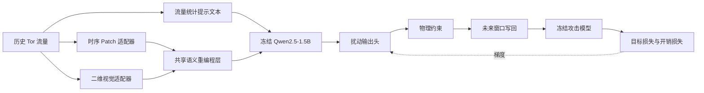

# 第二工作点技术与实现说明

## 1. 文档定位

本文是第二工作点的唯一技术说明，合并并取代原有的技术方案、数据预处理、模块说明、训练链路、真实基模接入、语义对齐和主线实现等分散文档。

第二工作点延续第一工作点的任务边界：数据集、三个攻击模型、物理扰动限制和基本比较口径保持不变，研究变化集中在扰动生成器的输入表示与生成机制。

> **当前主线：** 从 Tor 侧历史流量提取时序、二维结构和文本摘要，通过轻量重编程模块接入冻结 Qwen，生成未来时间与包大小扰动，再由冻结攻击模型提供训练反馈。

## 2. 与第一工作点的关系

第一工作点已经提供：

- DeepCorr300、m-DeepCorr 和 DeepCoFFEA 三个现成攻击模型及 checkpoint；
- DeepCorr 与 DeepCoFFEA 的真实数据组织方式；
- 仅允许增加延迟和填充的物理限制；
- 目标误导损失与时间、大小开销之间的联合优化思路。

第二工作点不重新训练攻击模型，也不通过更换数据或阈值制造表面提升。它要解决的是第一工作点生成器表示能力有限的问题：原始数值序列、二维流量形态与自然语言语义空间之间缺少稳定映射。

## 3. 总体架构



三个输入分支的职责不同：

| 分支 | 输入 | 作用 |
| --- | --- | --- |
| 时序分支 | 原始通道按时间切分的 Patch | 保留局部时间依赖和突发变化 |
| 视觉分支 | `通道 × 时间` 二维张量 | 用小型 2D CNN 提取跨通道局部形态 |
| 文本分支 | 由历史窗口统计量构造的提示文本 | 为冻结语言模型提供任务语义锚点 |

时序和视觉输入属于非文本模态，必须映射到 Qwen 可处理的 embedding 空间；提示文本本身已经处于语言空间，不需要再声称对其执行“跨模态语义对齐”。

## 4. 数据组织

### 4.1 DeepCorr300 与 m-DeepCorr

原始 pickle 样本被恢复为八通道完整流量：

| 通道 | 含义 | 第二工作点是否修改 |
| ---: | --- | --- |
| 0、3 | Tor 侧两个方向的时间信息 | 是 |
| 4、7 | Tor 侧两个方向的大小信息 | 是 |
| 1、2、5、6 | Exit 侧对应通道 | 否 |

生成器只观察 Tor 侧 `[0, 3, 4, 7]` 四个通道。DeepCorr300 使用 `flow_size=300`，m-DeepCorr 使用 `flow_size=700`；两者默认均采用 `seq_len=96`、`pred_len=48`、`stride=48`。

一条 DeepCorr300 流量产生 4 个历史/未来窗口，一条 m-DeepCorr 流量产生 12 个窗口。数据集以“完整流量”为样本单位；所有窗口仅在进入生成器时展平，生成后重新归组并全部写回原流量，再调用一次攻击模型：

```text
一条完整流量
  -> 全部历史窗口
  -> 全部未来扰动
  -> 写回同一条完整流量
  -> 冻结攻击模型反馈
```

这种组织方式避免了把同一条流的窗口当成互不相关样本，也与第一工作点的完整流量反馈边界保持一致。

### 4.2 DeepCoFFEA

DeepCoFFEA 从 session NPZ 中读取真实的：

- `tor_ipds` 与 `tor_sizes`；
- `exit_ipds` 与 `exit_sizes`；
- 会话配对标签。

生成器使用 `seq_len=150`、`pred_len=70`、`patch_len=10`、`stride=70`。攻击模型输入使用真实会话中的 500 包 Tor 窗口和 800 包 Exit 窗口，只在真实会话到达尾部时补零，不再用全零 Exit 流量替代真实配对。

由于 DeepCoFFEA 会话长度不同、窗口数可变，当前采用按窗口在线处理路径；这与 DeepCorr 的固定完整流分组路径是两个明确的数据边界。

## 5. 三类输入的构造

### 5.1 时序 Patch

历史流量形状为 `[B, C, L]`。沿时间轴以 `patch_len` 划分后，每个 Patch 展平为 `C × patch_len`，再通过线性层和 LayerNorm 映射到稳定的 `trainable_width`。

该分支不堆叠大量手工统计量，目的是保留原始局部因果结构。

### 5.2 二维视觉表示

视觉分支直接将历史流量看作单通道图像 `[B, 1, C, L]`，使用两层小型 `Conv2d + GELU` 提取局部特征，然后沿通道高度聚合，并按时间 Patch 汇总。

这是真正可学习的二维处理路径。旧文档中基于 mean、std、max、min 等统计描述子的“伪视觉”路径已从运行样本中删除。

### 5.3 提示文本

提示文本由历史窗口的稳定统计摘要构造，包括非零率、时间均值与变异系数、大小绝对均值与变异系数、突发比例、趋势比例和方向平衡等。

字段名称和顺序固定，数值随样本变化。提示文本描述当前流量状态，但不直接输出攻击判断，也不替代数值分支。

## 6. 语义重编程

主方案 `text_prototypes` 使用可训练权重从冻结 Qwen 词嵌入表中组合语义原型：

$$
E' = \operatorname{softmax}(W)E,
$$

其中 $E$ 是冻结词嵌入表，$W$ 是可训练的原型探测参数，$E'$ 是语义原型库。时序与视觉 token 作为 Query，对原型库执行多头路由，再投影到 Qwen embedding 宽度。

对照模式 `learned_prototypes` 使用完全独立的可训练原型，不从词嵌入表构造。两种模式共用后续 Qwen、宽度桥接与输出头，便于后续做机制消融。

## 7. 冻结 Qwen 的职责

默认骨干是本地 `Qwen2.5-1.5B-Instruct`，使用 FP16 加载。Qwen 参数全部冻结，其职责是：

- 让数值 token 在文本提示提供的语义上下文中发生交互；
- 为时序和视觉 token 提供统一的高维上下文变换；
- 将语义条件传递给未来扰动输出头。

“冻结”只表示参数不更新，不表示切断计算图。攻击损失仍然必须通过 Qwen 的前向运算传播到输入适配器和重编程层。

## 8. 扰动生成与物理约束

输出头对 Qwen 的数值上下文 token 做掩码池化，经两层轻量全连接网络生成 `[B, pred_len, C]` 扰动。

对于生成值 $\delta$，实际写回采用：

$$
x_{adv} = \operatorname{sign}(x)\left(|x| + |\delta|\right).
$$

因此原始方向符号保持不变，延迟或包大小幅度只能增加。`adv_type` 控制实际启用的通道：

| 配置值 | 有效扰动 |
| --- | --- |
| `time` | 仅时间通道 |
| `size` | 仅大小通道 |
| `time_and_size` | 时间与大小联合 |

## 9. 三个冻结攻击模型

| 攻击模型 | 输入适配 | 目标损失 |
| --- | --- | --- |
| DeepCorr300 | 八通道、长度 300 | 目标标签为 0 的 BCE |
| m-DeepCorr | 八通道、长度 700 | 目标标签为 0 的 BCE |
| DeepCoFFEA | Tor 500、Exit 800，双塔 embedding | 将余弦相似度压到 margin 以下的 hinge 损失 |

攻击模型参数全部冻结，但对抗输入上的前向计算保留梯度。原始流量分数在 `no_grad` 下计算，仅用于日志和比较。

## 10. 联合损失

总损失为：

$$
\mathcal{L} = \beta\mathcal{L}_{target}
+ \alpha\mathcal{L}_{time}
+ \gamma\mathcal{L}_{size}.
$$

- $\mathcal{L}_{target}$：降低攻击模型对真实配对的判定能力；
- $\mathcal{L}_{time}$：时间通道扰动相对原始流量的归一化 L2 开销；
- $\mathcal{L}_{size}$：大小通道扰动相对原始流量的归一化 L2 开销。

不同攻击模型使用与第一工作点相衔接的开销权重。正式比较时仍需在相同数据切分、目标模型和指标协议下报告结果。

## 11. 训练与恢复

训练器提供：

- Adam 优化器与梯度裁剪；
- epoch 级指数学习率衰减；
- 基于验证损失的早停；
- `checkpoint_epoch_N.pt`、`latest.pt` 与 `best.pt`；
- 模型、优化器、调度器、最佳损失和早停状态的完整恢复；
- `--resume`、`--evaluate`、`--seed` 命令行覆盖。

checkpoint 只保存 Work2 可训练参数，不重复保存冻结 Qwen 和攻击模型的大权重。

## 12. 当前验证状态

| 检查 | 状态 |
| --- | --- |
| 全部 JSON 配置加载与校验 | 通过 |
| Python 编译检查 | 通过 |
| 本地轻量测试 | 15 项中 13 项通过，2 项因本地无 PyTorch 跳过 |
| 远程测试 | 15/15 通过 |
| 2D 视觉分支反向传播 | 通过 |
| 完整流量多窗口写回与反向传播 | 通过 |
| 两卡 DeepCorr 主线 smoke | 通过 |

smoke 观测到的关键形状为：8 个历史窗口来自 2 条流，生成后写回 2 条 `[8, 300]` 完整目标流量。该结果只证明主线连通，不构成正式防御效果结论。

## 13. 当前边界

以下内容已有配置或接口，但尚未作为正式研究结果执行：

- 完整 DeepCorr300 训练；
- 时间、大小和模块消融；
- m-DeepCorr 与 DeepCoFFEA 正式跨目标比较；
- `10^-3`、`10^-4` 低 FPR 评估；
- 论文表格、图和统计结论。

后续实验应在主线代码稳定后分阶段运行，不能把 smoke 或短程 probe 指标写入论文结论。

## 14. 代码索引

| 路径 | 用途 |
| --- | --- |
| `vista_augur/run_train.py` | 统一训练与评估入口 |
| `vista_augur/second_workpoint/config.py` | 配置结构和合法性校验 |
| `vista_augur/second_workpoint/data/` | 数据恢复、窗口构造和样本接口 |
| `vista_augur/second_workpoint/models/` | Qwen、重编程、生成器和攻击模型适配 |
| `vista_augur/second_workpoint/training/` | 损失、训练、指标和 checkpoint |
| `vista_augur/configs/` | smoke、正式和消融配置 |
| `vista_augur/tests/` | 回归测试 |
