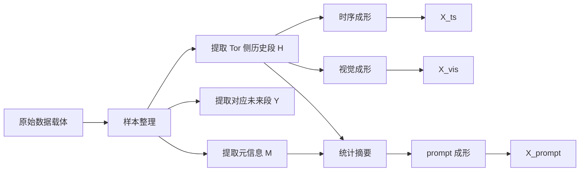
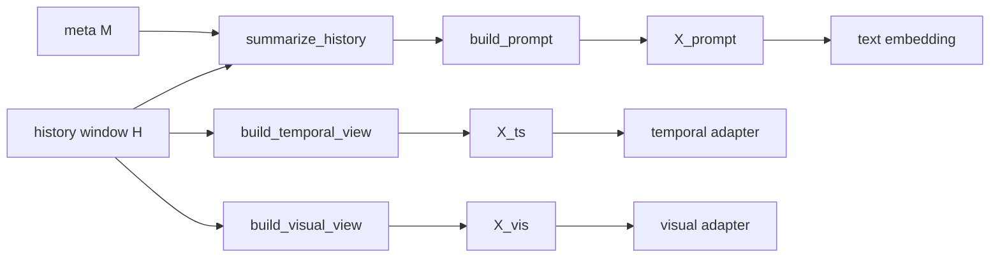

# 第二工作点数据预处理方案

## 快速导航

| 如果你最关心的问题是 | 建议先看 |
| --- | --- |
| 这份文档到底回答什么问题 | `1. 文档边界` |
| 现有数据怎样统一整理成第二工作点的样本单元 | `2. 统一预处理总览` |
| DeepCorr / mDeepCorr 和 DeepCoFFEA 的数据入口差别在哪里 | `3. 数据入口统一` |
| 视觉特征到底怎样从历史流量里提出来 | `4. 视觉特征提取方案` |
| 时序特征是不是还沿用第一工作点的主链路 | `5. 时序特征提取方案` |
| prompt 里到底该写什么，哪些信息能写，哪些不能写 | `6. Prompt 语义特征设计` |
| 三类输入最后以什么形状交给模型 | `7. 预处理输出接口总表` |

> [!IMPORTANT]
> 这份文档只回答一个问题：  
> **从 `datasets/` 下的真实数据出发，怎样整理出第二工作点的三类输入：时序输入、视觉化结构输入、prompt 语义输入。**
>
> 这里的“视觉”不是指生成 PNG、JPEG 之类的图片文件，而是指把同一段历史流量重排成**适合用视觉归纳偏置读取的二维结构视图**。  
> 它**止步于输入成形**，不会展开 Shared Reprogramming Layer 的内部算法，也不会重复训练流程文档中的 loss、冻结策略与反向传播细节。

---

## 1. 文档边界

- 第二工作点没有改变 Augur 的任务定义。它仍然是在相同数据集、相同目标模型和相同评估口径下，根据历史流量生成未来窗口上的可部署扰动。变化的不是任务，而是**输入表示方式**。
- 因此，数据预处理文档的重点不应是“模块名字有哪些”，而应是“同一段历史流量如何被整理成三类输入，并分别承担什么职责”。如果这一层写不清楚，后面的双视图、prompt、重编程和冻结 LLM 都会显得像机械拼接。
- 这份方案所依赖的任务契约已经收敛到当前第二工作点代码：
  - `vista_augur/second_workpoint/data/real_dataset.py`
  - `vista_augur/second_workpoint/data/preprocessing.py`
  - `vista_augur/second_workpoint/models/target_model_adapter.py`
  - `vista_augur/second_workpoint/training/losses.py`
- 第二工作点当前已经明确采用**单阶段端到端联合训练**。但这份文档不讨论训练组织，只讨论训练前端需要怎样构造输入。

### 1.1 本文不做什么

- 不重新定义 DeepCorr / mDeepCorr / DeepCoFFEA 的目标模型输入协议。
- 不把 prompt 写成主要被重编程的对象。
- 不把视觉支路写成一个独立图像任务。
- 不把数据预处理文档扩展成完整模型设计文档。

### 1.2 本文要交付什么

本文最终要固定的是一个统一样本接口：

$$
\mathcal{S} = \{X_{ts}, X_{vis}, X_{prompt}, Y_{future}, M\}
$$

其中：

| 符号 | 含义 |
| --- | --- |
| `X_ts` | 由历史窗口构造出的时序输入 |
| `X_vis` | 由同一历史窗口构造出的视觉化结构输入 |
| `X_prompt` | 由历史窗口统计量和任务元信息构造出的 prompt 语义输入 |
| `Y_future` | 对应的干净未来窗口，用于后续扰动生成与写回 |
| `M` | 元信息，包含数据集类型、通道语义、窗口位置等 |

---

## 2. 统一预处理总览

第二工作点的数据预处理应当按“统一样本单元”来理解，而不是按“哪个模型先吃什么”来理解。无论原始数据来自 DeepCorr / mDeepCorr 还是 DeepCoFFEA，预处理都先做三件事：

1. 从现有数据载体中抽出**生成器真正可见的 Tor 侧历史段**。
2. 把这段历史段分别转换成：
   - 保留因果顺序的时序视图
   - 显式暴露局部结构的视觉化结构视图
   - 提供语言锚点的 prompt 视图
3. 保留对应未来段和元信息，以便后续扰动写回和目标模型评估。

### 2.1 统一主流程



### 2.2 统一样本单元

为了让第二工作点的代码对两类数据集保持一致，建议在数据层先统一成下面这个概念：

```text
canonical sample
├── history_window      H        生成器唯一可见的历史段
├── clean_future        Y        与历史段对应的未来段
├── dataset_type        d        DeepCorr / mDeepCorr / DeepCoFFEA
├── channel_schema      c        当前样本的通道语义
├── window_meta         m        窗口位置、长度、统计摘要等
└── raw_carrier         r        原始 flow 或 session，供后续写回
```

其数学形式可以写成：

$$
H \in \mathbb{R}^{C \times L_h}, \qquad
Y \in \mathbb{R}^{C \times L_f}
$$

其中：

- `C` 是生成器真正处理的通道数。
- `L_h = seq_len`
- `L_f = pred_len`

对第二工作点来说，真正重要的不是原始数据最开始长什么样，而是**预处理之后必须稳定得到这一对 `H` 和 `Y`**。

### 2.3 三类输入各自的职责

| 输入 | 来自哪里 | 主要保留什么 | 明确不承担什么 |
| --- | --- | --- | --- |
| `X_ts` | 历史窗口 `H` | 因果顺序、局部动态、窗口连续性 | 不负责跨模态语义对齐 |
| `X_vis` | 同一历史窗口 `H` | 局部纹理、边界变化、密度轮廓 | 不替代时序主链路；不等于生成图像文件 |
| `X_prompt` | `H` 的摘要统计 + 元信息 `M` | 语言锚点、任务约束、输入解释 | 不承担主要重编程职责 |

---

## 3. 数据入口统一

这一节的目标不是重复数据集介绍，而是回答：**两套原始数据怎样被统一转换成第二工作点的历史段 `H` 与未来段 `Y`。**

### 3.1 DeepCorr / mDeepCorr

DeepCorr / mDeepCorr 的原始样本最终会被整理成一个固定长度流量张量：

$$
F \in \mathbb{R}^{8 \times \texttt{flow\_size}}
$$

其中 8 个通道的构造方式在现有代码里已经固定。第二工作点不应重写这个协议，而应直接沿用它。

#### 3.1.1 8 通道语义

| 索引 | 侧别 | 方向 | 特征 |
| --- | --- | --- | --- |
| `0` | `here` | `<-` | time |
| `1` | `there` | `->` | time |
| `2` | `there` | `<-` | time |
| `3` | `here` | `->` | time |
| `4` | `here` | `<-` | size |
| `5` | `there` | `->` | size |
| `6` | `there` | `<-` | size |
| `7` | `here` | `->` | size |

第二工作点的生成器前端只能使用 Tor 侧有效通道：

$$
\texttt{row}_{tor} = [0, 3, 4, 7]
$$

这一步不能写错。  
`8` 通道 flow 是整体整理结果，但生成器真正可见的历史段只取 Tor 侧这 `4` 个通道。

#### 3.1.2 数值尺度

现有代码已经做了一个重要的尺度对齐：

- 时间通道乘 `1000`，把秒级值转成毫秒尺度。
- 大小通道除 `1000`，把字节级值压缩到 KB 量级附近。

因此第二工作点默认不再引入额外的全局重标定，只做**继承式尺度对齐**。这样可以保持与第一工作点的公平性。

#### 3.1.3 历史段与未来段切分

从 Tor 侧 `4` 通道流量中取出：

$$
F_{tor} = F[[0,3,4,7], :] \in \mathbb{R}^{4 \times \texttt{flow\_size}}
$$

然后按滑窗切出历史段与未来段：

$$
H_i = F_{tor}[:, s_i:s_i+\texttt{seq\_len}]
$$

$$
Y_i = F_{tor}[:, s_i+\texttt{seq\_len}:s_i+\texttt{seq\_len}+\texttt{pred\_len}]
$$

其中：

$$
s_i = i \cdot \texttt{stride}
$$

默认参数如下：

| 数据集 | `flow_size` | `seq_len` | `pred_len` | `patch_len` | `stride` |
| --- | ---: | ---: | ---: | ---: | ---: |
| DeepCorr300 | `300` | `96` | `48` | `4` | `48` |
| mDeepCorr | `700` | `96` | `48` | `4` | `48` |

对 DeepCorr300：

$$
\texttt{batch\_num} = \left\lfloor \frac{300-96-48}{48} \right\rfloor + 1 = 4
$$

因此单条样本会形成：

```text
4 个 history 窗口 + 4 个 future 窗口
```

对 mDeepCorr，只是 `flow_size` 更长，切分方式不变。

### 3.2 DeepCoFFEA

DeepCoFFEA 与 DeepCorr 系列的关键差别不在于目标不同，而在于**原始载体不同**。

- DeepCorr / mDeepCorr：原始载体更像固定长度 flow tensor。
- DeepCoFFEA：原始载体分成两套：
  - `window-level npz`
  - `session-level npz`

#### 3.2.1 哪套数据用于第二工作点预处理

第二工作点的数据预处理必须明确：

- **生成器前端输入来自 Tor 侧 session 级数据。**
- **目标模型评估仍依赖窗口级数据组织。**

也就是说，DeepCoFFEA 不能只写 `window npz`，也不能只写 `session npz`。两者是不同阶段的载体：

| 载体 | 用途 |
| --- | --- |
| `session npz` | 构造生成器历史段 `H` 与未来段 `Y` |
| `window npz` | 保持目标模型侧的窗口协议不变 |

#### 3.2.2 原始 Tor session 形式

从 session 级文件中取出 Tor 侧两条序列：

$$
U = \begin{bmatrix}
\text{IPD} \\
\text{SIZE}
\end{bmatrix}
\in \mathbb{R}^{2 \times T}
$$

这里：

- `IPD` 是包间隔序列。
- `SIZE` 是大小序列，方向信息通过符号或数据组织保留。

#### 3.2.3 历史段与未来段切分

对每个 session 按滑窗切分：

$$
H_i = U[:, s_i:s_i+\texttt{seq\_len}]
$$

$$
Y_i = U[:, s_i+\texttt{seq\_len}:s_i+\texttt{seq\_len}+\texttt{pred\_len}]
$$

默认参数如下：

| 数据集 | `seq_len` | `pred_len` | `patch_len` | `stride` | `enc_in` |
| --- | ---: | ---: | ---: | ---: | ---: |
| DeepCoFFEA | `150` | `70` | `10` | `70` | `2` |

因此 DeepCoFFEA 的 canonical history/future 形状为：

$$
H_i \in \mathbb{R}^{2 \times 150}, \qquad
Y_i \in \mathbb{R}^{2 \times 70}
$$

#### 3.2.4 边界处理

DeepCoFFEA 的 session 长度不固定，因此这里必须明确两条规则：

1. 历史段 `H` 必须始终是完整窗口，不允许用未来值补历史。
2. 如果 session 尾部未来段 `Y` 不足 `pred_len`，可以只对 `Y` 做零填充对齐，**不能对 `H` 造假补齐**。

### 3.3 两类数据入口的统一视角

| 维度 | DeepCorr / mDeepCorr | DeepCoFFEA |
| --- | --- | --- |
| 原始载体 | 固定长度 `8 x flow_size` flow | 变长 `2 x T` Tor session + window npz |
| 生成器真实可见部分 | Tor 侧 `4` 通道 `[0,3,4,7]` | Tor 侧 `2` 通道 `[IPD, SIZE]` |
| 历史段形状 | `[4, seq_len]` | `[2, seq_len]` |
| 未来段形状 | `[4, pred_len]` | `[2, pred_len]` |
| 方向信息承载方式 | 通道身份本身 | 主要由大小符号 / 序列结构承载 |
| 预处理主任务 | 从 flow 中抽 Tor 历史段 | 从 session 中抽 Tor 历史段 |

---

## 4. 视觉特征提取方案

这一节回答的问题是：**如何从同一个历史段 `H` 中构造出视觉化结构输入 `X_vis`，让它显式暴露局部结构，而不引入一个沉重的视觉主干。**

先明确术语边界：这里的“视觉”是**表示方式**，不是**文件类型**。我们并不会把流量真的保存成图片再送进图像模型，而是把 `channel x time` 的历史窗口整理成一个二维张量，让“邻近位置共同决定局部纹理/边界”的结构更清楚。换句话说，它更接近“视觉化表征”或“二维结构视图”，只是为了简洁，沿用 `X_vis` 这个名字。

### 4.1 设计原则

- 视觉视图不是新模态采集，也不是外部图像输入，而是对历史流量窗口的**结构显式化重表示**。
- 默认主方案应是轻量的，不能把第二工作点写成“再加一个 CNN / ViT”。
- 视觉分支只负责暴露局部纹理、边界变化和密度轮廓，不替代时序主链路。

### 4.2 默认主方案：Channel-Time Texture Map + Patch Descriptor

推荐把视觉特征提取拆成两步：

1. 先构造一个中间视觉图：

$$
T_{vis} \in \mathbb{R}^{3 \times C \times L_h}
$$

2. 再把它按 patch 聚合成轻量视觉描述序列：

$$
X_{vis} \in \mathbb{R}^{N_p \times 6C}
$$

其中：

- `3` 是三类中间纹理平面。
- `C` 是有效通道数。
- `L_h = seq_len`
- `N_p = seq_len / patch_len`
- `6C` 来自每个通道的 6 维局部统计描述。

### 4.3 第一步：构造中间视觉图 `T_vis`

对历史段 `H` 的每个通道先做稳健归一化：

$$
\tilde{H}_{c,t} =
\operatorname{clip}
\left(
\frac{H_{c,t} - \operatorname{median}(H_c)}
{\operatorname{MAD}(H_c) + \epsilon},
-r, r
\right)
$$

这里推荐：

- `epsilon = 1e-6`
- `r = 5`

然后从同一个历史段构造三个平面：

#### 平面 1：幅值平面

$$
A_{c,t} = \tilde{H}_{c,t}
$$

它保留窗口内部的相对强弱分布。

#### 平面 2：梯度平面

$$
G_{c,t} = \tilde{H}_{c,t} - \tilde{H}_{c,t-1}
$$

边界点可以零填充或复制首点。  
它显式暴露局部跳变、包密度突变和方向切换邻域。

#### 平面 3：局部密度平面

$$
D_{c,t} = \operatorname{AvgPool}\left(\left|\tilde{H}_{c,:}\right|, k=\texttt{patch\_len}\right)_t
$$

它刻画窗口中局部能量和活动密度。

于是：

$$
T_{vis} = \operatorname{stack}(A, G, D)
$$

### 4.4 第二步：把视觉图压成 patch 级描述 `X_vis`

仅有中间视觉图还不够。第二工作点的视觉支路应最终输出一串轻量 patch 描述，便于后续线性视觉 adapter 使用。

对每个 patch `i` 和每个通道 `c`，在对应区间上抽取 6 个统计量：

1. `mean`
2. `std`
3. `max`
4. `min`
5. `grad_energy = mean(|G|)`
6. `density_mean = mean(D)`

于是第 `i` 个 patch 的视觉描述向量定义为：

$$
x^{vis}_i
=
\operatorname{concat}_{c=1}^{C}
\left[
\mu(A_{c,i}),
\sigma(A_{c,i}),
\max(A_{c,i}),
\min(A_{c,i}),
\mu(|G_{c,i}|),
\mu(D_{c,i})
\right]
$$

最终：

$$
X_{vis} = [x^{vis}_1, x^{vis}_2, \dots, x^{vis}_{N_p}]
$$

### 4.5 两类数据集上的落地

#### DeepCorr / mDeepCorr

历史段：

$$
H \in \mathbb{R}^{4 \times 96}
$$

默认 `patch_len=4`，所以：

$$
N_p = 96 / 4 = 24
$$

每个 patch 的视觉向量维度为：

$$
6C = 6 \times 4 = 24
$$

因此：

$$
X_{vis}^{dc} \in \mathbb{R}^{24 \times 24}
$$

#### DeepCoFFEA

历史段：

$$
H \in \mathbb{R}^{2 \times 150}
$$

默认 `patch_len=10`，所以：

$$
N_p = 150 / 10 = 15
$$

每个 patch 的视觉向量维度为：

$$
6C = 6 \times 2 = 12
$$

因此：

$$
X_{vis}^{dcf} \in \mathbb{R}^{15 \times 12}
$$

### 4.6 为什么默认不选 RP / GAF

| 方案 | 是否默认采用 | 原因 |
| --- | --- | --- |
| Channel-Time Texture Map | 是 | 直接来自历史窗口，物理语义清晰，额外计算低 |
| Recurrence Plot | 否，作为消融 | 结构上更重，且更容易引入与主链路脱节的相似性偏置 |
| Gramian Angular Field | 否，作为消融 | 对归一化和角度映射敏感，不适合作为主方案 |

### 4.7 视觉特征提取伪代码

```python
def build_visual_view(history_window, patch_len):
    """
    从历史窗口中提取视觉增强输入。

    参数
    ----
    history_window : Tensor
        历史窗口，形状为 [C, L]。
    patch_len : int
        patch 长度。

    返回
    ----
    texture_map : Tensor
        中间视觉图，形状为 [3, C, L]。
    visual_tokens : Tensor
        patch 级视觉描述序列，形状为 [N_p, 6*C]。
    """
    normed = robust_norm(history_window)
    amplitude = normed
    gradient = temporal_diff(normed)
    density = avg_pool_abs(normed, kernel=patch_len)

    texture_map = stack([amplitude, gradient, density], dim=0)

    visual_tokens = []
    for patch in split_by_patch(texture_map, patch_len):
        token = []
        for channel_patch in patch_channels(patch):
            token.extend([
                mean(channel_patch.amplitude),
                std(channel_patch.amplitude),
                max(channel_patch.amplitude),
                min(channel_patch.amplitude),
                mean(abs(channel_patch.gradient)),
                mean(channel_patch.density),
            ])
        visual_tokens.append(token)

    return texture_map, tensor(visual_tokens)
```

---

## 5. 时序特征提取方案

这一节回答的问题是：**时序输入 `X_ts` 到底提取什么，提取到什么程度为止。**

第二工作点的时序支路不应该写成一个重手工特征工程模块。它的职责是守住第一工作点已经成立的主逻辑：**历史窗口中的因果顺序必须被完整保留。**

### 5.1 默认原则：少做统计改写，保留原始因果 patch

推荐的默认时序预处理只做四步：

1. 选择生成器真正可见的有效通道。
2. 沿用现有尺度对齐，不额外篡改数值语义。
3. 从历史段 `H` 中按 `patch_len` 切块。
4. 直接把每个 patch 展平为 token 级输入。

因此，时序特征的核心不是“把统计量堆得很满”，而是：

> **把真实历史窗稳定变成一串保留顺序的 causal patch token。**

### 5.2 时序输入定义

对历史段：

$$
H \in \mathbb{R}^{C \times L_h}
$$

按 `patch_len = p` 切分：

$$
P_i = H[:, ip:(i+1)p], \qquad i = 0,1,\dots,N_p-1
$$

每个 patch 直接展平为时序 token：

$$
x^{ts}_i = \operatorname{vec}(P_i) \in \mathbb{R}^{Cp}
$$

最终：

$$
X_{ts} = [x^{ts}_1, x^{ts}_2, \dots, x^{ts}_{N_p}]
$$

### 5.3 两类数据集上的落地

#### DeepCorr / mDeepCorr

$$
H \in \mathbb{R}^{4 \times 96}, \qquad p = 4
$$

所以：

$$
N_p = 96 / 4 = 24
$$

每个时序 token 的维度为：

$$
Cp = 4 \times 4 = 16
$$

因此：

$$
X_{ts}^{dc} \in \mathbb{R}^{24 \times 16}
$$

#### DeepCoFFEA

$$
H \in \mathbb{R}^{2 \times 150}, \qquad p = 10
$$

所以：

$$
N_p = 150 / 10 = 15
$$

每个时序 token 的维度为：

$$
Cp = 2 \times 10 = 20
$$

因此：

$$
X_{ts}^{dcf} \in \mathbb{R}^{15 \times 20}
$$

### 5.4 为什么不把大量手工统计拼进 `X_ts`

这是第二工作点预处理里一个容易写偏的地方。

- 如果把大量统计量直接拼进时序 token，时序主链路会逐渐从“保留真实历史顺序”变成“消费一堆手工摘要向量”。
- 这样做虽然看起来更“特征工程”，但反而会削弱第二工作点与第一工作点之间最关键的连续性。
- 统计摘要确实有价值，但它更适合作为：
  - 视觉支路的局部结构描述
  - prompt 的语义锚点内容

因此，这里建议把时序支路保持成**最轻的 causal patch 输入**，不要在预处理阶段把它写成一个重统计分支。

### 5.5 时序特征提取伪代码

```python
def build_temporal_view(history_window, patch_len):
    """
    从历史窗口中提取时序输入。

    参数
    ----
    history_window : Tensor
        历史窗口，形状为 [C, L]。
    patch_len : int
        patch 长度。

    返回
    ----
    temporal_tokens : Tensor
        时序 patch 序列，形状为 [N_p, C*patch_len]。
    """
    temporal_tokens = []
    for patch in split_by_patch(history_window, patch_len):
        temporal_tokens.append(flatten(patch))
    return tensor(temporal_tokens)
```

---

## 6. Prompt 语义特征设计

这一节回答的问题是：**prompt 从哪里来，包含什么信息，为什么它是语义锚点而不是主要被重编程的对象。**

### 6.1 prompt 的角色边界

- prompt 本身已经处在语言空间里，因此它不应被描述成主要需要“对齐”的对象。
- prompt 的职责是给冻结 LLM 提供一个稳定参考系，告诉它：
  - 当前输入来自哪类流量
  - 当前窗口代表什么
  - 系统要预测什么
  - 输出必须满足哪些物理约束

更准确地说：

> prompt 提供的是语义锚点，  
> 时序视图和视觉视图才是主要被重编程到语言兼容空间中的对象。

### 6.2 prompt 的信息来源

prompt 必须只来自两类信息：

1. **历史窗口 `H` 的统计摘要**
2. **不泄漏未来的元信息 `M`**

严格不能写入：

- 未来段 `Y_future` 的真实值
- 目标模型输出
- 扰动后结果
- 任何需要看见未来才能得到的指标

### 6.3 推荐 prompt 结构

建议采用**短模板、固定字段、数值槽位**的方式，而不是自由文本长段落。

默认推荐的 prompt 由四层组成：

1. **任务锚点**
2. **数据集与通道说明**
3. **窗口摘要**
4. **约束说明**

其通用模板可以写成：

```text
Task: generate future perturbation from tor-side history.
Dataset: {dataset_name}
Schema: {channel_schema}
History length: {seq_len}; Predict length: {pred_len}
Summary: {summary_fields}
Constraint: future-only; nonnegative-delay; nonnegative-padding.
```

### 6.4 为什么推荐固定英文字段标签

这一点需要明确说明，不然实现时容易随意漂移。

- prompt 的作用不是自然语言对话，而是稳定语义锚点。
- 与长篇中文描述相比，**短英文字段标签 + 数值槽位**更容易保持模板一致性。
- 如果后续骨干固定为双语能力较好的模型，也可以做中英混合 prompt 的消融；但默认主实验最好保持一种稳定模板，不要在同一组实验里来回切换语言风格。

因此，建议：

- **文档解释用中文**
- **模型输入模板默认用固定英文字段标签**

### 6.5 建议写入 prompt 的动态摘要字段

推荐字段如下：

| 字段 | 含义 | 来源 |
| --- | --- | --- |
| `nonzero_rate` | 窗口内非零活动密度 | 历史窗口 |
| `time_mean` | 时间相关通道平均强度 | 历史窗口 |
| `time_cv` | 时间相关通道变异系数 | 历史窗口 |
| `size_mean_abs` | 大小通道绝对值均值 | 历史窗口 |
| `size_cv` | 大小通道变异系数 | 历史窗口 |
| `burst_ratio` | 局部 burst 强度 | 历史窗口 |
| `trend_ratio` | 后半段 / 前半段活跃度比值 | 历史窗口 |
| `dir_balance` | 方向平衡度 | 历史窗口 + 通道语义 |

其中：

#### 非零率

$$
\texttt{nonzero\_rate}
=
\frac{\#\{(c,t)\mid H_{c,t}\neq 0\}}{C \cdot L_h}
$$

#### 趋势比

$$
\texttt{trend\_ratio}
=
\frac{\operatorname{mean}(|H[:, L_h/2:L_h]|)}
{\operatorname{mean}(|H[:, 0:L_h/2]|)+\epsilon}
$$

#### burst 比

可以定义为局部峰值密度与全局均值的比值，例如：

$$
\texttt{burst\_ratio}
=
\frac{\operatorname{mean}(\text{TopK}(|H|))}
{\operatorname{mean}(|H|)+\epsilon}
$$

### 6.6 DeepCorr / mDeepCorr 的 prompt 设计

对 DeepCorr / mDeepCorr，方向信息主要由**通道身份**提供，因此建议 prompt 明确写出 4 通道语义：

```text
Task: generate future perturbation from tor-side history.
Dataset: DeepCorr300
Schema: in_time, out_time, in_size, out_size
History length: 96; Predict length: 48
Summary: nonzero_rate={...}; time_cv={...}; size_cv={...};
burst_ratio={...}; trend_ratio={...}; dir_balance={...}
Constraint: future-only; nonnegative-delay; nonnegative-padding.
```

其中 `dir_balance` 推荐按入/出方向的总活动量比值构造：

$$
\texttt{dir\_balance}
=
\frac{\|H_{in}\|_1}{\|H_{out}\|_1+\epsilon}
$$

这里：

- `H_in` 对应 `in_time + in_size`
- `H_out` 对应 `out_time + out_size`

### 6.7 DeepCoFFEA 的 prompt 设计

对 DeepCoFFEA，方向信息不像 DeepCorr 那样由分开的 4 个通道天然给出，因此 prompt 必须更明确指出当前样本是：

- Tor-side session history
- feature schema = `ipd, signed_size`

推荐模板：

```text
Task: generate future perturbation from tor-side session history.
Dataset: DeepCoFFEA
Schema: ipd, signed_size
History length: 150; Predict length: 70
Summary: nonzero_rate={...}; ipd_mean={...}; ipd_cv={...};
size_mean_abs={...}; size_cv={...}; burst_ratio={...}; trend_ratio={...}
Constraint: future-only; nonnegative-delay; nonnegative-padding.
```

这里的 `dir_balance` 不再按独立通道求，而按 signed size 的正负比例求：

$$
\texttt{dir\_balance}
=
\frac{\sum \mathbf{1}(SIZE_t > 0)}
{\sum \mathbf{1}(SIZE_t < 0)+\epsilon}
$$

### 6.8 prompt 字段字典

| 字段 | DeepCorr / mDeepCorr | DeepCoFFEA |
| --- | --- | --- |
| `dataset_name` | `DeepCorr300` / `mDeepCorr` | `DeepCoFFEA` |
| `channel_schema` | `in_time, out_time, in_size, out_size` | `ipd, signed_size` |
| `history_len` | `96` | `150` |
| `predict_len` | `48` | `70` |
| `dir_balance` 来源 | 入/出方向通道能量比 | signed size 正负比例 |
| 窗口载体 | fixed flow window | Tor session window |

### 6.9 prompt 构造伪代码

```python
def build_prompt(history_window, dataset_type, meta):
    """
    基于历史窗口统计量和元信息构造语义锚点 prompt。

    参数
    ----
    history_window : Tensor
        历史窗口，形状为 [C, L]。
    dataset_type : str
        数据集类型。
    meta : dict
        元信息，如 seq_len、pred_len、通道语义等。

    返回
    ----
    prompt_text : str
        固定模板 prompt。
    """
    stats = summarize_history(history_window, dataset_type)

    if dataset_type in {"DeepCorr300", "mDeepCorr"}:
        schema = "in_time, out_time, in_size, out_size"
    else:
        schema = "ipd, signed_size"

    prompt_text = (
        f"Task: generate future perturbation from tor-side history. "
        f"Dataset: {dataset_type}. "
        f"Schema: {schema}. "
        f"History length: {meta['seq_len']}; Predict length: {meta['pred_len']}. "
        f"Summary: nonzero_rate={stats['nonzero_rate']:.3f}; "
        f"time_cv={stats['time_cv']:.3f}; size_cv={stats['size_cv']:.3f}; "
        f"burst_ratio={stats['burst_ratio']:.3f}; trend_ratio={stats['trend_ratio']:.3f}; "
        f"dir_balance={stats['dir_balance']:.3f}. "
        f"Constraint: future-only; nonnegative-delay; nonnegative-padding."
    )
    return prompt_text
```

---

## 7. 预处理输出接口总表

当前文档到这里为止，就应当收束成一个稳定输入接口，而不是继续展开 Shared Reprogramming Layer 或训练流程。

### 7.1 三类输入最后长什么样

| 名称 | DeepCorr / mDeepCorr | DeepCoFFEA | 去向 |
| --- | --- | --- | --- |
| `X_ts` | `[24, 16]` | `[15, 20]` | 时序线性 adapter -> 共享重编程 |
| `X_vis` | `[24, 24]` | `[15, 12]` | 视觉线性 adapter -> 共享重编程 |
| `X_prompt` | 固定模板文本 / token ids | 固定模板文本 / token ids | 文本嵌入层，直接作为语义锚点 |
| `Y_future` | `[4, 48]` | `[2, 70]` | 后续扰动生成与写回目标 |
| `M` | 数据集名、窗口位置、通道语义等 | 数据集名、session 信息、窗口位置等 | 辅助记录与调试 |

### 7.2 接口边界图



这里必须明确一条边界：

> 只有 `X_ts` 和 `X_vis` 是主要的非文本输入成形结果。  
> `X_prompt` 是语言锚点，直接进入文本嵌入路径，而不是被当成主要重编程对象。

---

## 8. 面向实现者的最小检查表

- 是否沿用了现有数据集与既有切分协议，而不是新造数据来源。
- 是否把 DeepCorr / mDeepCorr 的有效 Tor 通道明确固定为 `[0, 3, 4, 7]`。
- 是否在 DeepCoFFEA 中明确区分了 `session npz` 与 `window npz` 的不同作用。
- 是否保证 prompt 只来自历史窗口和元信息，没有未来泄漏。
- 是否把视觉支路写成“历史段的结构显式化”，而不是独立图像任务。
- 是否把时序支路保持为轻量 causal patch 输入，而不是重统计分支。
- 是否在文档与实现里都明确：预处理到 `X_ts / X_vis / X_prompt` 为止，后续 Shared Reprogramming 和训练流程另有文档负责。

---

## 9. 一句话总结

第二工作点的数据预处理不是重新发明一套新数据协议，而是把 `datasets/` 中的真实历史流量稳定整理成三类彼此分工明确的输入：

- `X_ts` 守住因果顺序，
- `X_vis` 显式暴露局部结构，
- `X_prompt` 提供语言语义锚点。

只要这三类输入的来源、边界和形状写清楚，第二工作点后面的重编程、冻结 LLM 和未来扰动生成才会有一个稳固的数据前端。
