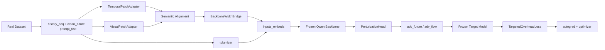

# 第二工作点运行与迁移手册

## 快速说明

> [!IMPORTANT]
> 这份手册描述的是 `vista_augur/second_workpoint/` 当前**唯一保留**的真实训练主线。
>
> 当前代码不再支持 stub，也不再存在 `numpy_stub` 后端。你现在实际运行的是：
>
> - 真实数据加载
> - 冻结 Hugging Face Qwen backbone
> - 冻结真实 target model
> - `torch_real` 训练闭环

## 阅读路径

如果你现在最关心的是：

| 目标 | 先看 |
| --- | --- |
| 我今天就要把项目跑起来 | `1. 先跑起来` |
| 每个配置参数到底是什么意思 | `4. 配置参数总表` |
| 我想迁移到 4090 / 更大基模 | `6. 常见迁移方案` |
| 我想新增一个自己的配置 | `5. 如何新建配置文件` |
| 跑不起来时先排查什么 | `8. 常见问题与排查` |

---

## 1. 先跑起来

这一节只回答一个问题：在当前仓库里，**最短路径**怎样把第二工作点跑起来。

### 1.1 运行前提

你至少需要准备好下面四件事：

| 项目 | 说明 |
| --- | --- |
| Python 环境 | 当前推荐直接用 `deepcorr` 环境 |
| 基模 | 本地可访问的 `Qwen2.5-3B-Instruct` |
| target 权重 | `target_model/` 目录下已有的 DeepCorr / DeepCoFFEA 权重 |
| 数据集 | `datasets/deepcorr/` 或 `datasets/deepcoffea/` 下的真实数据文件 |

### 1.2 当前默认运行命令

从仓库根目录 `/home/nixilin/work2` 执行：

```bash
cd /home/nixilin/work2
PYTHONPATH=/home/nixilin/work2/vista_augur \
/home/nixilin/anaconda3/envs/deepcorr/bin/python \
vista_augur/run_train.py \
  --config /home/nixilin/work2/vista_augur/configs/second_workpoint_deepcorr300_torch_real_smoke.json
```

这条命令对应的是：

- 数据集：`DeepCorr300`
- 语义对齐：`text_prototypes`
- backbone：本地 `Qwen2.5-3B-Instruct`
- target：真实 `DeepCorr300`
- 目的：跑通最小真实训练链路

### 1.3 另外两份保留配置

#### `learned_prototypes` 对照配置

```bash
cd /home/nixilin/work2
PYTHONPATH=/home/nixilin/work2/vista_augur \
/home/nixilin/anaconda3/envs/deepcorr/bin/python \
vista_augur/run_train.py \
  --config /home/nixilin/work2/vista_augur/configs/second_workpoint_deepcorr300_torch_real_smoke_learned.json
```

用途：

- 验证旧的自由原型版本仍然可跑
- 做 `text_prototypes` 的对照实验

#### `DeepCoFFEA` smoke 配置

```bash
cd /home/nixilin/work2
PYTHONPATH=/home/nixilin/work2/vista_augur \
/home/nixilin/anaconda3/envs/deepcorr/bin/python \
vista_augur/run_train.py \
  --config /home/nixilin/work2/vista_augur/configs/second_workpoint_deepcoffea_real_smoke.json
```

用途：

- 验证第二工作点在 `DeepCoFFEA` 数据组织上的兼容性

### 1.4 成功运行后会产出什么

训练输出默认写到：

- `vista_augur/outputs/checkpoints/<setting_name>/`

一个最小训练 run 里通常会看到：

| 文件 | 含义 |
| --- | --- |
| `checkpoint_epoch_1.json` | 该 epoch 的配置快照 + train/eval 摘要 |
| `checkpoint_epoch_1.pt` | trainable state + optimizer state |
| `train_summary.json` | 整个 run 的最终摘要 |

---

## 2. 这条训练链路到底在跑什么

这一节先把系统的基本逻辑说清楚，再进入参数细节。因为如果不先知道链路结构，只看参数表会很难判断哪些参数是关键的。



### 2.1 训练对象是什么

当前真正被训练的模块只有 generator 侧的小模块：

- `TemporalPatchAdapter`
- `VisualPatchAdapter`
- `SharedReprogrammingLayer`
- `BackboneWidthBridge`
- `PerturbationHead`

### 2.2 冻结对象是什么

下面两个对象都是冻结的：

- Hugging Face Qwen backbone
- DeepCorr / DeepCoFFEA target model

这里“冻结”的意思只是参数不更新，并不意味着它们被排除在计算图之外。梯度仍然会穿过它们回到 generator 侧。

### 2.3 当前支持的两种语义对齐模式

| 模式 | 作用 | 推荐用途 |
| --- | --- | --- |
| `text_prototypes` | 用预训练 embedding 构造语义原型，贴近 Time-LLM | 默认主方案 |
| `learned_prototypes` | 原型本身自由学习 | 对照 / 消融 |

---

## 3. 当前目录里哪些文件是关键的

如果你后面要改代码，这个文件索引会比全文搜索更省时间。

### 3.1 入口与配置

| 文件 | 作用 |
| --- | --- |
| [run_train.py](/home/nixilin/work2/vista_augur/run_train.py:1) | 唯一训练入口 |
| [config.py](/home/nixilin/work2/vista_augur/second_workpoint/config.py:1) | 所有配置字段和校验逻辑 |
| [configs/second_workpoint_deepcorr300_torch_real_smoke.json](/home/nixilin/work2/vista_augur/configs/second_workpoint_deepcorr300_torch_real_smoke.json:1) | 默认 smoke 配置 |

### 3.2 数据层

| 文件 | 作用 |
| --- | --- |
| [real_dataset.py](/home/nixilin/work2/vista_augur/second_workpoint/data/real_dataset.py:1) | `DeepCorr300` / `DeepCoFFEA` 数据集实现 |
| [preprocessing.py](/home/nixilin/work2/vista_augur/second_workpoint/data/preprocessing.py:1) | prompt 文本构造、窗口切分、视图构造 |
| [factory.py](/home/nixilin/work2/vista_augur/second_workpoint/data/factory.py:1) | 按 `data` 选择具体数据集 |

### 3.3 模型层

| 文件 | 作用 |
| --- | --- |
| [torch_real_model.py](/home/nixilin/work2/vista_augur/second_workpoint/models/torch_real_model.py:1) | generator 侧真实主模型 |
| [qwen_backbone.py](/home/nixilin/work2/vista_augur/second_workpoint/models/qwen_backbone.py:1) | 冻结 Qwen 加载与 `inputs_embeds` 路径 |
| [target_model_adapter.py](/home/nixilin/work2/vista_augur/second_workpoint/models/target_model_adapter.py:1) | 真实 target model 加载与流量形状适配 |

### 3.4 训练层

| 文件 | 作用 |
| --- | --- |
| [trainer.py](/home/nixilin/work2/vista_augur/second_workpoint/training/trainer.py:1) | dataloader、forward、writeback、optimizer、checkpoint |
| [losses.py](/home/nixilin/work2/vista_augur/second_workpoint/training/losses.py:1) | 目标误导 + 时间/大小开销约束 |

---

## 4. 配置参数总表

这一节按“功能分组”解释 `ExperimentConfig` 里的所有字段。为了避免参数表变成无意义的字段堆积，我额外加了一列“当前状态”。

- `核心`：当前真实主线真正依赖
- `常用`：实验中经常会改
- `兼容`：保留为了和第一工作点基线命名连续，但当前影响较弱

### 4.1 任务身份与入口参数

| 参数 | 默认值 | 当前状态 | 定义 |
| --- | --- | --- | --- |
| `random_seed` | `2025` | 核心 | 随机种子，影响数据切分、训练顺序和初始化。 |
| `is_training` | `1` | 核心 | `1` 表示训练，`0` 表示只跑 `evaluate()`。 |
| `model_id` | `second_workpoint_torch_real` | 常用 | 运行名的一部分，建议每个实验改成有辨识度的名字。 |
| `model` | `SecondWorkpointTorchRealModel` | 核心 | 当前唯一支持的主模型类名。通常不需要改。 |
| `adv_type` | `time_and_size` | 兼容 | 标记攻击类型，目前主要用于与旧工程命名保持连续。 |
| `backend` | `torch_real` | 核心 | 当前唯一允许值。不要改。 |

### 4.2 Target model 参数

| 参数 | 默认值 | 当前状态 | 定义 |
| --- | --- | --- | --- |
| `target_model` | `Deepcorr300` | 核心 | 选择目标反馈模型，支持 `Deepcorr100`、`Deepcorr300`、`Deepcorr700`、`mDeepcorr`、`Deepcoffea`。 |
| `target_model_mode` | `torch` | 核心 | 当前唯一允许值，表示加载真实 torch target model。 |
| `target_model_root` | `target_model` | 核心 | 目标模型代码根目录。通常保持默认。 |
| `target_model_path` | `""` | 常用 | 目标模型权重路径。留空时走适配器内部默认路径；显式填写时优先使用显式路径。 |
| `target_model_dropout` | `0.0` | 常用 | DeepCorr forward 时传入的 dropout，默认建议保持 `0.0`。 |
| `deepcoffea_tor_len` | `500` | 核心 | `DeepCoFFEA` target 侧 Tor 输入期望长度。只在 `Deepcoffea` 时有效。 |
| `deepcoffea_exit_len` | `800` | 核心 | `DeepCoFFEA` target 侧 exit 输入期望长度。只在 `Deepcoffea` 时有效。 |
| `deepcoffea_missing_exit_policy` | `zero` | 核心 | `DeepCoFFEA` 当前只支持缺失 exit 输入时补零。 |

### 4.3 Backbone 与语义对齐参数

| 参数 | 默认值 | 当前状态 | 定义 |
| --- | --- | --- | --- |
| `backbone_mode` | `hf_frozen` | 核心 | 当前唯一允许值，表示冻结 Hugging Face backbone。 |
| `backbone_model_name` | `Qwen/Qwen2.5-3B-Instruct` | 核心 | 当 `backbone_model_path` 不可用时，作为 `from_pretrained()` 的名称来源。 |
| `backbone_model_path` | `base_models/Qwen2.5-3B-Instruct` | 核心 | 本地基模目录。当前最推荐直接填本地绝对路径。 |
| `backbone_dtype` | `float16` | 常用 | backbone 加载 dtype，支持 `float32`、`float16`、`bfloat16`。 |
| `backbone_quantization` | `none` | 常用 | 支持 `none`、`4bit`、`8bit`。低显存环境可考虑 `4bit/8bit`。 |
| `backbone_prompt_max_tokens` | `64` | 常用 | tokenizer 截断长度上限。 |
| `semantic_alignment_mode` | `text_prototypes` | 核心 | 语义对齐模式，当前支持 `text_prototypes` 与 `learned_prototypes`。 |
| `reprogramming_num_prototypes` | `32` | 常用 | 原型数量，影响语义原型库容量。 |
| `llm_layers` | `2` | 兼容 | 当前在真实路径上不是主要控制项，保留为了命名连续。 |

### 4.4 设备与硬件参数

| 参数 | 默认值 | 当前状态 | 定义 |
| --- | --- | --- | --- |
| `backbone_device` | `cuda:0` | 核心 | 冻结 backbone 所在设备。 |
| `trainable_device` | `cuda:1` | 核心 | generator 可训练模块所在设备。 |
| `target_device` | `cuda:1` | 核心 | target model 所在设备。通常与 `trainable_device` 保持一致。 |
| `use_gpu` | `True` | 常用 | 是否优先使用 GPU。 |
| `gpu` | `0` | 兼容 | 当没有显式 `backbone_device` 时的后备 GPU 编号。 |
| `use_multi_gpu` | `False` | 兼容 | 当前真实主线不依赖这个字段做自动并行。 |
| `devices` | `0` | 兼容 | 保留给旧工程式命名，当前不是主控制开关。 |

### 4.5 数据与窗口参数

| 参数 | 默认值 | 当前状态 | 定义 |
| --- | --- | --- | --- |
| `data` | `Deepcorr300` | 核心 | 数据集名称，决定选择 `DeepCorrRealDataset` 还是 `DeepCoffeaRealDataset`。 |
| `data_loader` | `real` | 核心 | 当前唯一允许值。 |
| `data_path` | `datasets/deepcorr` | 核心 | 数据集根路径。不同数据集需要指向不同目录。 |
| `checkpoints` | `vista_augur/outputs/checkpoints` | 常用 | checkpoint 与 `train_summary.json` 的输出根目录。迁移到新机器时，如果你不想把产物写回仓库默认目录，可以改这里。 |
| `flow_size` | `300` | 核心 | 单条完整流量长度。对 `DeepCorr` 特别关键。 |
| `seq_len` | `96` | 核心 | 历史输入窗口长度。 |
| `pred_len` | `48` | 核心 | 未来扰动窗口长度。 |
| `patch_len` | `4` | 核心 | patch 切分长度，必须整除 `seq_len`。 |
| `stride` | `48` | 常用 | 滑窗步长。 |
| `enc_in` | `4` | 核心 | generator 输入通道数。`DeepCorr` 通常是 `4`，`DeepCoFFEA` 通常是 `2`。 |
| `split_seed` | `2025` | 常用 | 没有现成 train/val/test 索引时，用于稳定切分。 |
| `eval_split` | `val` | 核心 | eval 使用 `val` 还是 `test`。注意 `DeepCoFFEA` 只能用 `test`。 |
| `val_samples` | `1000` | 常用 | 无缓存索引时的验证集大小。 |
| `test_samples` | `1000` | 常用 | 无缓存索引时的测试集大小。 |
| `use_cached_indices` | `True` | 常用 | 是否优先读取现成的 train/val/test 索引文件。 |
| `max_train_samples` | `0` | 常用 | 训练样本上限，`0` 表示不截断。bring-up 时常设成很小。 |
| `max_eval_samples` | `0` | 常用 | 评估样本上限，`0` 表示不截断。 |
| `deepcoffea_prefix` | `d3_ws5_nw11_thr20_tl500_el800_nt1000` | 核心 | `DeepCoFFEA` session 文件名前缀。 |
| `deepcoffea_include_tail` | `True` | 常用 | `DeepCoFFEA` 切窗时是否保留尾部不完整 future 窗口。 |
| `tor_row_indices` | `[0, 3, 4, 7]` | 核心 | `DeepCorr` 中 Tor 视角 4 通道映射到完整 8 通道的位置。 |

### 4.6 Prompt 与通道语义参数

| 参数 | 默认值 | 当前状态 | 定义 |
| --- | --- | --- | --- |
| `time_channel_indices` | `[0, 1]` | 核心 | 参与时间开销计算的通道索引。 |
| `size_channel_indices` | `[2, 3]` | 核心 | 参与大小开销计算的通道索引。 |

这两个字段会同时影响：

- prompt 摘要统计量的构造
- `TargetedOverheadLoss` 中的时间/大小开销约束

因此迁移到新数据时，这两个字段一定要跟着核对。

### 4.7 Generator 结构参数

| 参数 | 默认值 | 当前状态 | 定义 |
| --- | --- | --- | --- |
| `trainable_width` | `128` | 核心 | generator 侧稳定工作宽度。建议把它理解为“可训练语义空间维度”。 |
| `visual_conv_channels` | `8` | 常用 | 视觉分支展开后的统计通道数。 |
| `d_model` | `128` | 兼容 | 当前仍参与部分结构命名和约束，通常与 `trainable_width` 保持一致。 |
| `n_heads` | `4` | 核心 | reprogramming multi-head attention 的头数，同时要求能整除 `trainable_width`。 |
| `d_ff` | `256` | 兼容 | 当前不是主导结构的关键旋钮，保留为了连续性。 |
| `padding_patch` | `end` | 兼容 | 当前真实路径里不是主要分支控制项。 |
| `individual` | `1` | 兼容 | 保留自旧工程命名，目前不是主逻辑开关。 |
| `Dtarget` | `1` | 兼容 | 同上。 |
| `depth` | `3` | 兼容 | 同上。 |
| `scale_factor` | `2` | 兼容 | 同上。 |
| `n_layers` | `2` | 兼容 | 同上。 |
| `att_dropout` | `0.1` | 兼容 | 当前真实主线里不是 backbone attention 的直接控制项。 |
| `head_dropout` | `0.0` | 兼容 | 同上。 |
| `factor` | `1` | 兼容 | 保留字段。 |
| `activation` | `gelu` | 兼容 | 保留字段。 |

### 4.8 训练控制参数

| 参数 | 默认值 | 当前状态 | 定义 |
| --- | --- | --- | --- |
| `num_workers` | `0` | 常用 | dataloader worker 数。 |
| `train_epochs` | `2` | 核心 | 训练 epoch 数。 |
| `batch_size` | `4` | 核心 | 物理 batch size。 |
| `gradient_accumulation_steps` | `1` | 核心 | 梯度累积步数。有效 batch 约等于 `batch_size * gradient_accumulation_steps`。 |
| `learning_rate` | `1e-3` | 核心 | Adam 学习率。 |
| `max_grad_norm` | `1.0` | 常用 | 梯度裁剪阈值。 |
| `max_train_steps` | `0` | 常用 | 训练阶段最多跑多少 step，`0` 表示不限制。 |
| `max_eval_steps` | `0` | 常用 | 评估阶段最多跑多少 step，`0` 表示不限制。 |
| `log_interval` | `1` | 常用 | 每隔多少 step 打印一次训练日志。 |
| `itr` | `1` | 兼容 | 保留旧工程命名，当前 trainer 不依赖它做循环控制。 |
| `patience` | `100` | 兼容 | 当前没有早停逻辑，保留字段。 |
| `lradj` | `constant` | 兼容 | 当前没有复杂学习率调度，保留字段。 |
| `pct_start` | `0.3` | 兼容 | 同上。 |

### 4.9 Loss 权重参数

| 参数 | 默认值 | 当前状态 | 定义 |
| --- | --- | --- | --- |
| `beta` | `1.0` | 核心 | 目标误导损失权重。 |
| `alpha` | `1.5` | 核心 | 时间开销约束权重。 |
| `gamma` | `0.9` | 核心 | 大小开销约束权重。 |

---

## 5. 如何新建配置文件

推荐的做法不是从零手写，而是从最接近的 smoke 配置复制。

### 5.1 如果你要做 `DeepCorr300` 实验

从下面这份复制：

- [second_workpoint_deepcorr300_torch_real_smoke.json](/home/nixilin/work2/vista_augur/configs/second_workpoint_deepcorr300_torch_real_smoke.json:1)

最常改的是：

- `model_id`
- `max_train_samples`
- `max_eval_samples`
- `train_epochs`
- `batch_size`
- `gradient_accumulation_steps`
- `learning_rate`
- `backbone_model_path`
- `semantic_alignment_mode`

### 5.2 如果你要做 `DeepCoFFEA` 实验

从下面这份复制：

- [second_workpoint_deepcoffea_real_smoke.json](/home/nixilin/work2/vista_augur/configs/second_workpoint_deepcoffea_real_smoke.json:1)

最需要注意的是：

- `eval_split` 必须是 `test`
- `enc_in` 通常是 `2`
- `time_channel_indices` / `size_channel_indices` 必须和 `ipd/size` 语义对应

### 5.3 一个建议的命名习惯

建议把 `model_id` 命名成：

```text
<任务名>_<backbone规模>_<语义模式>_<用途>
```

例如：

```text
deepcorr300_qwen3b_textproto_smoke
deepcorr300_qwen7b_textproto_train
deepcoffea_qwen3b_learnedproto_ablation
```

这样产物目录名会非常清楚。

---

## 6. 常见迁移方案

这一节回答的是“我现在能跑了，但我接下来想迁移到别的机器、别的基模、别的数据集，该怎么改”。

### 6.1 迁移到另一台机器，但仍然跑 `Qwen2.5-3B`

这是最常见也最稳妥的迁移方式。

#### 需要改的地方

| 项目 | 要不要改 | 说明 |
| --- | --- | --- |
| `backbone_model_path` | 要 | 改成新机器本地模型目录 |
| `target_model_path` | 可能要 | 如果权重目录结构不同，需要改 |
| `data_path` | 要 | 改成新机器上的数据目录 |
| `backbone_device / trainable_device / target_device` | 可能要 | 根据新机器 GPU 编号调整 |
| `batch_size / gradient_accumulation_steps` | 可能要 | 根据显存重新设 |

#### 不建议改的地方

- `backend`
- `data_loader`
- `backbone_mode`
- `target_model_mode`
- `model`

这些字段属于“主线 ABI”，不是迁移时应该动的实验变量。

### 6.2 从 `Qwen2.5-3B` 迁移到更大 backbone

这是你后面最可能做的正式训练升级。

#### 推荐迁移顺序

1. 先保持数据集和 target 不变。
2. 只替换 `backbone_model_name` 和 `backbone_model_path`。
3. 用 `batch_size=1` 重新做 smoke。
4. 再逐步调整 `gradient_accumulation_steps`、`backbone_quantization` 和训练样本量。

#### 一般要改的字段

| 参数 | 迁移方向 |
| --- | --- |
| `backbone_model_name` | 指向更大模型，例如 `Qwen/...7B...` |
| `backbone_model_path` | 指向新模型本地目录 |
| `backbone_dtype` | 视显存情况保留 `float16` 或切量化 |
| `backbone_quantization` | 显存紧时考虑 `4bit` / `8bit` |
| `batch_size` | 通常先降 |
| `gradient_accumulation_steps` | 通常先升 |

#### 一般不要改的字段

| 参数 | 原因 |
| --- | --- |
| `trainable_width` | 当前设计就是为了让 generator 侧与 backbone 规模解耦 |
| `model` | 主模型结构不需要因为 backbone 变大而换类名 |
| `semantic_alignment_mode` | 除非你在做实验比较，否则不该随 backbone 迁移顺手改掉 |

### 6.3 从 `2080/10~11GB` 调试环境迁移到 `4090/24GB`

这类迁移的重点不是改架构，而是放大训练强度。

#### 推荐改法

- 保持主拓扑不变
- 先把 `batch_size` 从 `1` 提到 `2`
- 再视显存把 `gradient_accumulation_steps` 调低
- 然后再考虑更大 backbone

#### 一个实用原则

先做下面这个分离：

- `2080`：证明代码链路正确
- `4090`：证明训练方案可扩展

不要为了 2080 把代码写成过度低显存特化版本。

### 6.4 从 `DeepCorr300` 迁移到 `DeepCoFFEA`

这不是简单地只改一个 `data` 字段，因为两边的数据组织和 target 侧期待都不一样。

#### 至少要一起核对的字段

| 参数 | `DeepCorr300` 常见值 | `DeepCoFFEA` 常见值 |
| --- | --- | --- |
| `data` | `Deepcorr300` | `DeepCoFFEA` |
| `data_path` | `.../deepcorr/dataset` | `.../deepcoffea/.../filtered_and_partitioned` |
| `flow_size` | `300` | `220` |
| `seq_len` | `96` | `150` |
| `pred_len` | `48` | `70` |
| `patch_len` | `4` | `10` |
| `enc_in` | `4` | `2` |
| `time_channel_indices` | `[0, 1]` | `[0]` |
| `size_channel_indices` | `[2, 3]` | `[1]` |
| `eval_split` | `val` | `test` |

#### 最重要的一条

`DeepCoFFEA` 当前只有 `train/test session` 文件，因此：

- `eval_split` 不能是 `val`

### 6.5 迁移到新的数据集

如果你以后要接自己的数据集，不建议直接在现有数据类里硬塞分支。更稳妥的顺序是：

1. 在 `data/real_dataset.py` 新增一个独立数据集类。
2. 让它统一输出当前 trainer 需要的样本字段。
3. 再在 `data/factory.py` 里接一个新分支。

#### 你必须提供的样本字段

| 字段 | 作用 |
| --- | --- |
| `full_flow` | generator 所在视角的完整流量底板 |
| `history_seq` | 历史窗口输入 |
| `clean_future` | 干净未来窗口 |
| `prompt_text` | 自然语言语义锚点 |
| `future_mask` | 尾窗时的有效 future mask |
| `writeback_meta` | future 写回位置与有效长度 |

如果 target 需要完整视角流量，还应额外提供：

- `target_full_flow`

---

## 7. 当前有哪些限制

这一节很重要，因为它回答的是“现在这套工程能做什么，也明确不能做什么”。

### 7.1 当前没有通用 resume 入口

现在 trainer 会保存：

- `checkpoint_epoch_*.pt`
- `checkpoint_epoch_*.json`

但当前没有在 `run_train.py` 暴露一个通用的 `resume_from_checkpoint` 配置入口。因此：

- checkpoint 现在主要用于记录、检查和手动恢复分析
- 还不是一套完整的断点续训工作流

### 7.2 当前不是自动多卡训练框架

虽然代码支持把 backbone、trainable modules、target 放在不同 GPU 上，但这不是：

- `DeepSpeed`
- `FSDP`
- `DDP`

当前更接近“显式设备拓扑管理”，而不是通用大规模分布式训练框架。

### 7.3 一些兼容字段仍然保留

你会看到 `config.py` 里还有一批与旧工程风格连续的字段，例如：

- `padding_patch`
- `individual`
- `depth`
- `scale_factor`
- `n_layers`
- `d_ff`
- `factor`
- `activation`
- `itr`
- `patience`
- `lradj`
- `pct_start`

这些字段目前并不是主导开关。它们保留的原因主要是：

- 维持和第一工作点基线的命名连续性
- 为后续扩展预留结构空间

因此迁移时，优先关注前面标成“核心 / 常用”的字段。

---

## 8. 常见问题与排查

### 8.1 报 `backbone_model_path 不存在`

说明配置里的本地基模路径写错了。

先检查：

```bash
ls -lah /你的模型目录
```

你至少应该能看到：

- `config.json`
- `model.safetensors.index.json`
- `model-00001-of-....safetensors`
- `model-00002-of-....safetensors`

### 8.2 报 `target_model_path 不存在`

说明 target 权重路径不对。

优先检查：

- `target_model_root` 是否正确
- `target_model_path` 是否填成了绝对路径或正确的相对路径

### 8.3 报 `DeepCoFFEA 当前 dataloader 不支持 val split`

这是配置问题，不是代码坏了。

解决方式：

- 把 `eval_split` 改成 `test`

### 8.4 报 CUDA OOM

优先按这个顺序降压：

1. `batch_size` 降到 `1`
2. `gradient_accumulation_steps` 提高
3. `max_train_samples / max_eval_samples` 降低
4. `backbone_quantization` 改成 `8bit` 或 `4bit`
5. 最后再考虑换更小 backbone

### 8.5 日志里只看到加载模型，没有看到 train 输出

这通常说明：

- 模型还在加载大权重
- 或者 dataloader 还在构造首个 batch

如果长时间卡住，优先检查：

- 基模目录是否完整
- 数据路径是否存在
- target 权重是否可读

---

## 9. 我建议你平时怎么用这套工程

### 9.1 日常 bring-up

用：

- `second_workpoint_deepcorr300_torch_real_smoke.json`

目的：

- 快速验证“代码有没有被我改坏”

### 9.2 语义对齐对照

在同一数据集、同一 backbone、同一 target 下切：

- `text_prototypes`
- `learned_prototypes`

不要同时改太多变量，否则实验解释会混在一起。

### 9.3 正式扩展

顺序建议是：

1. 先固定数据集
2. 再固定 target
3. 然后只改 backbone
4. 最后再放大 batch / epoch / 样本量

这样最容易定位问题到底出在哪一层。

---

## 10. 一句话总结

如果你把这份手册压缩成一句操作原则，那就是：

> 迁移时优先保持主线 ABI 不变，只修改“路径、设备、基模规模、数据集规模、训练强度”这些实验变量，不要把真实主线本身再改回多后端或多语义入口结构。
