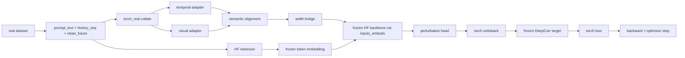

# 🧭 真实基模接入与训练主线设计说明

> [!IMPORTANT]
> **一句话结论**
> 这次接入真实基模，不是为了做一个“能跑一下”的临时版本，而是要直接建立一条以后能自然扩展到 `4090 24GB` 正式训练的主线。

> [!NOTE]
> `2026-04-28` 更新：真实 `torch_real` 主线已经完成两种语义对齐实现。推荐主线是与 Time-LLM 一致的 `text_prototypes`，即 `E' = W E + multi-head cross-attention`；旧的自由原型矩阵路径被保留为 `learned_prototypes` 开关，用于回归和消融。

> [!TIP]
> **推荐阅读顺序**
> 如果你想先抓住核心判断，建议按这个顺序看：
> `1. 先看最终结论` → `3. 为什么不能继续围绕 stub 架构修补` → `5. 目标架构` → `7. 第一阶段到底要证明什么`

## 🗺️ 快速导航

| 你现在最想搞清楚的问题 | 直接看哪里 |
| --- | --- |
| 这次技术选择的最终结论是什么 | `1. 先看最终结论` |
| 为什么不能继续在 `numpy_stub` 上修修补补 | `3. 为什么不能继续围绕 stub 架构修补` |
| 为什么第一阶段要先做 `DeepCorr300` | `6. 为什么第一阶段先选 DeepCorr300` |
| 真实基模接入后，主路径到底长什么样 | `5. 目标架构` |
| 为什么要用 projector，而不是直接把 `d_model` 改成基模维度 | `8. 为什么要引入 projector` |
| 2080 调试环境和 4090 正式训练环境怎么分工 | `9. 调试环境与正式训练环境的关系` |
| 第一版代码到底要改哪些文件 | `10. 文件范围与实现顺序` |

## 1. 先看最终结论

这一节只回答一个问题：这次真实基模接入，主线到底怎么定。

- **主线架构：** 从现在开始建立 `torch_real` 主路径，`numpy_stub` 只保留为回退和对照路径。
- **第一阻塞里程碑：** 不是“看到真实基模前向”，而是 **`DeepCorr300` 完成一次全可微的 torch-native train step**。
- **基模路线：** 以 `Qwen2.5` 家族为统一骨干接口，`3B` 用于 bring-up，后续 `7B` 作为正式训练目标。
- **训练策略：** 冻结 backbone，冻结 target model，只训练前端可学习模块和 projector，不做一次性 demo 架构。
- **语义对齐策略：** 真实主线默认采用 `text_prototypes`，并把 `learned_prototypes` 降为可选回退模式。
- **框架选择：** `PyTorch + Transformers` 为主，`accelerate` 先放外围，`bitsandbytes` 只是低显存运行策略，不是架构中心。

> [!NOTE]
> **关键判断**
> 这次最重要的不是“哪张卡先能跑起来”，而是“第一版真实训练循环的接口，能不能不经过第二次重构，直接扩展到正式实验”。

## 2. 当前仓库的实际状态

在开始设计之前，先把当前代码处于什么状态说清楚，否则很容易误把“已经有真实 target model”理解成“已经有真实训练主线”。

### 2.1 当前已经真实的部分

- `target_model_adapter.py` 已经能加载真实的 `DeepCorr` / `DeepCoFFEA` 权重。
- `real_dataset.py` 已经能从现有 Augur 数据路径读取真实样本。
- `preprocessing.py` 已经会构造 `prompt_text`，说明语义提示入口在概念上已经存在。

### 2.2 当前仍然是 stub 的核心部分

- `trainer.py` 仍然是 `StubTrainer`，训练主循环是 `numpy` 风格。
- `losses.py` 仍然是 `numpy` 风格损失。
- `second_workpoint_model.py` 和 `backbone_stub.py` 仍然是占位骨架，不是真实 `nn.Module + autograd` 路径。
- `prompt_text` 虽然已生成，但真正进入模型的还是哈希后的 `prompt_ids`，不是 Hugging Face tokenizer 路径。
- 真实 target 当前是“能加载、能前向”，但不是“保留输入梯度的训练接口”。

因此，当前仓库更准确的描述不是“半真实训练框架”，而是：

```text
真实数据 / 真实 target 权重
+ stub generator / stub backbone / stub loss / stub update
```

这也是为什么这次如果还沿着 stub 架构继续补丁式演化，后面一定会再重构一次。

## 3. 为什么不能继续围绕 stub 架构修补

这一节回答的是：为什么不能先在现在的 `numpy_stub` 主线上，临时接一个真实 Qwen，再慢慢说。

### 3.1 因为当前 stub 主线的中心是“伪训练”，不是“真实训练”

- 现在的主循环本质上还是手工构造更新信号，而不是标准 `autograd -> backward -> optimizer.step()`。
- 这意味着只要你继续把真实组件接到这个主循环上，最先得到的不是“以后可以放大的训练框架”，而是“以后必须拆掉的过渡框架”。
- 这类过渡框架在短期里看起来推进很快，但长期代价很高，因为你会在错误的抽象中心上写越来越多代码。

### 3.2 因为未来真正要扩展的是训练 ABI，而不是 smoke 参数

这里的核心不是 `batch_size=1` 还是 `batch_size=4`，也不是 `3B` 还是 `7B`，而是下面这组接口能不能从第一版就定对：

| 接口问题 | 如果现在不定对，会发生什么 |
| --- | --- |
| batch 到底是 `numpy` 还是 `torch.Tensor` | 后面 trainer 必须整体重写 |
| prompt 主输入到底是 `prompt_ids` 还是 `prompt_text` | 真实 tokenizer 路径会被二次接线 |
| frozen target 是不是允许输入梯度回传 | 后面 loss 逻辑和 target adapter 都要重写 |
| trainable width 如何对齐 backbone width | 后面 `3B -> 7B` 升级时容易引发全模型改形状 |

> [!IMPORTANT]
> **关键句**
> 这次需要优先固定的，不是“显存调度技巧”，而是“以后训练主线的 ABI”。

## 4. 这次技术选择的总原则

为了保证第一版真实训练循环能平滑扩展到后面的正式训练，这里固定六条原则。

### 4.1 一套主线，两种规模

- 只保留一套主线架构。
- `2080` 环境只是这套架构的缩小配置。
- `4090` 环境只是这套架构的正式训练配置。

这意味着你不能为了 `2080` 方便，而把核心设计做成“低显存专用特别版”。

### 4.2 先证明可微训练，再谈更大规模

- 第一阶段不是证明“模型能加载”。
- 第一阶段也不是证明“target 有输出”。
- 第一阶段必须证明：**loss 可以通过 frozen target 和 frozen backbone，真实约束上游可训练模块。**

### 4.3 冻结参数，不冻结图

这个原则非常关键。

- frozen backbone：参数不更新，但 forward 仍在图中。
- frozen target：参数不更新，但 forward 仍在图中。
- 真正被冻结的是参数，不是梯度回传路径。

这也是为什么不能在真实训练主路径上用 `torch.no_grad()` 把 target/backbone 前向包住。

### 4.4 低显存技巧是策略层，不是架构层

- `bitsandbytes`
- 更小 batch
- 更小 sample cap
- 更低 dtype

这些都可以用，但它们只属于“运行策略”，不应成为模型接口设计的核心。

## 5. 目标架构

这一节回答：真正接入真实基模后，主路径应该长什么样。

### 5.1 训练主线总览



### 5.2 模块边界

| 模块 | 角色 | 训练状态 |
| --- | --- | --- |
| temporal adapter | 把时序流量映射成可学习 token | 训练 |
| visual adapter | 把视觉/统计视图映射成可学习 token | 训练 |
| semantic alignment (`text_prototypes` / `learned_prototypes`) | 把两路 token 映射到统一语义空间 | 训练 |
| projector | 把稳定 trainable width 投到 backbone embedding width | 训练 |
| HF tokenizer | 处理 `prompt_text` | 不训练 |
| frozen Qwen backbone | 提供语言语义骨干 | 冻结 |
| perturbation head | 生成 future 扰动 | 训练 |
| frozen target model | 提供攻击目标反馈 | 冻结 |

当前已经落地的区别是：

- `text_prototypes`：先使用冻结 Qwen 的 input embedding 矩阵 `E` 构造 `E' = W E`，再让 patch token 对 `E'` 做 multi-head cross-attention
- `learned_prototypes`：保留旧的自由原型矩阵路由，只作为回退与消融
- 真实 prompt 截断长度现在由 `backbone_prompt_max_tokens` 控制，而不是复用 stub 的 `prompt_len`

### 5.3 为什么 backbone 和 target 都要保留在图里

- backbone 是语义变换骨干，如果它的 forward 不在图里，那么上游学到的就不是“如何借助语言骨干组织语义”，而只是“如何对接一个静态黑箱接口”。
- target model 是任务约束源，如果它的 forward 不在图里，那么损失就无法真实反馈“扰动是否真的误导了目标模型”。
- 因此，冻结并不意味着脱图。冻结只意味着参数不更新。

## 6. 为什么第一阶段先选 DeepCorr300

这一节回答的是：为什么不是一开始就把 `DeepCoFFEA` 也列成同级第一目标。

### 6.1 DeepCorr300 是当前最小、最干净的真实证明目标

- 数据接口更直接。
- target 形态更清晰。
- 当前 second workpoint 里对它的支持已经比 `DeepCoFFEA` 更接近真实 Augur 路线。

### 6.2 DeepCoFFEA 现在还不适合作为第一阶段 correctness proof

- 现有 `DeepCoFFEA` 路径在 second workpoint 里仍然有明显的语义缺口。
- 尤其是 Exit 侧输入和可微分分区/重建逻辑，还没有被真实迁移到当前新路径里。
- 如果把它过早抬成第一阶段目标，就会把“target fidelity 不足”的问题和“基模接入错误”的问题混在一起。

> [!WARNING]
> **明确限制**
> 第一阶段里，`DeepCoFFEA` 只能作为“兼容性 smoke”，不能作为“target seam 已经正确”的证明，也不能作为“实验 readiness”的证明。

## 7. 第一阶段到底要证明什么

这一节非常重要，因为它决定了“第一版算不算完成”。

### 7.1 错误理解

- 真实 Qwen 能加载
- tokenizer 有输出
- target model 有 logits
- 训练脚本能保存一个文件

这些都不够。

### 7.2 正确理解

第一阶段完成的唯一硬证明应该是：

> **`DeepCorr300` 上完成一次全可微的 torch-native train step。**

这一步必须同时满足：

1. `prompt_text -> tokenizer -> inputs_embeds` 真实成立
2. trainable 模块输出能经过 projector 对齐 backbone width
3. frozen backbone forward 保留图
4. perturbation writeback 是 torch-native
5. frozen target forward 保留图
6. loss 是 torch-native
7. backward 后，trainable 参数有非零梯度
8. frozen backbone / frozen target 参数不更新

也就是说，第一版的结束条件不是“能跑”，而是“训练契约成立”。

## 8. 为什么要引入 projector

这里是整个设计里最关键的一个长期决策点。

### 8.1 两种选择

| 方案 | 含义 | 问题 |
| --- | --- | --- |
| trainable 模块直接等于 backbone hidden size | 把 `d_model` 直接绑到 Qwen 宽度 | 后面 backbone 升级时容易牵一发动全身 |
| 固定 trainable width + projector | trainable 模块自己保持稳定，最后再投到 backbone 宽度 | 会多一个可训练层，但长期最稳 |

### 8.2 为什么最终选 projector

- `3B` bring-up 和 `7B` 正式训练需要共享同一套训练主线。
- 如果 trainable 模块从第一天就直接绑定 backbone 宽度，那么 backbone 更换时，前端几乎必然触发形状层面的二次改造。
- projector 的价值不是“更复杂”，而是把 backbone 变化约束在单独的宽度桥接层上。

更准确地说：

```text
稳定 trainable width
-> projector
-> backbone embedding width
```

这种方式把“未来可能变化的部分”收缩到最小范围内。

## 9. 调试环境与正式训练环境的关系

这一节回答的是：既然现在机器和以后机器不同，架构应该怎么处理。

### 9.1 正确关系

| 环境 | 角色 | 允许改变的内容 | 不允许改变的内容 |
| --- | --- | --- | --- |
| 2080 调试环境 | 验证 ABI、设备分配、梯度链路 | batch、dtype、sample cap、是否量化 | trainer 结构、prompt 主路径、loss 主路径 |
| 4090 正式训练环境 | 正式实验和规模化训练 | batch、epoch、backbone size、checkpoint 策略 | 主路径 ABI、核心模块边界 |

### 9.2 这意味着什么

- `2080` 上的妥协只应该是配置妥协。
- `4090` 上的放大应该主要是规模放大。
- 两边不应该是两套不同的训练架构。

所以最合理的主线是：

- `3B`：bring-up 和小规模真实训练
- `7B`：后续正式训练

而不是：

- 为 `2080` 造一套低显存专用训练架构
- 再为 `4090` 重新造第二套

## 10. 文件范围与实现顺序

这一节把实际落地会改动的范围明确列出来。

### 10.1 必改文件

| 文件 | 为什么一定要改 |
| --- | --- |
| [config.py](/home/nixilin/work2/work2/second_workpoint/config.py) | 需要支持 `torch_real` backend 和设备/宽度字段 |
| [runtime.py](/home/nixilin/work2/work2/second_workpoint/utils/runtime.py) | 需要支持 torch 设备、dtype、runtime summary |
| [preprocessing.py](/home/nixilin/work2/work2/second_workpoint/data/preprocessing.py) | 需要让 `prompt_text` 成为真实主输入 |
| [trainer.py](/home/nixilin/work2/work2/second_workpoint/training/trainer.py) | 需要新增 torch-native trainer |
| [losses.py](/home/nixilin/work2/work2/second_workpoint/training/losses.py) | 需要新增 torch-native loss |
| [target_model_adapter.py](/home/nixilin/work2/work2/second_workpoint/models/target_model_adapter.py) | 需要改成保图的 frozen target seam |
| [second_workpoint_model.py](/home/nixilin/work2/work2/second_workpoint/models/second_workpoint_model.py) | 当前 trainable stack 仍是 numpy 结构，必须 torch 化 |
| [backbone_stub.py](/home/nixilin/work2/work2/second_workpoint/models/backbone_stub.py) | 需要与真实 `FrozenHFBackbone` seam 对齐 |

### 10.2 推荐实现顺序

1. `config.py` / `runtime.py`
2. torch-real collate ABI
3. torch 版 trainable modules
4. projector
5. `FrozenHFBackbone`
6. torch-native `target_model_adapter`
7. torch-native loss
8. `DeepCorr300` 一步训练证明

这个顺序的好处是，每一步都在加强未来主线，而不是堆临时胶水。

## 11. 具体的验证门槛

为了避免“看起来差不多能跑”这种模糊状态，这里把验证门槛写成明确规则。

### 11.1 ABI gate

- `torch_real` batch 中 tensor 保持 tensor
- `prompt_text` 是 `list[str]`
- `prompt_ids` 不得进入 `torch_real` 主路径

### 11.2 No-numpy gate

- collate 之后到 loss.backward() 之前，不允许 numpy round-trip

### 11.3 Width-seam gate

- 必须能明确打印并校验：
  - trainable width
  - projector output width
  - backbone embedding width

### 11.4 Frozen-backbone gate

- backbone 参数 `requires_grad=False`
- backbone forward 不允许 `torch.no_grad()`

### 11.5 Frozen-target gate

- target 参数 `requires_grad=False`
- target forward 不允许 `torch.no_grad()`

### 11.6 Autograd gate

- trainable 模块梯度非零
- frozen 参数不更新
- optimizer 只更新 trainable 参数

### 11.7 Blocking-proof gate

- 在 `DeepCorr300` 上完成一次全可微 torch-native train step，才算第一阶段完成

## 12. 常见误解与正确理解

### 误解一：现在只是调试环境，所以可以先用临时结构

**正确理解：**
调试环境可以临时降配置，但不应该临时换架构。

### 误解二：frozen target 就应该 `torch.no_grad()`

**正确理解：**
冻结的是参数，不是输入梯度路径。参数不更新，但 loss 仍要通过它约束上游。

### 误解三：先做一个半真实路径，后面再重构也行

**正确理解：**
如果你已经明确知道后面要在 `4090` 上正式训练，那么半真实路径通常只会制造第二次重构。

### 误解四：先把 `DeepCoFFEA` 也一起接进第一阶段更完整

**正确理解：**
这会把多个未完成问题叠在一起。第一阶段最重要的是先证明 `DeepCorr300` 上的真实梯度主线成立。

## 13. 最后收束

这份文档真正想固定的不是某个具体超参数，而是一条工程判断：

> **第二工作点从现在开始应该以“真实训练主线”来设计最小闭环，而不是以“最小 demo”来设计未来训练。**

更具体地说，后续所有实现动作都应该围绕下面这条主线收束：

```text
prompt_text
-> HF tokenizer
-> frozen Qwen backbone
-> trainable reprogramming / projector / perturbation head
-> frozen DeepCorr target
-> torch-native loss
-> real autograd update
```

只要这条主线第一次在 `DeepCorr300` 上成立，后面从 `3B` 放大到 `7B`，从 `2080` 调试环境迁移到 `4090` 正式训练环境，就主要是“配置放大”和“实验放大”的问题，而不是“架构重来”的问题。
