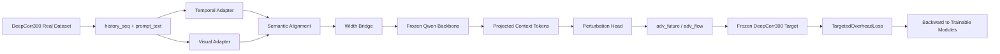

# 真实基模接入实现说明

## 文档目的

这份文档回答的问题不是“这次勉强跑起来了什么”，而是：

- 这次为什么要从 `numpy_stub` 切到 `torch_real`
- 真实基模、可训练模块、冻结 target model 现在是如何连起来的
- 这次代码到底改了哪些关键接缝
- 当前最小训练循环证明了什么，后面迁移到 `4090 24GB` 时又该保留什么

当前实现的目标是：

- 在 `deepcorr` 环境中接入真实 `Qwen2.5-3B-Instruct`
- 使用真实 `DeepCorr300` 数据和真实 `DeepCorr300` target model
- 在两张 `2080 Ti 11GB` 上完成一次真实的 `train step + eval step`
- 把语义对齐主线切到与 Time-LLM 一致的 `text_prototypes` 模式，同时保留 `learned_prototypes` 开关
- 保持主路径设计可直接扩展到后续更大显存环境，而不是写成一次性的低配 demo

---

## 一句话结论

这次已经把第二工作点的主训练路径改造成了一个真正可微的 `torch_real` 链路：

- 输入不再只服务于 stub，而是走 `prompt_text -> tokenizer -> inputs_embeds -> frozen Qwen`
- 默认真实语义对齐模式不再是自由原型矩阵，而是 `E' = W E` 的 `text_prototypes`
- 基模参数保持冻结，但上游可训练模块的梯度可以穿过 `inputs_embeds` 回传
- target model 也保持冻结，但不再用 `torch.no_grad()` 粗暴切断梯度
- `DeepCorr300` 上已经跑通一次真实的最小训练循环

---

## 当前部署形态

### 设备拆分

当前默认拆分如下：

| 模块 | 设备 | 原因 |
| --- | --- | --- |
| Frozen Qwen backbone | `cuda:0` | 主要显存压力来自基模，单独放一张卡最稳 |
| Trainable adapters / projector / output head | `cuda:1` | 这些模块参数量小，但需要参与反向传播 |
| Frozen DeepCorr target model | `cuda:1` | 目标反馈和 generator 输出写回强耦合，放同卡可减少无意义搬运 |

这个拆分的意义不是“为了 2080 特化”，而是先建立一个后续仍然成立的主拓扑。后面切到 `4090 24GB` 时，可以保持相同的逻辑分层，只调整模型规模、batch 和量化策略。

### 当前 smoke 配置

当前真实 smoke 配置文件是：

- [second_workpoint_deepcorr300_torch_real_smoke.json](/home/nixilin/work2/work2/configs/second_workpoint_deepcorr300_torch_real_smoke.json)
- [second_workpoint_deepcorr300_torch_real_smoke_learned.json](/home/nixilin/work2/work2/configs/second_workpoint_deepcorr300_torch_real_smoke_learned.json)

它的意图是：

- `batch_size=1`
- `max_train_steps=1`
- `max_eval_steps=1`
- `train_epochs=1`
- 数据和 target 都走真实 `DeepCorr300`
- backbone 走本地下载好的 `Qwen2.5-3B-Instruct`

这不是正式训练配置，而是“真实链路 bring-up 配置”。

其中：

- `second_workpoint_deepcorr300_torch_real_smoke.json` 现在默认走论文同款 `text_prototypes`
- `second_workpoint_deepcorr300_torch_real_smoke_learned.json` 保留旧的 learned-prototype 路径，主要用于回归与消融

---

## 训练链路长什么样

### 数据流

当前真实主路径可以概括成下面这张图：



这里最关键的变化有两个：

- `prompt_text` 现在是真实主输入，而不是为了将来预留的装饰字段
- backbone 与 target 都是冻结的，但训练梯度仍然能回到 generator 侧可训练模块

### 为什么必须走 `prompt_text`

以前的 stub 路径里，`prompt_text` 虽然已经能生成，但真正进 backbone 的还是哈希过的 `prompt_ids`。这会带来两个问题：

- 它没有真实 tokenizer 语义，因此无法证明“语言空间锚点”这件事真的接上了
- 它会让后续从 `3B` 升到 `7B` 时，还需要再做一次 prompt 接口重构

现在改成 `prompt_text -> tokenizer -> inputs_embeds` 之后，第二工作点真正依赖的语义入口已经固定下来，后面放大 backbone 规模时不需要再重做这一层。

同时，真实路径还把 prompt 长度控制和 stub 长度控制拆开了：

- `prompt_len` 现在只保留给 stub 哈希 `prompt_ids`
- `backbone_prompt_max_tokens` 单独控制真实 tokenizer 的截断上限

### 为什么要加 width bridge

训练模块现在使用的是“稳定 trainable width”，而不是直接和 backbone hidden size 绑死。

| 层次 | 当前作用 |
| --- | --- |
| `trainable_width` | generator 侧统一工作宽度 |
| `BackboneWidthBridge` | 把 generator token 投到 backbone embedding width，再从 backbone hidden states 投回来 |
| backbone hidden width | 完全由具体 Qwen 模型决定 |

这一步非常重要，因为它直接决定了以后：

- `3B -> 7B` 是否只需要改 backbone 配置
- generator 主体是否需要因为 backbone hidden size 改动而重写

现在的实现是“generator 宽度稳定，backbone 宽度可替换”，这就是后续训练可扩展性的核心。

---

## 这次改了什么

### 1. 配置层改造

文件：

- [config.py](/home/nixilin/work2/work2/second_workpoint/config.py)

新增或固定了这些关键配置：

- `backbone_mode`
- `backbone_model_name`
- `backbone_model_path`
- `backbone_dtype`
- `backbone_quantization`
- `backbone_device`
- `trainable_device`
- `target_device`
- `trainable_width`
- `backbone_prompt_max_tokens`
- `semantic_alignment_mode`
- `gradient_accumulation_steps`
- `max_train_steps`
- `max_eval_steps`

同时把 `torch_real` 路径的约束写进了配置校验：

- `torch_real` 只能配合 `data_loader=real`
- `torch_real` 只能配合 `backbone_mode=hf_frozen`
- `torch_real` 只能配合 `target_model_mode=torch`
- 必须提供本地 backbone 路径或 backbone 名称

这一步的意义是把“真实训练主线的 ABI”前移到配置层，而不是等运行时才随机报错。

### 2. 真实 Qwen backbone 接入

文件：

- [qwen_backbone.py](/home/nixilin/work2/work2/second_workpoint/models/qwen_backbone.py)

这里完成了几件真正关键的事：

- 从本地 `Qwen2.5-3B-Instruct` 目录加载 tokenizer 和模型
- 支持 `prompt_text -> tokenizer -> input embeddings`
- 暴露冻结的 input embedding 矩阵 `E`，并提供 `E' = W E` prototype 构造接口
- 用 `inputs_embeds` 形式把 prompt token、time token、visual token 拼接起来
- 根据 Transformers 版本在 `dtype` 与 `torch_dtype` 之间做兼容选择
- 冻结 backbone 参数，同时保留上游梯度对输入 embedding 的可微路径
- 支持显式 `backbone_device`

也就是说，真实 backbone 不再是“放一个 HF 模型对象进来”，而是已经承担了第二工作点真正需要的那道语义接口。

### 3. `torch_real` 主模型引入

文件：

- [torch_real_model.py](/home/nixilin/work2/work2/second_workpoint/models/torch_real_model.py)

这里新增了完整的 torch-native generator 主体，包括：

- `TemporalPatchAdapter`
- `VisualPatchAdapter`
- `TextPrototypeReprogrammingLayer`
- `LearnedPrototypeReprogrammingLayer`
- `BackboneWidthBridge`
- `PerturbationHead`
- `SecondWorkpointTorchRealModel`

它和以前的 stub 最大的区别是：

- 整条主路径不再回落到 numpy
- `prompt_ids` 在真实路径上被显式禁止
- 真实语义对齐层支持两种模式，但默认推荐 `text_prototypes`
- `text_prototypes` 不会把整张词表 embedding 长驻复制到训练卡，而是在 backbone 卡上构造小型 `E'` 后再跨卡传输
- generator 输出的 `perturbation` 来自真实 backbone 上下文，而不是 stub 混合结果
- backbone 在训练期会被强制固定为 `eval` 模式，避免“冻结参数但重新启用 train-time 行为”
- 输出头只对真正的 conditioning tokens 做池化，不把 prompt padding 混入生成信号

### 4. 真实 target model 梯度接缝修复

文件：

- [target_model_adapter.py](/home/nixilin/work2/work2/second_workpoint/models/target_model_adapter.py)

这里的关键修复不是“加载 DeepCorr 权重”，而是：

- 保留 numpy/stub 路径兼容性
- 新增 torch tensor 输入路径
- 对 torch 路径不再使用会切断上游梯度的包裹方式
- 让 target 侧真正成为“冻结参数的可微反馈模块”

这一步决定了第二工作点训练目标是否还是“假的 end-to-end”。

### 5. 损失函数双路径支持

文件：

- [losses.py](/home/nixilin/work2/work2/second_workpoint/training/losses.py)

这里把 `TargetedOverheadLoss` 同时支持了：

- 原 stub/numpy 计算
- 新 torch/tensor 计算

这意味着：

- 不必为了真实路径再复制一套损失定义
- stub 可以继续作为对照路径保留
- 真正训练时 loss 不会在最后一步掉回 numpy 切断图

### 6. Trainer 分叉为 `numpy_stub` / `torch_real`

文件：

- [trainer.py](/home/nixilin/work2/work2/second_workpoint/training/trainer.py)
- [run_train_stub.py](/home/nixilin/work2/work2/run_train_stub.py)
- [run_train.py](/home/nixilin/work2/work2/run_train.py)

这里完成了主执行面的切换：

- 保留 `StubTrainer`
- 新增 `TorchTrainer`
- 通过 `build_trainer(config)` 按 backend 分流
- `TorchTrainer` 使用真实 DataLoader、真实模型、真实 target、真实 loss
- checkpoint 现在既保存 JSON 摘要，也保存 `.pt` 的 trainable state

这样后续再切换模型规模或训练配置时，入口脚本和 trainer 主干都不需要再重构一遍。

---

## 当前最小训练循环证明了什么

这次在 `deepcorr` 环境中的真实 smoke 已经得到以下结果：

- 真实 Qwen 3B backbone 从本地目录成功加载
- backbone 成功放到 `cuda:0`
- trainable 模块和 DeepCorr target 成功放到 `cuda:1`
- 真实 `DeepCorr300` 数据成功取样、切窗、构造 `prompt_text`
- 完成一次真实 forward / backward / optimizer step
- 完成一次 eval step
- 成功写出训练摘要和 checkpoint
- 训练期 backbone 保持冻结 `eval` 行为
- 输出头没有把 prompt padding 位置计入池化

本次运行里看到的关键日志是：

- `history_seq=(1, 4, 96)`
- `perturbation=(1, 48, 4)`
- `adv_flow=(1, 4, 300)`
- `target_adv_flow=(1, 8, 300)`
- `logits=(1, 1)`
- `train loss=2.0308`
- `eval loss=2.3273`

这说明当前链路不是“只把模型对象实例化成功”，而是真的把数据、可训练模块、基模、target、loss 和反向传播都串起来了。

---

## 如何复现

### 环境

当前复现实验使用：

- Python: `deepcorr` conda 环境
- 基模目录：`/home/nixilin/work2/base_models/Qwen2.5-3B-Instruct`
- 入口脚本：[run_train.py](/home/nixilin/work2/work2/run_train.py)

### 运行命令

```bash
cd /home/nixilin/work2
PYTHONPATH=/home/nixilin/work2/work2 \
/home/nixilin/anaconda3/envs/deepcorr/bin/python \
work2/run_train.py \
--config /home/nixilin/work2/work2/configs/second_workpoint_deepcorr300_torch_real_smoke.json
```

### 产物位置

训练产物会写到：

- `work2/outputs/checkpoints/second_workpoint_deepcorr300_torch_real_smoke_SecondWorkpointTorchRealModel_Deepcorr300_sl96_pl48_dm128_nh4/`

里面包括：

- `train_summary.json`
- `checkpoint_epoch_1.json`
- `checkpoint_epoch_1.pt`

---

## 这份实现为什么方便后续正式训练

### 不是为 2080 写死的

现在这条路径只是用 `2080 Ti` 做 bring-up，但结构上已经对齐后续正式训练需求：

- prompt 入口已经是真实 tokenizer 路径
- backbone 已经是 HF 冻结模型，而不是 stub
- generator 已经是 torch-native，而不是 numpy 伪更新
- target 已经是冻结但可微的真实反馈模块

因此迁移到 `4090 24GB` 时，主要调整的是：

- backbone 规模
- batch size
- gradient accumulation
- 是否启用低比特加载

而不是再重写训练主线。

### 后续扩展建议

后面如果进入正式训练，建议按这个顺序扩展：

1. 先把当前 smoke 配置复制成 `4090-3B` 版本  
   目的：保持同一条代码路径，只放大 batch 与 step 数。

2. 再加 `4090-7B` 配置  
   目的：验证 `BackboneWidthBridge` 设计是否如预期避免二次重构。

3. 最后再引入更长训练、更多样本和更完整评估  
   目的：把 bring-up 逻辑与正式实验逻辑清晰分层。

---

## 当前已知边界

当前版本已经能跑真实最小训练循环，但还不是正式训练终态，主要边界有这些：

- 现在验证的是 `DeepCorr300` 主线，`DeepCoFFEA` 还没有作为同等强度的真实 smoke 完成
- 当前配置仍然偏向 bring-up，batch 和步数都非常小
- 还没有引入更系统的训练日志、恢复训练和长程 checkpoint 策略
- `backbone_quantization` 支持位已经预留，但当前 smoke 使用的是 `float16 + no quantization`

这些边界不影响这次结论：真实训练主线已经接上并跑通。

---

## 最终判断

这次工作的本质成果不是“把一个 HF 模型对象塞进项目里”，而是把第二工作点真正需要的训练主干建立起来了：

- 真实 prompt 语义入口已经建立
- 真实 backbone 计算图已经建立
- 真实 target feedback 已经建立
- 最小可微训练循环已经建立

因此后续你要做的，不再是“如何从 stub 过渡到真实训练”，而是沿着当前这条 `torch_real` 主线继续放大实验规模、切换更强 backbone、补足评估与训练工程能力。
