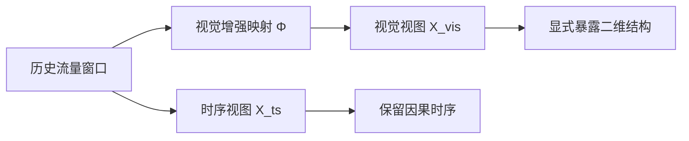
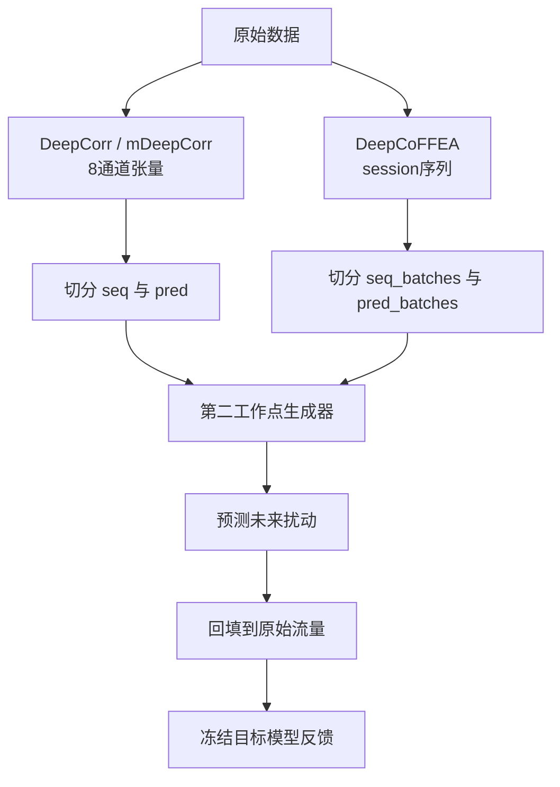
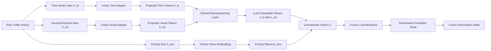
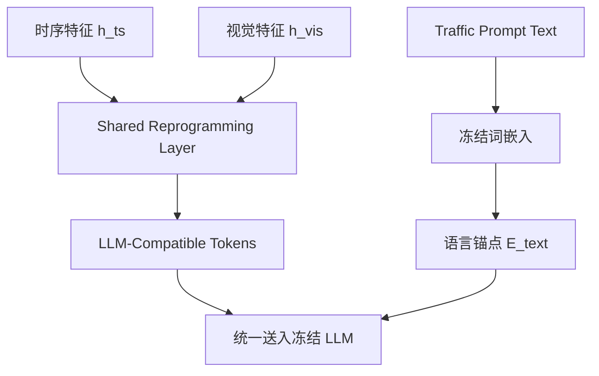
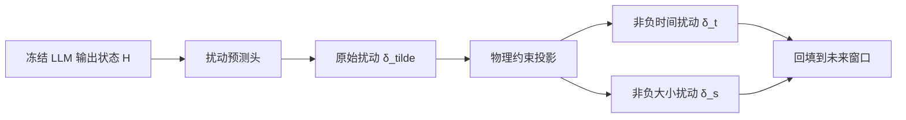
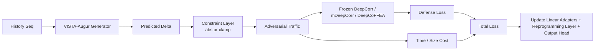

# 第二个工作点技术实现文档

## 1. 文档定位

- 本文档讨论的不是一个脱离 Augur 的新课题，而是在 **Augur 已有研究背景、已有数据集、已有目标模型和已有训练闭环** 上，对内部扰动生成器进行结构升级的第二个工作点。这样定义的意义在于，后续实验结果能够直接和第一工作点形成公平对比，读者也能明确知道：我们改变的不是问题本身，而是解决问题的内部表示方式与编码方式。

- 第二个工作点的研究目标仍然保持不变，依旧是在低时延匿名通信环境中，为 Tor 侧历史流量生成未来窗口上的扰动，从而削弱 DeepCorr、mDeepCorr 和 DeepCoFFEA 的关联能力。这里必须反复强调“未来扰动生成”这一定义，因为只要把任务偷换成“分类”或“异常检测”，整个工作就会偏离 Augur 原本的防御语境。

- 本文档的写作原则是“结构清晰，但每一点都讲完整”。因此，后续内容会保留分点结构，方便读者快速扫描；但每个点都不会只停留在几个字，而会说明该设计的约束来源、数学或物理意义，以及它对系统稳定性的贡献。

---

## 2. 第二个工作点的约束条件

- **数据集不能变。** 第二个工作点必须继续使用 `Generator_Trainer` 中已经在用的那一批数据，而不能为了适配新模型去另找一套更“顺手”的数据。原因很直接：只要数据变了，后续实验即便结果更好，也无法严格说明提升究竟来自模型结构，还是来自数据分布变化。保持数据不变，等于锁定了实验地基，使得后续改动能够被合理归因。

- **背景和任务目标不能变。** 第二个工作点仍然属于 Augur 的主线问题，即面向流量关联攻击的实时防御，而不是去做流量分类、协议识别或别的应用场景。换句话说，读者必须从头到尾都能感受到：这项工作关心的不是“理解流量是什么”，而是“怎样利用历史流量生成足够有效、同时足够低开销的未来扰动”。

- **适配器必须保持轻量。** 这里的“轻量”不是一个风格偏好，而是工程约束。第一工作点已经有较完整的训练链路和部署假设，如果第二工作点再引入一整套复杂 CNN、ViT 或大型跨模态注意力结构，那么系统复杂度会急剧上升，论文里也很难说清楚改进究竟来自“视觉增强”还是“又加了一个很重的新网络”。因此，本工作点中的 adapter 只使用简单线性层，但允许加入一个轻量共享 Reprogramming Layer，用来完成真正的语义重表示。

---

## 3. 第一工作点的瓶颈从哪里来

- 第一工作点已经证明，基于 PatchTST 的时序生成器可以工作。它能够读取历史流量窗口，预测未来一段窗口上的扰动，再通过冻结目标模型的反馈来优化自身。这个结论说明，纯时序预测式扰动生成在 Augur 的问题设置下是成立的，因此第二工作点不是从零开始。

- 但是，第一工作点的表示空间仍然存在一个天然瓶颈：它主要依赖一维时序对复杂流量模式进行编码。对于包间隔时间、包大小、方向切换、局部 burst 和窗口边界扰动这类模式来说，一维序列能够保留时间顺序，却不一定能把结构模式显式地呈现出来。很多模式在数值链上看只是普通起伏，但当它们被重新组织成二维结构时，局部重复、纹理突变和相位偏移会变得更明显。

- 因此，第二工作点真正要解决的问题不是“第一工作点失效了”，而是“第一工作点虽然有效，但其输入表征仍然可以继续显式化”。也就是说，第二工作点的出发点是一种表征升级：在保持任务目标不变的前提下，让生成器不仅看见时间序列，还能看见时间序列在另一种坐标系中的结构形态。

---

## 4. 为什么需要双视图输入

- **必须保留时序视图。** 时序视图不能被替代，因为 Augur 的原始任务本质上是一个在线预测问题：系统必须根据过去决定未来，而不能依赖未来信息本身。时序视图保留了历史窗口的因果顺序，因此它承担的是任务主语义，即“根据历史生成未来扰动”的根本逻辑。如果这一条链路被弱化，第二工作点就会失去和第一工作点之间最重要的连续性。

- **必须增加视觉增强视图。** 增加视觉视图的原因不是为了堆模态，而是因为某些对关联攻击高度敏感的局部模式，在一维数值序列中不够显眼。把同一段历史流量重新组织成二维结构之后，局部重复、方向切换和边界波动可以在纹理层面变得更可见。这种“可见”不是面向人眼，而是面向后续表示学习过程。它的价值在于：把原本需要模型自己从一维序列里艰难恢复的结构信息，直接搬到更容易编码的坐标系里。

- **视觉增强不应设计得过重。** 第二工作点不是要再引入一个大型视觉网络，而是要让“视觉重表示”本身承担主要价值。因此，推荐把 `Channel-Time Texture Map` 作为主方案。它的好处在于定义简单，时间轴和通道轴的物理含义都清楚，而且不会引入过多额外超参数。相比之下，Recurrence Plot 和 Gramian Angular Field 可以作为扩展或消融，但不一定适合作为主干方案。

### 4.1 双视图形成过程



- 上图想说明的是：第二工作点不是把时序变成图像后就抛弃原始时序，而是让同一段历史流量同时拥有两种表征。一种负责保留时间逻辑，另一种负责显式暴露结构纹理。两者不是竞争关系，而是互补关系。

---

## 5. 数据集与任务对象

- **DeepCorr / mDeepCorr 数据保持不变。** 这部分数据位于 `Generator_Trainer/target_model/deepcorr/dataset/`，在现有工程里已经被整理成 8 通道张量。第二工作点不会去改这些数据的定义，只会继续沿用 Tor 侧有效的 4 个通道，也就是当前生成器真正修改的那些位置。这样做的好处是，DeepCorr300 和 mDeepCorr 的实验能够与第一工作点逐项对齐，而不是只做概念对齐。

- **DeepCoFFEA 数据保持不变。** 这部分数据位于 `Generator_Trainer/target_model/deepcoffea/dataset/CrawlE_Proc`，其任务形态是 session 级 IPD 和 size 序列，再经过窗口划分和 embedding 匹配进入目标模型。第二工作点在这条链路上同样不改变数据协议，而只是替换生成器的内部结构，使其仍然能够输出未来窗口上的扰动。

- **关键参数保持一致。** 对 DeepCorr300 与 mDeepCorr，第二工作点仍然沿用 `seq_len=96`、`pred_len=48` 等核心窗口参数；对 DeepCoFFEA，则继续沿用 `seq_len=150`、`pred_len=70` 等配置。参数保持一致的意义在于，它让第二工作点真正成为“同一实验地面上的结构升级”，而不是“重新设置参数后得到的新结果”。

### 5.1 数据总览表

| 数据类型 | 路径 | 任务对象 | 保持不变的关键参数 |
| --- | --- | --- | --- |
| DeepCorr300 / mDeepCorr | `Generator_Trainer/target_model/deepcorr/dataset/` | 8 通道固定长度流量张量 | `seq_len=96`, `pred_len=48` |
| DeepCoFFEA | `Generator_Trainer/target_model/deepcoffea/dataset/CrawlE_Proc` | session 级 IPD/size 序列 | `seq_len=150`, `pred_len=70` |

### 5.2 数据流向图



---

## 6. 第二工作点的总流程

- 第二工作点的整体流程可以概括为：历史流量先被组织成时序视图、视觉增强视图和文本提示三类输入；其中两类非文本输入先做轻量投影，再进入 Reprogramming Layer；文本提示则直接通过冻结词嵌入进入系统，作为天然语言锚点。之后，三类 token 被统一送入冻结 LLM，LLM 不负责分类，只负责形成足够丰富的上下文表示；最后由轻量预测头输出未来窗口上的时间扰动和大小扰动。

- 这个流程最关键的地方在于职责分离。时序视图承担时间因果信息，视觉视图承担结构显式化，prompt 承担语言锚点与任务约束，Reprogramming Layer 承担语义重表示，冻结 LLM 承担上下文整合，输出头承担未来扰动预测。只要把这几层职责说清楚，整套结构就不会显得像“把一堆模块机械拼接在一起”。

### 6.1 总流程图



---

## 7. Reprogramming 到底在做什么

> [!NOTE]
> `2026-04-28` 更新：当前真实 `torch_real` 代码已经支持两种语义对齐实现。默认推荐的是与 Time-LLM 一致的 `text_prototypes`，即先从冻结 backbone 的预训练 embedding 构造 `E' = W E`，再用 patch token 对 `E'` 做 multi-head cross-attention；原来的自由原型矩阵 `P` 版本被保留为 `learned_prototypes` 开关。

- **最容易被误解的地方：** Reprogramming 不是让视觉特征和时序特征彼此直接对齐。这个说法听起来顺口，但不准确。因为在 Time-LLM 里，reprogramming 的本义不是“不同非文本模态之间的互相看齐”，而是“把原本不属于语言模态的输入，重新表示为 LLM 已经熟悉的语言语义空间中的 token”。

- **在第二工作点里，真正需要被映射的是两种非文本模态。** 也就是说，时序特征和视觉特征需要被重表示；而 prompt 不需要，因为 prompt 原本就是文本。它在系统中的角色是天然语言锚点和任务指令，而不是主要的被对齐对象。

- **为什么两个线性层不够。** 如果只有 `Linear_ts` 和 `Linear_vis`，那么系统完成的只是基础维度投影。它解决的是“能不能把不同来源的输入拼到一起”，而不是“这些输入是否已经落到 LLM 熟悉的语义空间”。因此，如果文档里把“分别进线性层”直接说成“完成了语义对齐”，那会让整个方法论失去严谨性。

- **为什么还需要共享 Reprogramming Layer。** 这层的作用是把时序和视觉两种非文本模态，进一步映射到一个共享的、LLM 兼容的轻量语义原型空间。当前推荐实现不是直接学习一张自由原型矩阵，而是沿用 Time-LLM 的 `E' = W E` 思路，让 prototype bank 保持在预训练语言 embedding 空间内；自由原型矩阵版本只保留为回退和消融。

### 7.1 数学表达

设线性投影后的时序与视觉表示分别为：

$$
h_{ts} = W_{ts}\,\mathrm{vec}(X_{ts}) + b_{ts}, \qquad
h_{vis} = W_{vis}\,\mathrm{vec}(X_{vis}) + b_{vis}
$$

如果按当前推荐实现来写，先定义冻结 backbone 的词表 embedding 与小型 prototype bank：

$$
E \in \mathbb{R}^{V \times D}, \qquad E' = W E, \qquad W \in \mathbb{R}^{K \times V}
$$

其中，`K` 表示轻量 prototype 的数量。两种模态分别对 `E'` 做 cross-attention：

$$
Q_{ts} = h_{ts} W^Q,\qquad K = E' W^K,\qquad V = E' W^V
$$

$$
Q_{vis} = h_{vis} W^Q,\qquad
z_{ts} = \operatorname{MHA}(Q_{ts}, K, V),\qquad
z_{vis} = \operatorname{MHA}(Q_{vis}, K, V)
$$

如果按回退/消融模式来写，才退化为自由原型矩阵 `P`：

$$
P \in \mathbb{R}^{K \times d},\qquad
A_{ts} = \mathrm{softmax}\!\left(\frac{h_{ts} P^\top}{\sqrt{d}}\right),\qquad
A_{vis} = \mathrm{softmax}\!\left(\frac{h_{vis} P^\top}{\sqrt{d}}\right)
$$

$$
z_{ts} = A_{ts} P,\qquad
z_{vis} = A_{vis} P
$$

| 符号 | 含义 |
| --- | --- |
| `X_ts` | 输入的时序窗口特征 |
| `X_vis` | 由同一流量窗口构造出的视觉增强表示 |
| `W_ts, b_ts` | 时序线性 adapter 的参数 |
| `W_vis, b_vis` | 视觉线性 adapter 的参数 |
| `E` | 冻结 backbone 的预训练 input embedding 矩阵 |
| `W` | 把整张词表 embedding 压成小型 prototype bank 的可学习探测矩阵 |
| `E'` | 小型 text prototype bank |
| `P` | 可选回退模式中的自由原型矩阵 |
| `A_ts, A_vis` | 回退模式里两种非文本模态对原型空间的响应权重 |
| `z_ts, z_vis` | 最终进入冻结 LLM 的重编程 token |

- 这一组表达式想说明的不是“两个模态必须彼此一样”，而是“两个模态都要经过同一套轻量语义原型，被重写到 LLM 可以稳定处理的语言兼容语义空间中”。如果你的 Markdown 预览环境支持 `$$...$$`，这种写法会比纯文本公式更清晰，也更适合后续直接迁移到论文正文中。

### 7.2 Reprogramming 关系图



### 7.3 一段伪代码

```python
def reprogram_features(x_ts, x_vis, prompt_text, prototype_bank):
    """
    将非文本流量特征重编程到与 LLM 兼容的语义空间中。

    参数
    ----
    x_ts : Tensor
        批量时序历史窗口，形状为 [B, L, C]。
        该张量必须包含有效的因果历史，不能是空序列。
    x_vis : Tensor
        由同一流量窗口构造出的批量视觉增强表示。
        其 batch 维必须与 x_ts 保持一致，空间尺寸不能为零。
    prompt_text : list[str]
        由历史窗口统计量构造出的自然语言提示文本。
        这一分支天然属于语言空间，因此不经过重编程层，而是交给 tokenizer
        和冻结基模的 input embedding 直接编码。
    prototype_bank : Tensor
        共享语义原型库，形状为 [K, d]。
        在 `text_prototypes` 模式下，它来自预训练 embedding 矩阵；
        在 `learned_prototypes` 模式下，它来自可学习原型参数。

    返回
    ----
    z_ts : Tensor
        重编程后的时序 token。
    z_vis : Tensor
        重编程后的视觉 token。
    e_text : Tensor
        嵌入后的文本提示 token，用作语义锚点。
    """

    if x_ts.ndim != 3:
        raise ValueError("x_ts 的形状必须为 [B, L, C]。")
    if x_ts.shape[1] == 0 or x_ts.shape[2] == 0:
        raise ValueError("x_ts 不包含有效的历史窗口。")
    if x_vis.shape[0] != x_ts.shape[0]:
        raise ValueError("x_ts 与 x_vis 的 batch 维不一致。")
    if prototype_bank.shape[0] <= 0:
        raise ValueError("原型矩阵至少需要包含一个语义原型。")

    # 先把两种非文本模态投影到统一维度
    h_ts = linear_ts(flatten_or_patch(x_ts))
    h_vis = linear_vis(flatten_or_patch(x_vis))

    # 再计算它们对共享原型空间的响应权重
    a_ts = softmax((h_ts @ prototype_bank.T) / sqrt(prototype_bank.shape[-1]), dim=-1)
    a_vis = softmax((h_vis @ prototype_bank.T) / sqrt(prototype_bank.shape[-1]), dim=-1)

    # 用响应权重重组原型，得到可送入 LLM 的 token
    z_ts = a_ts @ prototype_bank
    z_vis = a_vis @ prototype_bank

    # 文本提示分支直接通过 tokenizer + frozen embedding 编码
    e_text = frozen_encode(prompt_text)
    return z_ts, z_vis, e_text
```

---

## 8. 冻结 LLM 的职责边界

- 冻结 LLM 在第二工作点里不是分类器，而是上下文编码器。它接收到的输入已经不是原始流量数字，而是经过重表示的时序 token、视觉 token 和文本锚点 token。它要做的事情，是在这些 token 之间建立上下文关系，从而形成一个适合未来扰动预测的统一状态。

- 这里保持冻结而不全参数微调，有两个现实收益。其一，训练稳定性更高，因为主干参数不会在有限数据上发生大幅漂移；其二，可训练参数量被控制在合理范围，系统的复杂性不会因为“引入 LLM”而失控。

- 因此，真正需要更新的参数只有四类：时序线性 adapter、视觉线性 adapter、语义对齐层（`W` 或 `P`）、以及最后的扰动输出头。这个边界越清晰，后续实验越容易解释。

### 8.1 可训练部分总表

| 组件 | 是否训练 | 作用 |
| --- | --- | --- |
| `Linear_ts` | 是 | 时序基础投影 |
| `Linear_vis` | 是 | 视觉基础投影 |
| `W` / `P` | 是 | 语义对齐层参数（论文同款 `E' = W E` 或回退原型矩阵） |
| `Frozen LLM Backbone` | 否 | 上下文编码 |
| `Output Head` | 是 | 未来扰动预测 |

---

## 9. 输出为什么仍然必须是未来扰动

- 第二工作点的输出绝不能被改写成分类标签或异常概率，否则整项工作会脱离 Augur 的原始任务。输出头仍然必须输出未来窗口上的时间扰动和大小扰动，这一点不是形式问题，而是任务边界问题。

- 对 DeepCorr / mDeepCorr，输出头需要产生未来窗口 4 个通道上的扰动；对 DeepCoFFEA，则输出 2 个通道上的扰动。输出完成后，还必须经过物理约束层，把数学空间中的预测结果投回现实可部署空间。简单来说，系统可以增加延迟、增加 padding，但不能“负向删除时间”或“负向删除已存在的数据大小”。

### 9.1 输出与约束关系

输出头先产生一个未约束的扰动预测，然后再经过物理可部署约束层投回真实空间。该过程可以写成：

$$
\tilde{\delta} = \mathrm{Head}(H), \qquad
\delta_t = \max(0, \tilde{\delta}_t), \qquad
\delta_s = \max(0, \tilde{\delta}_s)
$$

这里，`\tilde{\delta}` 表示模型在数学空间中的直接输出，`\delta_t` 表示经过非负约束后的时间扰动，`\delta_s` 表示经过非负约束后的大小扰动。它表达的核心不是复杂的数学技巧，而是一个非常明确的工程约束链条：模型可以先自由预测，但最终落地到真实流量时，必须满足非负、可部署、可解释的物理边界。

### 9.2 输出流程图



---

## 10. 训练闭环与损失函数

- 第二工作点最稳妥的策略，不是把损失函数全面重写，而是尽量保持第一工作点的主目标不变。这样做的原因在于，实验中如果同时改变数据表示、模型结构和损失函数，就很难判断最终收益到底来自哪一层变化。第二工作点要证明的是“生成器结构升级有效”，不是“我们把整套系统全部改了一遍”。

- 因此，对 DeepCorr 与 mDeepCorr，仍然沿用标签翻转后的 BCE 目标；对 DeepCoFFEA，仍然沿用相似度下降目标；同时继续保留时间开销和大小开销约束。这样，第二工作点和第一工作点的可比性才能成立。

- 在此基础上，第二工作点可以增加一个轻量 `L_align`。但这个辅助项必须解释清楚：它不是要求时序 token 和视觉 token 完全一致，而是约束它们不要偏离共同的任务语义区域太远。也就是说，它维护的是“共享任务边界”，而不是“逐元素相等”。

### 10.1 损失项总表

| 损失项 | 含义 |
| --- | --- |
| `L_def` | 目标攻击模型上的防御主损失 |
| `L_t` | 时间扰动开销 |
| `L_s` | 大小扰动开销 |
| `L_align` | 轻量语义一致性约束 |

### 10.2 总损失公式

总损失可以统一写成：

$$
L_{total} = L_{def} + \lambda_t L_t + \lambda_s L_s + \lambda_a L_{align}
$$

其中，`L_def` 是针对目标攻击模型的主防御损失，`L_t` 和 `L_s` 分别约束时间扰动与大小扰动的开销，`L_align` 是可选的轻量语义一致性项，`\lambda_t`、`\lambda_s` 和 `\lambda_a` 用于控制不同损失项在总目标中的权重。这样的写法更接近论文风格，也更容易和前文的变量体系保持一致。

### 10.3 训练闭环图



---

## 11. 实验怎么设计才有说服力

- 实验不能只展示“最终模型比分数更高”，而必须一层一层剥离增益来源。只有这样，读者才能知道第二工作点到底是因为“用了 LLM”更好，还是因为“视觉增强”更好，还是因为“Reprogramming Layer”真正起作用了。

### 11.1 主实验对比组

| 组别 | 配置 | 想回答的问题 |
| --- | --- | --- |
| G1 | 原始 Augur / PatchTST Generator | 基线是什么 |
| G2 | 仅时序 + 线性 adapter + 冻结 LLM | 冻结 LLM 本身是否有帮助 |
| G3 | 时序 + 视觉增强 + 线性 adapter + 冻结 LLM | 视觉视图是否有帮助 |
| G4 | 时序 + 视觉增强 + 线性 adapter + Reprogramming Layer + 冻结 LLM | 轻量重编程是否有帮助 |
| G5 | 时序 + 视觉增强 + 线性 adapter + Reprogramming Layer + 冻结 LLM + prompt | 文本锚点是否继续带来增益 |

### 11.2 消融实验

| 消融项 | 想证明什么 |
| --- | --- |
| 去掉视觉增强 | 双视图是不是必要 |
| 去掉 Reprogramming Layer | 只有线性投影是不是不够 |
| 去掉 prompt | 文本锚点是否有效 |
| 只保留时序 token | 时序分支单独有多强 |
| 只保留视觉 token | 视觉分支单独有多强 |
| 去掉 `L_align` | 轻量语义约束是否有帮助 |

### 11.3 指标体系

| 类别 | 指标 |
| --- | --- |
| DeepCorr / mDeepCorr | ROC, AUC, F1, 对抗后准确率下降 |
| DeepCoFFEA | 相似度变化, 投票结果, F1 / TPR at low FPR |
| 扰动代价 | `L2_time_ratio`, `L2_size_ratio` |
| 工程开销 | 推理延迟, 吞吐, 显存消耗 |

---

## 12. 文档收束结论

- 第二工作点最准确的定义是：在 Augur 相同的数据集、相同背景和相同防御目标下，用一个由双视图输入、轻量线性 adapter、共享 Reprogramming Layer 和冻结 LLM 组成的新 generator，替代第一工作点中的纯 PatchTST 时序生成器。

- 这项工作的核心不在于“模态更多了”，而在于三层因果关系终于被理顺了。第一层是：由于一维时序对复杂流量结构的显式表达不足，所以需要视觉增强视图。第二层是：由于时序与视觉都不是语言模态，所以不能假设冻结 LLM 能直接理解它们，因此需要 Reprogramming Layer。第三层是：由于 prompt 原本就是文本，所以它不是主要被对齐对象，而应该作为语言锚点和任务引导进入系统。

- 只要这三层关系在论文和文档中被持续写准，第二工作点就会既严谨、又清晰，也更容易让读者真正看懂它为什么值得作为第一工作点的升级版存在。
