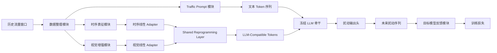
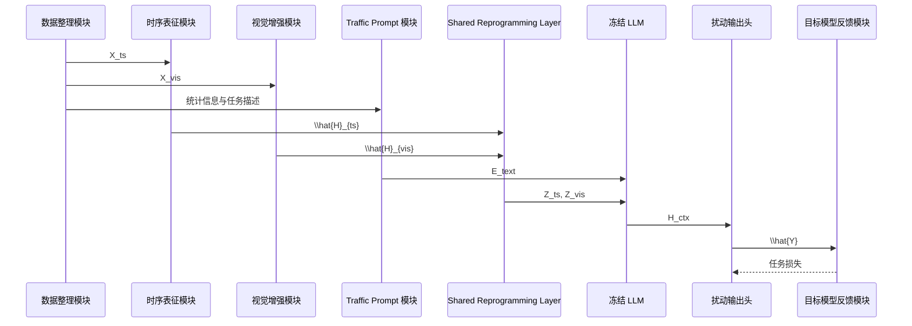
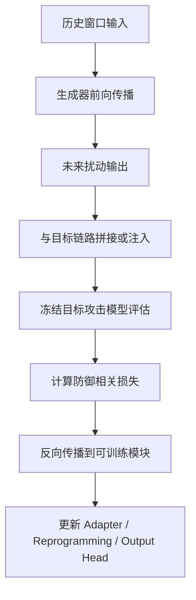

# 🧩 第二工作点模块说明文档

## 🗺️ 快速导航

| 你现在最想看什么 | 建议先看哪一节 |
| --- | --- |
| 想先知道整套系统到底由哪些部分组成 | `1. 文档目的`、`3. 总体模块图` |
| 想知道每个模块分别负责什么 | `4. 核心模块逐项说明` |
| 想知道数据是怎么在模块间流动的 | `5. 数据流与接口关系` |
| 想知道为什么不能只用线性层直接拼接 | `4.6 Shared Reprogramming Layer` |
| 想知道训练时谁负责提供反馈 | `4.9 目标模型反馈模块`、`6. 训练闭环说明` |
| 想快速把模块关系记住 | `7. 一页式总结` |

---

## 🎯 1. 文档目的

- 这份文档不再重复“第二工作点为什么成立”这一整套方法论推导，而是专门回答一个更工程化的问题：当第二工作点真正落地为一个可训练系统时，整套方法应当拆成哪些模块，每个模块究竟承担什么职责，它为什么不能被随意删除，以及它和前后模块之间通过什么形式发生连接。这个问题之所以必须单独写清楚，是因为第二工作点引入了时序链路、视觉链路、文本 prompt、线性 adapter、Shared Reprogramming Layer、冻结 LLM、输出头以及目标模型反馈等多个组成部分。如果没有一份单独的模块说明，读者很容易把这套结构误解成“把几个热门部件机械拼装在一起”。

- 模块说明文档的价值不在于把名字列出来，而在于把“职责边界”写清楚。对于一个研究型系统来说，真正决定实验是否可信的，往往不是模块数量，而是每个模块是否只承担自己应该承担的那一层语义。例如，时序分支应该负责历史窗口中的因果顺序与动态波动，视觉分支应该负责把局部结构模式显式化，prompt 应该负责提供语言锚点与任务约束，Shared Reprogramming Layer 应该负责把非文本模态映射到 LLM 可接受的语义空间，而不是让不同模态彼此直接“对齐”。只有把这些边界划清楚，后续的消融实验、误差分析和论文表述才会稳定。

> [!IMPORTANT]
> <span style="color:#15803d;"><strong>这份文档的核心目标不是“介绍模块名称”，而是“解释模块存在的因果理由与接口边界”。</strong></span>

> [!NOTE]
> `2026-04-28` 更新：当前真实 `torch_real` 实现已经把 Shared Reprogramming 扩展为两种可切换模式。推荐主线是与 Time-LLM 一致的 `text_prototypes`，而原来的自由原型矩阵形式保留为 `learned_prototypes` 对照模式。

---

## 📌 2. 模块总览表

| 模块名称 | 主要输入 | 主要输出 | 核心职责 | 是否参与训练 |
| --- | --- | --- | --- | --- |
| 数据整理模块 | 历史流量窗口、标签与训练配置 | 规范化后的时序张量与辅助视图 | 统一输入格式，保证后续链路可复现 | 否 |
| 时序表征模块 | 历史流量序列 `X_ts` | 时序特征 `H_ts` | 保留因果顺序与局部动态波动 | 是 |
| 视觉增强模块 | 同一历史窗口的结构化视图 `X_vis` | 视觉特征 `H_vis` | 显式化局部形态与结构模式 | 是 |
| Traffic Prompt 模块 | 任务描述、窗口统计、约束信息 | 文本 token `E_text` | 提供语言锚点与任务语义前缀 | 否或弱训练 |
| 线性 Adapter 模块 | `H_ts`、`H_vis` | `\hat{H}_{ts}`、`\hat{H}_{vis}` | 完成维度投影与模态内压缩 | 是 |
| Shared Reprogramming / Semantic Alignment | `\hat{H}_{ts}`、`\hat{H}_{vis}`、`E'` 或原型矩阵 `P` | `Z_ts`、`Z_vis` | 将非文本模态映射到 LLM 兼容语义空间 | 是 |
| 冻结 LLM 模块 | `E_text`、`Z_ts`、`Z_vis` | 上下文表示 `H_ctx` | 在统一语言语义空间中做上下文整合 | 否 |
| 扰动输出头 | `H_ctx` | 未来窗口扰动 `\hat{Y}` | 生成可部署的未来扰动序列 | 是 |
| 目标模型反馈模块 | `\hat{Y}` 与目标攻击模型 | 攻击损失与反馈梯度 | 把防御目标转化为训练信号 | 否 |

---

## 🧭 3. 总体模块图



- 这张图最重要的不是展示“模块很多”，而是展示一条严格分层的数据流。历史流量窗口先被整理为两种非文本视图和一种文本描述入口，然后两种非文本视图分别完成特征提取与线性投影，接着进入 Shared Reprogramming Layer，把原本不属于语言模态的表示变成 LLM 可接受的语义 token。与此同时，Traffic Prompt 作为天然文本输入直接进入语言空间。最后，冻结 LLM 只负责做统一上下文建模，输出头负责把高层语义重新压回未来扰动序列，目标模型反馈模块负责把“防御是否有效”变成训练信号。

---

## 🧱 4. 核心模块逐项说明

### 4.1 数据整理模块

- 这个模块看起来最朴素，但它实际上决定了整个系统是否具备可复现性。因为第二工作点不是重新定义一个新任务，而是在第一工作点的同一数据地基上改造内部生成器。因此，数据整理模块的第一职责不是“多做预处理”，而是“少做会改变任务边界的预处理”。它必须保证输入仍然来自 `Generator_Trainer` 中已经使用的数据集，并且历史窗口、未来窗口、标签切分方式和目标模型的评估接口都保持一致。只有这样，后续实验里的收益才可以被归因到结构变化，而不是数据流被悄悄换掉。

- 从张量层面看，这个模块负责把同一个历史窗口稳定拆成两类表示。第一类是供时序链路使用的顺序张量 `X_ts`，它保留原始时间步结构；第二类是供视觉增强链路使用的结构化表示 `X_vis`，它强调局部模式、密度变化和波动形态。这里的关键不是制造两个毫不相关的输入，而是从同一份物理信号中构造两个观察视角。这样做的数学意义在于：原始流量序列本身是一条一维动态轨迹，而视觉增强视图相当于对这条轨迹做结构显式化，帮助模型更稳定地观察局部波峰、平台、密集区和突变段。

### 4.2 时序表征模块

- 时序表征模块是整套系统中的“任务主语义”承载者。因为 Augur 的原始目标不是做离线识别，而是根据过去窗口生成未来扰动，所以只要离开时间因果顺序，整个任务定义就会立刻松动。这个模块存在的根本原因，是历史流量中的时间次序不仅是一个排列关系，更是一种约束：系统只能利用过去信息预测未来，不能借助未来片段反向解释当前扰动。因此，这个模块必须优先保留顺序依赖、局部波动和阶段性变化，而不是一上来就把所有样本压成一个与时间无关的全局向量。

- 从实现角度看，这一层可以继续沿用第一工作点中已经验证过的时序建模主线。它不必承担跨模态对齐，也不必承担语言语义映射，它只需要把原始历史窗口编码成对后续预测有用的时序表征 `H_ts`。如果这个模块被替换成一个过度静态的特征汇聚器，那么后续再精巧的 LLM 或 Reprogramming 结构也只能处理一个已经失去因果纹理的输入。换句话说，时序表征模块不是为了“提供另一路特征”，而是为了守住第二工作点与第一工作点之间最重要的任务连续性。

### 4.3 视觉增强模块

- 视觉增强模块的引入，并不是因为流量任务被改写成了图像任务，而是因为单纯的一维时序读法容易把局部结构模式埋没在连续数值里。很多时候，某些扰动前兆不是体现在单个时间点的值，而是体现在一段邻域内的密度形状、跃迁边界或重复纹理。用原始序列直接表达这些模式时，模型需要自己在高维空间中重新组织局部关系；而视觉增强模块做的事情，是先把这种局部结构显式化，让后续模型不必反复从零学习“哪些邻域形状值得关注”。

- 这里必须强调，这个模块提供的是“辅助结构视图”，不是对时序主链路的替代。它的物理意义类似于在不改变原始信号来源的前提下，增加一层结构观察窗口，让系统既看到时间顺序，也看到局部形态。这样做对系统稳定性的贡献在于：当原始序列在数值上存在噪声、抖动或局部弱模式时，视觉视图能够给出更显式的结构提示，减少后续表示学习对偶然波动的过拟合风险。

### 4.4 Traffic Prompt 模块

- 很多人第一次看到 prompt，会误以为它承担的是“生成说明”或“文本解释”功能。但在第二工作点里，Traffic Prompt 的真正作用不是为了让模型说话，而是为了给冻结 LLM 提供一个任务锚点。因为 LLM 预训练时熟悉的是语言 token，而不是流量 patch 或视觉结构块，所以当非文本模态被送入骨干之前，系统最好同时提供一段明确的任务语境，告诉骨干当前输入代表的是什么对象、预测目标是什么、输出需要满足什么边界。这相当于在语言空间里先建立一个参考坐标，再把非文本表示投进去。

- 因此，Traffic Prompt 不是主要被“对齐”的对象。它天然就在语言空间里，承担的是参照系功能。真正需要被重新表征的，是时序特征和视觉特征。这个区别必须在模块层面写清楚，否则读者很容易误以为 Reprogramming Layer 主要是在处理文本 prompt。更准确的说法是：prompt 提供语义锚点，非文本模态通过重编程映射到与该锚点兼容的空间，冻结 LLM 再对这些共享空间中的 token 做上下文整合。

### 4.5 线性 Adapter 模块

- 线性 Adapter 模块的职责非常明确，只负责维度投影和模态内压缩，不负责真正的跨模态语义对齐。之所以必须单独保留这一步，是因为时序表征模块和视觉增强模块输出的特征维度、数值尺度和统计分布很可能不同，而冻结 LLM 需要的是一种更接近其输入嵌入维度的稳定表示。如果跳过这一步，后续 Shared Reprogramming Layer 不得不同时处理“维度兼容”和“语义映射”两类问题，训练难度会明显增大。

- 这一层选择简单线性网络，而不是更重的卷积或交叉注意力结构，是一个工程约束而不是风格偏好。因为第二工作点的研究重点不在于重新发明一个复杂适配器，而在于验证“视觉增强 + 轻量重编程 + 冻结 LLM”这条主线是否比第一工作点的纯时序生成器更有效。把 Adapter 控制在线性层级，可以把结构收益更干净地归因给真正关键的语义重编程机制，而不是被一个额外的大模块掩盖。

### 4.6 Shared Reprogramming Layer

> [!IMPORTANT]
> 当前代码里这一层已经不是“只有一个 `P` 矩阵”的单实现了，而是一个统一接口下的两种语义对齐模式：
> - `text_prototypes`：先用冻结 backbone 的预训练 embedding 矩阵 `E` 构造 `E' = W E`，再由 patch token 对 `E'` 做 multi-head cross-attention。这是当前推荐主线。
> - `learned_prototypes`：保留自由可学习原型矩阵 `P`，主要用于回归和消融。

- Shared Reprogramming Layer 是整套系统中最容易被误解、但也最不能缺失的模块。很多人会把“两个分支各过一个线性层再拼接”误写成 reprogramming，但这实际上只完成了维度兼容，没有完成语义重表示。真正的 reprogramming，遵循的是 Time-LLM 的核心思想：把原本不属于语言模态的输入，映射为 LLM 已经熟悉的语义 token 形式。也就是说，这个模块要解决的不是“时序和视觉彼此怎么对齐”，而是“时序和视觉这两种非文本模态，怎样分别被映射到同一个 LLM-compatible semantic space”。

- 如果按当前推荐主线来写，更严格的表达应该是：线性 Adapter 先给出中间表示 `\hat{H}_{ts}` 和 `\hat{H}_{vis}`，然后利用冻结 backbone 的词表 embedding `E \in \mathbb{R}^{V \times D}` 构造一个小型 prototype bank `E' = W E`，再用 patch token 对 `E'` 做 cross-attention，从而得到真正进入 LLM 的对齐 token。它的核心形式可以写成：

$$
E' = W E, \qquad W \in \mathbb{R}^{V' \times V}, \qquad V' \ll V
$$

$$
Q = \hat{H} W^Q,\qquad K = E' W^K,\qquad V = E' W^V
$$

$$
Z = \operatorname{MHA}(Q, K, V)
$$

- 如果按回退/消融模式来写，这一层也可以退化为自由原型矩阵 `P` 的 learned 路由。这个版本仍然成立，但它不再代表“论文同款默认实现”。其数学形式可以写成：

$$
A_{ts} = \operatorname{softmax}(\hat{H}_{ts} P^\top), \quad
A_{vis} = \operatorname{softmax}(\hat{H}_{vis} P^\top)
$$

$$
Z_{ts} = A_{ts} P, \quad
Z_{vis} = A_{vis} P
$$

- 这里的关键不是公式本身，而是它揭示的职责边界。`P` 不是一个普通参数矩阵，而是一组共享语义原型；`A_{ts}` 和 `A_{vis}` 也不是简单权重，而是两种非文本模态对这些原型的重组系数。只有当这一步存在时，我们才有理由说系统完成了“把非文本模态映射到语言骨干兼容空间”的过程。否则，后面的冻结 LLM 只是在处理两个数值上拼接好的输入，而不是在处理真正被重表示过的 token。

### 4.7 冻结 LLM 模块

- 冻结 LLM 模块的存在理由，不是让第二工作点变成一个“更会说话”的系统，而是把它当作一个高维上下文整合器。前面的模块已经分别准备好了三类输入：文本 prompt 给出了语言锚点，时序重编程 token 给出了因果动态信息，视觉重编程 token 给出了局部结构信息。冻结 LLM 的职责是把这些已经处于统一语义空间中的 token 放到同一个上下文窗口里，利用其预训练得到的语言语义组织能力，为输出头提供一个更稳定的高层表示。

- 这里必须强调“冻结”两个字的重要性。第二工作点的研究目的不是微调整个大模型，而是在有限计算资源下，把它当作语义骨干来使用。冻结策略的直接好处有两个。第一，它显著降低显存压力和训练不稳定性，使系统能够在两张 4090 的约束下稳定运行。第二，它把学习压力集中到真正应该学习的外层模块上，也就是 adapter、reprogramming 和输出头。这样一来，实验更容易解释，系统也更接近“用预训练骨干承载新模态映射”的研究问题本身。

### 4.8 扰动输出头

- 扰动输出头负责把高层上下文表示重新压回到任务定义所要求的未来扰动空间。这一步之所以不能被一句“接一个 MLP”轻描淡写带过，是因为第二工作点的输出不是分类标签，也不是异常分数，而是未来窗口上的可部署扰动序列。也就是说，输出头必须把语言骨干中的抽象语义重新翻译为一种满足物理边界、时间边界和部署边界的数值结果。如果这一层设计得含糊，整个系统就会悄悄从“生成未来扰动”滑向“做一个好看的表征学习实验”。

- 更具体地说，输出头至少要面对两个约束。第一是维度约束，即输出长度必须与目标未来窗口一致；第二是值域约束，即生成结果必须满足任务定义里的扰动边界，而不能产生明显不可部署的数值。这个模块对系统稳定性的贡献在于：它把高层语义空间和低层物理部署空间连接起来，使得前面的复杂表征学习最终落在一个可执行的扰动输出上。

### 4.9 目标模型反馈模块

- 目标模型反馈模块是第二工作点区别于“普通多模态表征学习”的关键闭环。因为这项工作最终要回答的不是“表示看起来是否更丰富”，而是“生成出的未来扰动是否真的削弱了 DeepCorr、mDeepCorr 或 DeepCoFFEA 的流量关联能力”。如果训练过程里没有目标模型反馈，那么系统最多只能学会拟合某种统计分布，却无法直接对齐 Augur 的防御目标。因此，这个模块的本质是把外部攻击模型的表现转化为生成器内部可以优化的损失信号。

- 从工程视角看，这个模块通常不参与参数更新，但它决定了训练信号是否与最终任务一致。它的地位有些像判别器或任务裁判：生成器负责提出未来扰动，目标模型负责给出“这种扰动是否真的削弱关联攻击”的反馈。只要这条反馈链是稳定的，第二工作点的训练目标就不会漂移成一个脱离实际防御场景的代理任务。

---

## 🔄 5. 数据流与接口关系



- 这张时序图强调的是“谁把什么交给谁”，而不是再次重复模块名称。数据整理模块先完成统一切分，然后分别喂给时序链路、视觉链路和 prompt 构造链路。时序与视觉分支各自经过模态内表征和线性投影之后，统一进入 Shared Reprogramming Layer；prompt 则直接作为文本序列送入冻结 LLM。最终，冻结 LLM 输出上下文表示，输出头给出未来扰动，目标模型反馈模块负责把外部攻击效果重新投射为训练信号。这样一来，每一层接口的职责都变得可检查、可替换、可消融。

---

## 🧪 6. 训练闭环说明



- 第二工作点的训练闭环之所以必须单独说明，是因为很多读者会本能地以为“既然用了 LLM，那训练重点就在 LLM 上”。但实际情况正好相反。整个闭环真正被更新的，是外层的线性 Adapter、Shared Reprogramming Layer 和输出头。冻结 LLM 与目标模型都处在“提供结构化上下文”或“提供外部反馈”这一层。这个边界越清楚，系统越稳定，实验也越容易复现。

- 从损失传播路径看，未来扰动 `\hat{Y}` 不是训练的终点，而是任务反馈的起点。只有当它被送入目标模型评估链路之后，系统才能知道这次生成是否真正干扰了攻击模型的关联能力。因此，第二工作点的优化方向不是让输出“像原始数据”，而是让输出“在可部署边界内，尽可能削弱目标模型判断”。这就是为什么目标模型反馈模块必须出现在模块说明文档中，而不能只在实验章节被顺带提一下。

---

## 💻 7. 核心实现伪代码

```python
def forward_second_workpoint(history_seq, stats_text):
    """
    第二工作点生成器的核心前向流程。

    参数:
        history_seq: 历史流量窗口张量，形状通常为 [B, T, C]
        stats_text: 由窗口统计量、任务描述和约束信息拼成的 prompt 文本

    返回:
        pred_perturbation: 未来窗口上的扰动预测结果

    异常:
        ValueError: 当输入为空或时间维长度非法时抛出
    """

    # 边界条件检查，避免后续模块在空输入上产生无意义结果
    if history_seq is None:
        raise ValueError("history_seq 不能为空")
    if history_seq.shape[1] <= 0:
        raise ValueError("历史窗口长度必须大于 0")

    # 1. 从同一历史窗口构造两种观察视图
    x_ts = build_temporal_view(history_seq)
    x_vis = build_visual_view(history_seq)

    # 2. 分别提取时序特征和视觉特征
    h_ts = temporal_encoder(x_ts)
    h_vis = visual_encoder(x_vis)

    # 3. 线性 adapter 只负责模态内投影，不负责真正语义对齐
    h_ts_proj = linear_adapter_ts(h_ts)
    h_vis_proj = linear_adapter_vis(h_vis)

    # 4. 共享重编程层把非文本模态映射到 LLM 兼容语义空间
    z_ts = shared_reprogram(h_ts_proj)
    z_vis = shared_reprogram(h_vis_proj)

    # 5. prompt 作为语言锚点直接进入文本嵌入空间
    e_text = prompt_encoder(stats_text)

    # 6. 冻结 LLM 只做上下文整合，不参与参数更新
    h_ctx = frozen_llm(e_text, z_ts, z_vis)

    # 7. 输出头把高层上下文表示压回未来扰动空间
    pred_perturbation = output_head(h_ctx)

    return pred_perturbation
```

- 这段伪代码最重要的地方，在于它把“维度投影”和“语义重编程”分成了两个连续但不同的步骤。只要这两个步骤在实现里被混成一个黑箱，读者就会再次误解系统只是做了简单拼接。因此，在真正编码时，也建议保持这种显式分层写法，让模块边界在代码结构中和文档中保持一致。

> [!NOTE]
> 在当前真实代码里，`shared_reprogram(...)` 应当理解为抽象接口：它既可以落到 `text_prototypes`，也可以落到 `learned_prototypes`，而不是固定等价于一个自由原型矩阵 `P`。

---

## 📚 8. 常见误解与正确理解

| 常见误解 | 正确理解 |
| --- | --- |
| 两个分支各过一个线性层，再拼起来就是 reprogramming | 线性层只解决维度兼容，reprogramming 解决的是非文本模态到语言语义空间的映射 |
| prompt 也是主要被对齐对象 | prompt 本来就在语言空间里，它是语义锚点，不是主要被重表示的对象 |
| 视觉链路加入后，时序链路可以弱化 | 时序链路仍然是任务主语义承载者，视觉链路只是结构增强视图 |
| 冻结 LLM 只是为了“蹭大模型” | 冻结 LLM 的真正作用是提供稳定的统一上下文空间，同时控制训练成本 |
| 输出头只是普通回归层 | 输出头承担的是把高层语义压回可部署扰动空间的任务边界转换 |

---

## ✅ 9. 一页式总结

- 第二工作点可以被理解为一个分层明确的生成系统，而不是一个杂糅的多模态拼接器。数据整理模块负责保证任务地基不变；时序表征模块守住因果顺序；视觉增强模块显式化局部结构；Traffic Prompt 模块提供语言锚点；线性 Adapter 完成维度投影；Shared Reprogramming Layer 把非文本模态映射到 LLM 兼容空间；冻结 LLM 完成上下文整合；输出头负责生成未来扰动；目标模型反馈模块负责把防御目标转化为训练信号。

- 如果只允许记住一句话，那么最准确的总结是：<span style="color:#15803d;"><strong>第二工作点不是把视觉特征和时序特征彼此硬对齐，而是让它们分别经过轻量重编程后，与 prompt 一起进入同一个冻结语言骨干，在统一语义空间中完成未来扰动生成。</strong></span>
