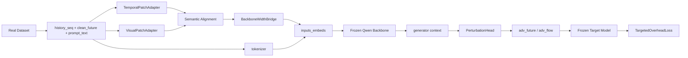

# 第二工作点训练流程全链路详解

## 快速说明

> [!IMPORTANT]
> 这份文档描述的是 `work2/second_workpoint/` 当前真实可运行主线，而不是早期的 stub 原型。现在仓库里只保留：
>
> - 真实数据加载
> - 冻结 Hugging Face Qwen backbone
> - 冻结真实 target model
> - `torch_real` 训练闭环

## 快速导航

| 如果你最关心的问题是 | 建议先看 |
| --- | --- |
| 当前到底训练什么、冻结什么 | `2. 模块与职责` |
| 两种语义对齐模式有什么区别 | `3. 语义对齐模式` |
| 一个 batch 从数据到 loss 如何流动 | `4. 真实训练数据流` |
| 梯度为什么能穿过冻结 backbone 和 target | `5. 反向传播边界` |
| 后面如何扩展到更大 backbone | `7. 面向扩展的设计点` |

## 1. 当前入口与配置

当前训练入口只有一个：

- [run_train.py](/home/nixilin/work2/work2/run_train.py)

当前保留的配置文件有三个：

| 配置 | 作用 |
| --- | --- |
| [second_workpoint_deepcorr300_torch_real_smoke.json](/home/nixilin/work2/work2/configs/second_workpoint_deepcorr300_torch_real_smoke.json) | `DeepCorr300 + text_prototypes` 最小真实 smoke |
| [second_workpoint_deepcorr300_torch_real_smoke_learned.json](/home/nixilin/work2/work2/configs/second_workpoint_deepcorr300_torch_real_smoke_learned.json) | `DeepCorr300 + learned_prototypes` 对照 smoke |
| [second_workpoint_deepcoffea_real_smoke.json](/home/nixilin/work2/work2/configs/second_workpoint_deepcoffea_real_smoke.json) | `DeepCoFFEA + text_prototypes` 最小真实 smoke |

这些配置共同遵守同一个约束：

- `backend=torch_real`
- `data_loader=real`
- `backbone_mode=hf_frozen`
- `target_model_mode=torch`

## 2. 模块与职责

### 2.1 主模型栈

| 模块 | 文件 | 是否训练 | 作用 |
| --- | --- | --- | --- |
| `TemporalPatchAdapter` | [torch_real_model.py](/home/nixilin/work2/work2/second_workpoint/models/torch_real_model.py) | 是 | 把历史流量切成 patch 后映射到稳定的 trainable width |
| `VisualPatchAdapter` | 同上 | 是 | 从同一历史窗口提取视觉化统计 token |
| `SharedReprogrammingLayer` | 同上 | 是 | 对两路非文本 token 做语义对齐 |
| `BackboneWidthBridge` | 同上 | 是 | 在稳定 trainable width 与 backbone embedding width 之间显式投影 |
| `FrozenQwenBackbone` | [qwen_backbone.py](/home/nixilin/work2/work2/second_workpoint/models/qwen_backbone.py) | 否 | 真实 tokenizer + `inputs_embeds` + 冻结 Qwen hidden states |
| `PerturbationHead` | [torch_real_model.py](/home/nixilin/work2/work2/second_workpoint/models/torch_real_model.py) | 是 | 从 backbone 上下文生成未来窗口扰动 |

### 2.2 目标反馈栈

| 模块 | 文件 | 是否训练 | 作用 |
| --- | --- | --- | --- |
| `DeepCorrTorchTarget` | [target_model_adapter.py](/home/nixilin/work2/work2/second_workpoint/models/target_model_adapter.py) | 否 | 加载真实 DeepCorr family |
| `DeepCoFFEATorchTarget` | 同上 | 否 | 加载真实 DeepCoFFEA |
| `TargetedOverheadLoss` | [losses.py](/home/nixilin/work2/work2/second_workpoint/training/losses.py) | 否 | 组合目标误导损失与时间/大小开销约束 |

## 3. 语义对齐模式

### 3.1 `text_prototypes`

这是当前默认推荐模式，也更贴近 Time-LLM。

它做的事情不是“让时序特征和视觉特征彼此对齐”，而是：

- 先读取冻结基模的预训练 embedding 矩阵 `E`
- 学习一个 probe 权重 `W`
- 构造 `E' = W E`
- 让 patch token 对 `E'` 做 multi-head cross-attention

换句话说，非文本 token 被重新表达成“基模 embedding 空间里的一组语义原型”。

### 3.2 `learned_prototypes`

这是保留的对照模式。

- 原型矩阵本身是可学习参数
- 不直接利用词表 embedding 的语言先验
- 适合做消融实验，回答“性能变化到底来自 paper-faithful 语义对齐，还是仅来自引入了一个可学习原型层”

### 3.3 两种模式的共同点

- 时序 token 和视觉 token 都走同一个 reprogramming 机制
- prompt 文本都直接作为语言锚点输入冻结 backbone
- 最终都要经过 `BackboneWidthBridge` 才能进入 Qwen

## 4. 真实训练数据流



### 4.1 数据集侧输出什么

真实数据集样本现在统一输出这些字段：

| 字段 | 作用 |
| --- | --- |
| `full_flow` | 当前窗口对应的原始流量主体 |
| `history_seq` | 输入给 generator 的历史窗口 |
| `clean_future` | 未来干净窗口，用于构造扰动前后的对比 |
| `prompt_text` | 由历史窗口统计量生成的自然语言提示 |
| `future_mask` | 尾窗补零时标记哪些 future token 有效 |
| `writeback_meta` | 未来窗口回写到完整流量时的位置与有效长度 |
| `target_full_flow` | 当 target 需要完整通道时使用的真实流量底板 |

### 4.2 为什么不再有 `prompt_ids`

现在主路径已经固定为：

`prompt_text -> tokenizer -> prompt embeddings -> inputs_embeds`

因此不再需要任何哈希 `prompt_ids` 占位接口。这样做有三个好处：

- 语言锚点是真的语言空间，而不是假 token
- 后面换更大 backbone 时不需要再改 prompt 接缝
- 数据预处理和 backbone 语义入口的边界更清楚

## 5. 反向传播边界

### 5.1 冻结 backbone 为什么仍然可微

关键点不在于参数是否冻结，而在于前向是否仍在 autograd 图里。

当前实现是：

- Qwen 参数 `requires_grad=False`
- 但 backbone forward 仍然正常执行
- 上游 trainable token 通过 `inputs_embeds` 进入 backbone

所以梯度会回到：

- temporal adapter
- visual adapter
- semantic alignment layer
- width bridge
- perturbation head

但不会更新 Qwen 参数本身。

### 5.2 冻结 target 为什么仍然提供训练信号

target 侧也是同样的逻辑：

- DeepCorr / DeepCoFFEA 参数冻结
- 但 target forward 不用 `torch.no_grad()` 包住
- target logits 仍然参与 loss

因此，loss 对 `adv_flow` 的梯度依然存在，generator 可以继续学习。

## 6. 一次最小 train step 内部发生了什么

可以把当前 `TorchTrainer` 的核心循环压缩成下面这段伪代码：

```python
# 所有注释均为中文，便于和项目文档保持一致
batch = next(train_loader)
outputs = model(history_seq=batch["history_seq"], prompt_text=batch["prompt_text"])

perturbation = outputs["perturbation"]
adv_future = build_positive_future(clean_future=batch["clean_future"], perturbation=perturbation)
adv_flow = writeback_future(batch["full_flow"], adv_future, batch["writeback_meta"], batch["future_mask"])
target_adv_flow = writeback_target_view(batch, adv_future)

target_logits = frozen_target(target_adv_flow)
loss_dict = criterion(
    target_logits=target_logits,
    target_labels=zeros_like(target_logits),
    original_flow=batch["full_flow"],
    adv_flow=adv_flow,
    flow_mask=build_flow_mask(batch),
)

loss = loss_dict["loss"] / gradient_accumulation_steps
loss.backward()
optimizer.step()
optimizer.zero_grad()
```

这段流程里最值得注意的是两件事：

- `adv_future` 不是直接覆盖 `clean_future`，而是按 mask 和 writeback 元信息回写
- target 输入不一定等于 generator 的 `full_flow`，DeepCorr 场景下可能先写回 `target_full_flow`

## 7. 面向扩展的设计点

### 7.1 为什么要保留稳定的 trainable width

如果可训练模块直接绑死在 backbone hidden size 上，那么从 `3B` 升到 `7B` 时，训练模块本身也要跟着重构。

现在的做法是：

- generator 侧使用稳定的 `trainable_width`
- 通过 `BackboneWidthBridge` 投到实际 backbone width

这样切换更大 backbone 时，主要变化集中在：

- `backbone_model_name / backbone_model_path`
- `backbone_dtype / backbone_quantization`
- batch 与 accumulation 配置

而不是整套 generator 结构重写。

### 7.2 为什么保留两种语义对齐模式

这不是为了兼容 stub，而是为了实验可解释性。

- `text_prototypes` 用来代表论文式主方案
- `learned_prototypes` 用来做对照和消融

如果后面 `7B` 训练效果发生变化，这个双开关能帮助判断变化到底来自 backbone 规模，还是来自语义对齐机制。

## 8. 当前最小链路已经证明了什么

当前最小 smoke 已经证明：

- 真实数据可以进入第二工作点 dataloader
- `prompt_text` 可以走真实 tokenizer 路径
- paper-faithful `text_prototypes` 能接入冻结 Qwen
- future 扰动可以回写到真实 target 所需输入格式
- loss 能对上游 trainable 模块产生真实梯度
- checkpoint 和 `train_summary.json` 能正常落盘

这意味着下一阶段的重点，不再是“怎样摆脱 stub”，而是：

- 在 `4090 24GB` 上放大训练规模
- 测试更大 backbone
- 补充更系统的实验与评估设置
