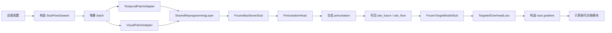
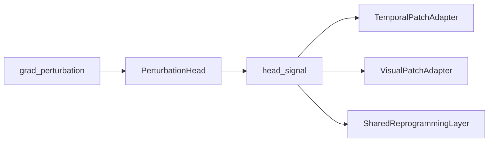

# 第二工作点训练流程全链路详解

## 快速说明

> [!IMPORTANT]
> 这份文档说明的不是 `Generator_Trainer/` 里原始 Augur 三条训练主线，而是当前已经落在 `work2/second_workpoint/` 下的“第二工作点最小可跑通训练版本”。
>
> 当前版本是 `numpy stub` 训练骨架，重点是把第二工作点的模块边界、数据结构、训练闭环、冻结策略和后续替换接口先固定下来。
>
> `2026-04-28` 更新：真实 `torch_real` 主线已经接通，并且默认推荐的真实语义对齐模式是 `text_prototypes`。因此，本文中的 `prompt_len=12`、`prompt_ids` 和共享原型矩阵 `P` 只对应 stub 路径；真实 Qwen 路径现在使用 `prompt_text -> tokenizer -> inputs_embeds`，并通过 `backbone_prompt_max_tokens` 控制 tokenizer 上限。

## 快速导航

| 如果你最关心的问题是 | 建议先看 |
| --- | --- |
| 第二工作点到底训练什么、冻结什么 | `3. 训练/冻结总表` |
| 是否需要先单独训练对齐模块 | `3.3 单阶段端到端训练规则` |
| 数据从进入脚本到 loss 之前经历了哪些结构变化 | `5. 数据流与结构变化` |
| 每个模块内部的 shape 怎么变 | `6. 主模型前向细节` |
| 当前“训练”到底是怎么更新参数的 | `8. stub 更新路径` |
| 配置参数和 `Generator_Trainer` 对齐到了哪些地方 | `2. 当前默认配置` |

---

## 1. 文档范围

- 当前文档对应的代码入口是 [run_train_stub.py](</n:/postgraduate/work2/work2/run_train_stub.py:1>)。
- 主配置文件是 [second_workpoint_stub.json](</n:/postgraduate/work2/work2/configs/second_workpoint_stub.json:1>)。
- 当前训练器、模型、损失和数据接口分别位于：
  - [trainer.py](</n:/postgraduate/work2/work2/second_workpoint/training/trainer.py:1>)
  - [second_workpoint_model.py](</n:/postgraduate/work2/work2/second_workpoint/models/second_workpoint_model.py:1>)
  - [losses.py](</n:/postgraduate/work2/work2/second_workpoint/training/losses.py:1>)
  - [stub_dataset.py](</n:/postgraduate/work2/work2/second_workpoint/data/stub_dataset.py:1>)
  - [backbone_stub.py](</n:/postgraduate/work2/work2/second_workpoint/models/backbone_stub.py:1>)
  - [target_model_stub.py](</n:/postgraduate/work2/work2/second_workpoint/models/target_model_stub.py:1>)

这份文档回答的是一个非常具体的问题：

- 当前第二工作点最小训练版本怎样从配置出发，生成 batch；
- batch 在每个模块里怎样变形；
- 哪些模块训练，哪些模块冻结；
- loss 怎样构成；
- 所谓“反向”在当前 stub 里是怎样被近似实现的；
- 后续替换成真实 backbone / 真实 target model / 真实 torch 训练时，应该替换哪几层。

---

## 2. 当前默认配置

当前默认配置来自 [second_workpoint_stub.json](</n:/postgraduate/work2/work2/configs/second_workpoint_stub.json:1>)，字段命名尽量贴近 `Generator_Trainer/run_deepcorr300.py` 与 `run_mdeepcorr.py`。

### 2.1 关键超参数

| 参数 | 当前值 | 作用 |
| --- | --- | --- |
| `flow_size` | `300` | 单条完整流量长度 |
| `seq_len` | `96` | 输入历史窗口长度 |
| `pred_len` | `48` | 未来预测窗口长度 |
| `patch_len` | `4` | patch 切分长度 |
| `enc_in` | `4` | 输入通道数 |
| `d_model` | `128` | token 隐层维度 |
| `n_heads` | `4` | 预留的多头配置字段，当前 stub 主要用于形状约束 |
| `prompt_len` | `12` | stub 路径中哈希 `prompt_ids` 的固定长度 |
| `prompt_vocab_size` | `256` | prompt token 词表大小 |
| `visual_conv_channels` | `8` | 视觉分支展开后的伪视觉通道数 |
| `reprogramming_num_prototypes` | `32` | 共享原型数 |
| `target_hidden_dim` | `64` | 冻结目标模型 stub 的隐藏层维度 |

### 2.2 训练超参数

| 参数 | 当前值 | 作用 |
| --- | --- | --- |
| `train_epochs` | `2` | 最小跑通时的 epoch 数 |
| `batch_size` | `4` | batch 大小 |
| `learning_rate` | `1e-3` | stub 更新步长 |
| `beta` | `1.0` | 目标误导损失权重 |
| `alpha` | `1.5` | 时间开销权重 |
| `gamma` | `0.9` | 大小开销权重 |
| `stub_update_scale` | `0.05` | 伪梯度更新缩放系数 |
| `backend` | `numpy_stub` | 当前后端实现 |

### 2.3 与 `Generator_Trainer` 的对齐情况

当前配置已经对齐了这些核心字段：

- 任务级字段：`model_id`、`model`、`target_model`、`adv_type`
- 数据级字段：`flow_size`、`data`、`data_path`
- 生成器级字段：`seq_len`、`pred_len`、`patch_len`、`stride`、`enc_in`、`d_model`、`n_heads`、`d_ff`
- 训练级字段：`train_epochs`、`batch_size`、`learning_rate`、`lradj`、`pct_start`
- 设备级字段：`use_gpu`、`gpu`、`use_multi_gpu`、`devices`

这意味着后续把当前 stub 版本替换成真实训练版本时，配置层不需要大改，主要替换的是模块实现。

> [!NOTE]
> 真实 `torch_real` 路径已经额外引入 `backbone_prompt_max_tokens` 与 `semantic_alignment_mode`。前者控制真实 tokenizer 的最大长度，后者在 `text_prototypes` 与 `learned_prototypes` 之间切换。

---

## 3. 训练/冻结总表

当前第二工作点总模型由四个可训练模块和两个冻结模块组成。

| 模块 | 文件位置 | 是否训练 | 当前参数量 | 作用 |
| --- | --- | --- | ---: | --- |
| `TemporalPatchAdapter` | `second_workpoint_model.py` | 是 | `2176` | 把历史流量切成时序 patch token |
| `VisualPatchAdapter` | `second_workpoint_model.py` | 是 | `4224` | 把历史流量变成伪视觉统计 token |
| `SharedReprogrammingLayer` | `second_workpoint_model.py` | 是 | `4096` | 把两路 token 映射到共享语义原型空间 |
| `PerturbationHead` | `second_workpoint_model.py` | 是 | `41280` | 生成未来窗口扰动 |
| `FrozenBackboneStub` | `backbone_stub.py` | 否 | `73472` | 冻结基模，占位真实 backbone |
| `FrozenTargetModelStub` | `target_model_stub.py` | 否 | `1153` | 冻结目标反馈模型，占位真实目标模型 |

### 3.1 总参数量

训练脚本实际打印出来的是：

| 项目 | 数值 |
| --- | ---: |
| `second_workpoint_total` | `125248` |
| `second_workpoint_trainable` | `51776` |
| `target_total` | `1153` |
| `target_trainable` | `0` |

### 3.2 为什么要这样切

- 第二工作点当前的目标不是立刻复刻真实实验结果，而是先把“多分支输入 -> 冻结基模上下文 -> 扰动生成 -> 冻结目标模型反馈 -> 参数更新”这条结构链路固定下来。
- 因为真实 backbone 和真实 target model 未来都要替换，所以现在先把它们放在冻结位置，保证训练接口不会因为后端替换而重写。
- 真正需要学习的是“如何从历史窗口中提取可控特征，并把它们转成未来扰动”，所以可训练部分被集中在前端适配器、共享重编程层和输出头。

### 3.3 单阶段端到端训练规则

这一点现在明确固定如下：

> [!IMPORTANT]
> 第二工作点采用的是“单阶段端到端联合训练”，不是“两阶段训练”。
>
> 也就是说，不会先把 `SharedReprogrammingLayer` 或所谓“语义对齐模块”单独预训练好再冻结，而是让它和两路 adapter、输出头一起，在同一条主任务训练链路里联合优化。

当前第二工作点的训练组织方式应当理解成：

```text
history flow + prompt
-> temporal adapter
-> visual adapter
-> shared reprogramming
-> frozen backbone
-> perturbation head
-> frozen target model feedback
-> main task loss
-> 回传并联合更新前端可训练模块
```

更具体地说：

- `TemporalPatchAdapter`：参与单阶段联合训练
- `VisualPatchAdapter`：参与单阶段联合训练
- `SharedReprogrammingLayer`：参与单阶段联合训练
- `PerturbationHead`：参与单阶段联合训练
- `FrozenBackboneStub`：始终冻结
- `FrozenTargetModelStub`：始终冻结

这条规则参考的是 Time-LLM 的训练范式，而不是“先训练语义对齐模块，再训练主任务头”的两阶段范式。

这里必须特别区分两件事：

- “端到端训练”指的是：主任务 loss 从最终输出一路约束到最前面的输入重编程路径。
- “冻结 backbone”指的是：梯度可以穿过 backbone 的输入输出关系回到前端模块，但 backbone 自己的参数不更新。

因此，第二工作点中所谓“语义对齐”不是靠单独的预训练阶段获得的，而是靠主任务损失在单阶段训练中联合学出来的。

---

## 4. 训练闭环总览



这条链路的关键点只有一句话：

> 当前第二工作点训练的本质，是让“历史流量 -> 多分支 token -> 冻结 backbone 上下文 -> 未来扰动”这条路径变得可训练，同时把真实大模型和真实目标模型都先替换成可控 stub。

补一句训练策略上的结论：

> 当前这条闭环本身就是完整训练闭环，因此第二工作点只保留这一次主训练，不再额外拆出“对齐模块预训练阶段”。

---

## 5. 数据流与结构变化

这一节只讲数据在训练器里如何一步一步变形，不讨论模块内部细节。

## 5.1 单条样本从数据集出来时长什么样

`StubFlowDataset.__getitem__()` 返回四个字段：

| 字段 | 形状 | 含义 |
| --- | --- | --- |
| `full_flow` | `[4, 300]` | 一条完整流量 |
| `history_seq` | `[4, 96]` | 历史输入窗口 |
| `clean_future` | `[48, 4]` | 未来干净窗口 |
| `prompt_ids` | `[12]` | prompt token 序列 |

### 结构来源

- `full_flow` 由合成正弦波、趋势项和噪声叠加而成。
- `history_seq = full_flow[:, :seq_len]`
- `clean_future = full_flow[:, seq_len:seq_len+pred_len].T`
- `prompt_ids` 是随机整数 token，用来占位未来真实 prompt 或语义条件。

所以单条样本在数据集阶段就已经被切成了：

$$
\texttt{full\_flow} \in \mathbb{R}^{4 \times 300}
$$

$$
\texttt{history\_seq} \in \mathbb{R}^{4 \times 96}
$$

$$
\texttt{clean\_future} \in \mathbb{R}^{48 \times 4}
$$

$$
\texttt{prompt\_ids} \in \mathbb{N}^{12}
$$

## 5.2 一个 batch 堆叠后会变成什么

在默认 `batch_size=4` 时，`_stack_batch()` 会把样本堆成：

| 字段 | batch 后形状 |
| --- | --- |
| `full_flow` | `[4, 4, 300]` |
| `history_seq` | `[4, 4, 96]` |
| `clean_future` | `[4, 48, 4]` |
| `prompt_ids` | `[4, 12]` |

为了避免歧义，下文把第一个维度写成 `B`：

$$
\texttt{full\_flow} \in \mathbb{R}^{B \times 4 \times 300}
$$

$$
\texttt{history\_seq} \in \mathbb{R}^{B \times 4 \times 96}
$$

$$
\texttt{clean\_future} \in \mathbb{R}^{B \times 48 \times 4}
$$

$$
\texttt{prompt\_ids} \in \mathbb{N}^{B \times 12}
$$

## 5.3 进入模型之后的总结构变化

训练器中的 `_forward_batch()` 会把 batch 依次变成：

```text
history_seq [B, 4, 96]
-> model.forward(...)
-> perturbation [B, 48, 4]
-> abs()
-> positive_delta [B, 48, 4]
-> 与 clean_future 组合
-> adv_future [B, 48, 4]
-> transpose 回写
-> adv_flow [B, 4, 300]
-> FrozenTargetModelStub
-> target_logits [B, 1]
-> loss
```

当前默认日志里打印出的第一次 shape 也是：

```text
history_seq=(4, 4, 96)
temporal_tokens=(4, 24, 128)
visual_tokens=(4, 24, 128)
context_tokens=(4, 60, 128)
perturbation=(4, 48, 4)
adv_flow=(4, 4, 300)
logits=(4, 1)
```

---

## 6. 主模型前向细节

这一节进入 [second_workpoint_model.py](</n:/postgraduate/work2/work2/second_workpoint/models/second_workpoint_model.py:1>) 内部，逐模块说明结构变化。

## 6.1 时序分支 `TemporalPatchAdapter`

输入：

$$
\texttt{history\_seq} \in \mathbb{R}^{B \times 4 \times 96}
$$

因为：

$$
\texttt{patch\_num} = \frac{96}{4} = 24
$$

所以它的结构变化是：

```text
[B, 4, 96]
-> reshape(B, 4, 24, 4)
-> transpose(0, 2, 1, 3)
-> [B, 24, 4, 4]
-> reshape
-> flat_inputs [B, 24, 16]
-> Linear(16 -> 128)
-> [B, 24, 128]
-> layer_norm
-> temporal_tokens [B, 24, 128]
```

### 这一步的含义

- 每个 patch 覆盖 `4` 个时间点。
- 每个 patch 内保留 `4` 个通道，所以 patch 展平后的长度是 `4 * 4 = 16`。
- 线性层把局部原始 patch 投影成 backbone 可接受的 token 维度 `128`。

## 6.2 视觉分支 `VisualPatchAdapter`

视觉分支并没有真的做二维卷积，而是把每个 patch 的统计量当成“伪视觉特征”。

起点和时序分支一样：

```text
history_seq [B, 4, 96]
-> reshape + transpose
-> patch_view [B, 24, 4, 4]
```

然后在 patch 维上提取四类统计：

- `mean_feature` -> `[B, 24, 4]`
- `std_feature` -> `[B, 24, 4]`
- `max_feature` -> `[B, 24, 4]`
- `min_feature` -> `[B, 24, 4]`

再堆叠成：

```text
stats [B, 24, 4, 4]
```

因为当前 `visual_conv_channels=8`，而统计维只有 `4`，所以代码会沿最后一维重复展开，得到：

```text
expanded [B, 24, 4, 8]
-> reshape
-> flat_inputs [B, 24, 32]
-> Linear(32 -> 128)
-> layer_norm
-> visual_tokens [B, 24, 128]
```

### 这一步的含义

- 时序分支更强调原始局部片段本身。
- 视觉分支更强调局部统计轮廓。
- 这对应第二工作点的一个核心设计意图：同一段历史流量不只从一个投影空间进入基模，而是至少准备两种表征。

## 6.3 共享重编程层 `SharedReprogrammingLayer`

> [!NOTE]
> 本节只描述 `numpy_stub` 中的共享原型矩阵 `P` 版本。当前真实 `torch_real` 实现已经新增 paper-faithful 的 `text_prototypes` 模式：先从冻结 backbone 的预训练 embedding 矩阵 `E` 构造 `E' = W E`，再用 patch token 对 `E'` 做 multi-head cross-attention；原来的 `P` 版本被保留为 `learned_prototypes` 对照开关。

两路 token 进入同一个共享原型空间。

输入：

$$
\texttt{temporal\_tokens}, \texttt{visual\_tokens} \in \mathbb{R}^{B \times 24 \times 128}
$$

原型矩阵：

$$
\texttt{prototypes} \in \mathbb{R}^{32 \times 128}
$$

对每一路 token，都做：

```text
tokens [B, 24, 128]
-> 与 prototypes 做相似度
-> logits [B, 24, 32]
-> softmax
-> weights [B, 24, 32]
-> weights @ prototypes
-> reprogrammed_tokens [B, 24, 128]
```

所以这里的结构变化本质上是：

$$
\mathbb{R}^{B \times 24 \times 128}
\rightarrow
\mathbb{R}^{B \times 24 \times 32}
\rightarrow
\mathbb{R}^{B \times 24 \times 128}
$$

### 这一步的含义

- `32` 个 prototype 相当于一个共享语义字典。
- 无论 token 来自时序分支还是视觉分支，最后都被重写到同一组原型坐标系里。
- 这正是当前第二工作点里“多模态入口，但共享语义对接层”的最小实现。

## 6.4 冻结基模 `FrozenBackboneStub`

输入包括三段：

| 来源 | 形状 |
| --- | --- |
| `prompt_embeddings` | `[B, 12, 128]` |
| `reprogrammed_temporal` | `[B, 24, 128]` |
| `reprogrammed_visual` | `[B, 24, 128]` |

拼接后：

```text
[B, 12, 128] + [B, 24, 128] + [B, 24, 128]
-> context [B, 60, 128]
```

再加位置编码：

```text
context [B, 60, 128]
+ position_embedding [1, 60, 128]
-> [B, 60, 128]
```

当前 `llm_layers=2`，所以会经过两次冻结的混合层，每次都保持 shape 不变：

```text
[B, 60, 128]
-> mix layer 1
-> [B, 60, 128]
-> mix layer 2
-> [B, 60, 128]
```

输出就是：

$$
\texttt{context\_tokens} \in \mathbb{R}^{B \times 60 \times 128}
$$

### 为什么这个模块必须冻结

- 它的职责是提供“一个固定的语义解释空间”。
- 如果 backbone 也一起训练，那么当前实验里就无法分辨性能变化到底来自重编程层，还是来自 backbone 自身被改写。
- 第二工作点真正想验证的，是前端映射与扰动生成机制，而不是重新训练一个新的 backbone。

## 6.5 输出头 `PerturbationHead`

输入：

$$
\texttt{context\_tokens} \in \mathbb{R}^{B \times 60 \times 128}
$$

结构变化如下：

```text
context_tokens [B, 60, 128]
-> mean(axis=1)
-> pooled_context [B, 128]
-> layer_norm
-> normed_context [B, 128]
-> Linear(128 -> 128)
-> hidden_pre [B, 128]
-> GELU
-> hidden [B, 128]
-> Linear(128 -> 192)
-> [B, 192]
-> reshape
-> perturbation [B, 48, 4]
```

这里 `192 = pred_len * enc_in = 48 * 4`。

### 这一步的含义

- backbone 输出的是整段上下文 token。
- 输出头把整段上下文压成一个全局摘要，再一次性生成未来 `48` 步、每步 `4` 通道的扰动。
- 这意味着当前版本不是逐时刻自回归生成，而是一次性并行生成整个未来窗口。

---

## 7. 对抗样本构造与损失

这一节对应 [trainer.py](</n:/postgraduate/work2/work2/second_workpoint/training/trainer.py:1>) 与 [losses.py](</n:/postgraduate/work2/work2/second_workpoint/training/losses.py:1>)。

## 7.1 `perturbation` 如何变成 `adv_future`

模型给出：

$$
\texttt{perturbation} \in \mathbb{R}^{B \times 48 \times 4}
$$

训练器先做绝对值：

```text
positive_delta = abs(perturbation)
```

再根据 `clean_future` 的符号确定方向：

```text
direction = where(clean_future >= 0, 1, -1)
```

最终得到：

$$
\texttt{adv\_future}
=
\texttt{direction} \odot (\lvert \texttt{clean\_future} \rvert + \lvert \texttt{perturbation} \rvert)
$$

形状保持不变：

$$
\texttt{adv\_future} \in \mathbb{R}^{B \times 48 \times 4}
$$

### 这一步的物理含义

- 扰动不是任意替换，而是“在原有未来窗口幅值基础上增加量级”。
- 时间通道和大小通道都被当作非负增量处理。
- 方向由原始 `clean_future` 的符号决定，因此不会把正负语义完全打乱。

## 7.2 `adv_future` 如何回写成完整流量

原始完整流量是：

$$
\texttt{full\_flow} \in \mathbb{R}^{B \times 4 \times 300}
$$

未来窗口占据的位置是：

```text
seq_len : seq_len + pred_len
= 96 : 144
```

因此训练器做：

```text
adv_flow = full_flow.copy()
adv_flow[:, :, 96:144] = adv_future.transpose(0, 2, 1)
```

于是得到：

$$
\texttt{adv\_flow} \in \mathbb{R}^{B \times 4 \times 300}
$$

这里最关键的结构变化只有一次转置：

```text
adv_future [B, 48, 4]
-> transpose(0, 2, 1)
-> [B, 4, 48]
-> 回写到 adv_flow[:, :, 96:144]
```

## 7.3 冻结目标模型如何给出反馈

`FrozenTargetModelStub` 的输入是：

$$
\texttt{adv\_flow} \in \mathbb{R}^{B \times 4 \times 300}
$$

它先在时间维上做四类统计：

| 统计量 | 形状 |
| --- | --- |
| `mean_feature` | `[B, 4]` |
| `std_feature` | `[B, 4]` |
| `max_feature` | `[B, 4]` |
| `min_feature` | `[B, 4]` |

然后堆叠并展平：

```text
-> stack
-> [B, 4, 4]
-> reshape
-> features [B, 16]
-> Linear(16 -> 64)
-> GELU
-> Linear(64 -> 1)
-> target_logits [B, 1]
```

因为标签被固定成全 0：

$$
\texttt{target\_labels} \in \mathbb{R}^{B \times 1}, \quad \texttt{target\_labels} = 0
$$

所以当前目标是把对抗样本推向“目标模型认为它不是正确目标”的一侧。

## 7.4 损失由哪三部分组成

总损失是：

$$
\mathcal{L}
=
\beta \cdot \mathcal{L}_{label}
+ \alpha \cdot \mathcal{L}_{time}
+ \gamma \cdot \mathcal{L}_{size}
$$

其中：

### 1. 目标误导损失

$$
\mathcal{L}_{label}
=
\text{BCEWithLogits}(\texttt{target\_logits}, 0)
$$

### 2. 时间开销项

对 `time_channel_indices=[0, 1]` 计算相对 L2 比：

$$
\mathcal{L}_{time}
=
\frac{\|x_{time}^{adv}-x_{time}\|_2}{\|x_{time}\|_2}
$$

### 3. 大小开销项

对 `size_channel_indices=[2, 3]` 计算相对 L2 比：

$$
\mathcal{L}_{size}
=
\frac{\|x_{size}^{adv}-x_{size}\|_2}{\|x_{size}\|_2}
$$

---

## 8. stub 更新路径

这一节是当前第二工作点最容易被误解的地方。

> [!NOTE]
> 当前版本不是标准意义上的自动求导训练，而是“先把更新边界和接口固定下来，再用可解释的伪梯度近似把链路跑通”。

但训练组织形式仍然按照“单阶段端到端联合训练”来设计，而不是按照“两阶段预训练 + 冻结”来设计。

## 8.1 当前没有发生什么

当前没有发生这些事情：

- 没有 `torch.autograd`
- 没有真实 `optimizer.step()`
- 没有真实梯度张量沿图逐层反传
- 没有对冻结 backbone / 冻结 target model 求导

## 8.2 当前实际发生了什么

训练器会根据当前 step 的输出，手工构造一个：

$$
\texttt{grad\_perturbation} \in \mathbb{R}^{B \times 48 \times 4}
$$

构造逻辑是：

1. 先取 `sign(perturbation)`，让更新方向与当前扰动方向一致。
2. 用 `sigmoid(target_logits)` 的均值构造 `target_pressure`，表示目标模型当前“置信压力”。
3. 再分别给时间通道和大小通道加上额外的开销约束信号。

也就是说，当前的伪梯度表达的是：

- 如果目标模型还很确信，就更强地推动扰动变化；
- 如果时间/大小扰动已经偏大，就在对应通道上给更强约束。

## 8.3 伪梯度更新会更新到哪里

`SecondWorkpointStubModel.apply_stub_update()` 的更新顺序是：



### 1. 先更新 `PerturbationHead`

- `grad_perturbation [B, 48, 4]`
- 展平并取 batch 均值后得到 `grad_output [192]`
- 更新：
  - `weight2 [128, 192]`
  - `bias2 [192]`
  - `weight1 [128, 128]`
  - `bias1 [128]`

### 2. 再得到 `head_signal [128]`

这个信号不是严格反传梯度，而是头部更新后留下来的隐藏层方向信号。

### 3. 用 `head_signal` 更新三个前端模块

- `TemporalPatchAdapter`
  - 输入均值 `input_mean [16]`
  - 更新 `projection_weight [16, 128]`
  - 更新 `projection_bias [128]`

- `VisualPatchAdapter`
  - 输入均值 `input_mean [32]`
  - 更新 `projection_weight [32, 128]`
  - 更新 `projection_bias [128]`

- `SharedReprogrammingLayer`
  - 原型权重均值 `prototype_weight_mean [32]`
  - 更新 `prototypes [32, 128]`

## 8.4 哪些模块明确不更新

以下模块虽然参与前向，但不会被任何更新逻辑写入：

- `FrozenBackboneStub`
- `FrozenTargetModelStub`

这正对应了当前第二工作点的实验边界：

- 学的是“如何投影、如何对接共享语义空间、如何生成扰动”
- 不学“如何改写基模”
- 不学“如何改写目标攻击模型”

---

## 9. 每个 epoch 里到底发生了什么

训练器一个 epoch 的流程是固定的：

1. 从 `train_dataset` 读样本。
2. 用 `_iterate_batches()` 组 batch。
3. 调 `_forward_batch()` 得到：
   - `model_outputs`
   - `target_logits`
   - `loss`
   - `adv_flow`
4. 调 `_build_stub_gradient()` 构造伪梯度。
5. 调 `model.apply_stub_update()` 更新可训练模块。
6. 累积：
   - `loss`
   - `label_loss`
   - `time_ratio`
   - `size_ratio`
   - `update_norm`
7. epoch 结束后，再跑一次 `evaluate()`。
8. 保存 checkpoint 与 summary。

当前默认配置下：

- 训练集大小：`24`
- 验证集大小：`8`
- `batch_size=4`

所以：

- 每个训练 epoch 有 `6` 个训练 step
- 每次评估有 `2` 个 eval step

---

## 10. 输出产物

当前训练完成后会在：

`work2/outputs/checkpoints/second_workpoint_stub_SecondWorkpointStub_Deepcorr300Stub_sl96_pl48_dm128_nh4/`

下生成这些文件：

| 文件 | 作用 |
| --- | --- |
| `checkpoint_epoch_1.json` | 记录第 1 个 epoch 的配置和指标 |
| `checkpoint_epoch_1.npz` | 记录第 1 个 epoch 的模型参数 |
| `checkpoint_epoch_2.json` | 记录第 2 个 epoch 的配置和指标 |
| `checkpoint_epoch_2.npz` | 记录第 2 个 epoch 的模型参数 |
| `train_summary.json` | 汇总整个训练过程 |

这里的 `.npz` 里保存的是当前第二工作点总模型的 `state_dict()`，因此同时包含：

- 可训练模块参数
- 冻结 backbone stub 参数

但“被保存”不等于“被训练”，冻结模块只是随模型一起序列化。

---

## 11. 一句话总结

如果只记住一句话，可以记成：

```text
当前第二工作点训练的核心，不是复现 Augur 原始训练链路，
而是先把“历史流量 -> 双分支 token -> 共享重编程 -> 冻结 backbone ->
未来扰动 -> 冻结目标模型反馈 -> 只更新前端与输出头”这条最小闭环完整跑通。
```

## 12. 后续替换路线

从当前实现继续往前推进，最自然的替换顺序是：

> [!IMPORTANT]
> 即使后续替换成真实数据、真实 backbone、真实 target model 和真实 `torch` 自动求导，训练阶段的组织方式也仍然保持为“单阶段端到端联合训练”。默认不新增“先单独预训练 SharedReprogrammingLayer，再冻结后训练 adapter”的中间阶段。

1. 保留 `config.py` 和 `trainer.py` 的接口不动。
2. 先把 `StubFlowDataset` 换成真实数据读取器。
3. 再把 `FrozenTargetModelStub` 换成真实 `DeepCorr300 / mDeepCorr / DeepCoFFEA` 反馈模型。
4. 再把 `FrozenBackboneStub` 换成真实基模。
5. 最后把 `stub_update` 替换成真实 `torch` 自动求导训练。

这样改的好处是，第二工作点的训练边界不会变，变的只是每一层占位实现。
